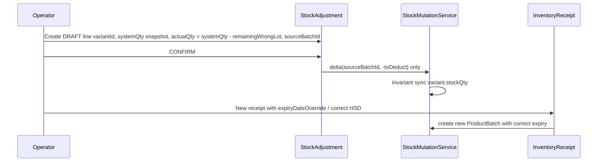

# Wrong batch expiry after partial sales (KiotViet-style)

## 1. Analysis — why direct expiry edits are unsafe

- **Audit and traceability**: [`ProductBatch`](NhaDanShop/src/main/java/com/example/nhadanshop/entity/ProductBatch.java) `expiryDate` is part of the immutable “identity” of a goods receipt lot. Sales lines record **which batch** was consumed via [`SalesInvoiceItemBatchAllocation`](NhaDanShop/src/main/java/com/example/nhadanshop/entity/SalesInvoiceItemBatchAllocation.java) and COGS via `unitCostSnapshot`. Changing `expiryDate` retroactively rewrites what the system claims the lot was at receipt time, while historical allocations still point at the same `batch_id` — reports and investigations no longer match physical reality or past screens.
- **Soft-cancel edge case**: [`InvoiceService.cancelInvoice`](NhaDanShop/src/main/java/com/example/nhadanshop/service/InvoiceService.java) restores `remainingQty` but **does not remove** batch allocations. So `importQty == remainingQty` can be true even after a sale was made and cancelled; relying only on `remainingQty < importQty` would **falsely allow** expiry edits after cancelled sales.

**Affected flows**

| Area | Mechanism |
|------|-----------|
| **Sales** | FEFO deduct + allocations in [`ProductBatchService.deductFromBatches`](NhaDanShop/src/main/java/com/example/nhadanshop/service/ProductBatchService.java) / [`InvoiceService`](NhaDanShop/src/main/java/com/example/nhadanshop/service/InvoiceService.java) |
| **Stock invariant** | [`StockMutationService`](NhaDanShop/src/main/java/com/example/nhadanshop/service/StockMutationService.java) enforces `variant.stockQty == sum(batch.remainingQty)` |
| **FEFO** | [`ProductBatchRepository`](NhaDanShop/src/main/java/com/example/nhadanshop/repository/ProductBatchRepository.java) queries filter `expiryDate > CURRENT_DATE` for sellable stock |
| **Reporting / warnings** | Expiring/expired batch lists and [`ExpiryWarningService`](NhaDanShop/src/main/java/com/example/nhadanshop/service/ExpiryWarningService.java) depend on stored `expiryDate` |

## 2. Design — correct business procedure (no historical mutation)



- **Do not** change past invoices or allocation rows.
- **Do not** change `importQty`, historical `costPrice`, or `expiryDate` on the old batch once it is “touched”.
- **Do** reduce only `remainingQty` on the wrong batch (full or partial) through a **documented** adjustment, then **add** a **new** batch via a normal receipt (same pattern as today in [`InventoryReceiptService.createReceipt`](NhaDanShop/src/main/java/com/example/nhadanshop/service/InventoryReceiptService.java) with `expiryDateOverride` on [`ReceiptItemRequest`](NhaDanShop/src/main/java/com/example/nhadanshop/dto/ReceiptItemRequest.java)).

**Operational recipe (example: 100 imported, 40 sold, 60 wrong-expiry remaining)**

1. Create stock adjustment (reason `OTHER` or a dedicated `DATA_CORRECTION` enum — see implementation) with one line: `variantId` correct, `systemQty` = current variant stock at draft time, `actualQty` = `systemQty - 60`, **`sourceBatchId`** = the wrong batch’s id.
2. Confirm adjustment → only that batch loses 60; sold 40 and invoice history unchanged.
3. Create a new inventory receipt (or Excel import) for 60 units with the **correct** `expiryDateOverride` → new `ProductBatch`, FEFO and stock invariant stay consistent.

## 3. Implementation plan (backend Java only)

### 3.1 Guard: when batch expiry (and optionally `mfgDate`) must not change

Add a single reusable guard in [`ProductBatchService`](NhaDanShop/src/main/java/com/example/nhadanshop/service/ProductBatchService.java), e.g. `assertBatchDatesMutable(Long batchId)` (or package-private helper used by a thin update method):

- **Throw** (e.g. `IllegalStateException` with a clear Vietnamese message) if **either**:
  - `importQty > remainingQty` (quantity has left the lot by any path that updates the batch ledger), **or**
  - [`SalesInvoiceItemBatchAllocationRepository`](NhaDanShop/src/main/java/com/example/nhadanshop/repository/SalesInvoiceItemBatchAllocationRepository.java) `existsByBatch_Id(batchId)` is true (covers **cancelled** invoices where stock was restored).

- **Allow** changes only when both are false (pristine lot).

Wire this guard into **every** code path that could change `expiryDate` / `mfgDate`:

- Today there is **no** public batch update API ([`ProductBatchController`](NhaDanShop/src/main/java/com/example/nhadanshop/controller/ProductBatchController.java) is GET-only). The guard is still valuable as the **single authority** for future admin endpoints or accidental new code paths.
- Optional minimal API (only if you want enforcement at the HTTP layer now): `PATCH /api/batches/{id}` for `mfgDate`/`expiryDate` calling the guard — requires extending [`SecurityConfig`](NhaDanShop/src/main/java/com/example/nhadanshop/security/SecurityConfig.java) so non-GET `/api/batches/**` is `ADMIN` (currently POST would fall through to `authenticated()` only).

[`InventoryReceiptService`](NhaDanShop/src/main/java/com/example/nhadanshop/service/InventoryReceiptService.java): **no change required** for batch expiry today (only creates batches; [`updateReceiptMeta`](NhaDanShop/src/main/java/com/example/nhadanshop/service/InventoryReceiptService.java) correctly does not alter lots). Document in code near batch creation that **corrections** are never done by editing receipt-linked batch rows after the fact.

### 3.2 Batch-targeted stock adjustment (minimal schema + confirm logic)

**Problem**: [`StockAdjustmentService.confirm`](NhaDanShop/src/main/java/com/example/nhadanshop/service/StockAdjustmentService.java) decreases stock using **FEFO across all batches**, which cannot reliably drain **only** the mis-labelled lot when other lots exist.

**Change**

1. **Flyway** new migration (e.g. `V7__stock_adjustment_source_batch.sql`): add nullable `source_batch_id BIGINT REFERENCES product_batches(id)` on `stock_adjustment_items`, index optional (`variant_id` already indexed).
2. **Entity** [`StockAdjustmentItem`](NhaDanShop/src/main/java/com/example/nhadanshop/entity/StockAdjustmentItem.java): optional `@ManyToOne` `ProductBatch sourceBatch`.
3. **DTO** [`StockAdjustmentRequest.ItemRequest`](NhaDanShop/src/main/java/com/example/nhadanshop/dto/StockAdjustmentRequest.java): optional `Long sourceBatchId`.
4. **Response** [`StockAdjustmentResponse.ItemResponse`](NhaDanShop/src/main/java/com/example/nhadanshop/dto/StockAdjustmentResponse.java): optional `Long sourceBatchId` (and optionally batch code for UI) — update [`StockAdjustmentService.toResponse`](NhaDanShop/src/main/java/com/example/nhadanshop/service/StockAdjustmentService.java) and any mapper if applicable.
5. **`create()`**: if `sourceBatchId != null`, validate batch exists and `batch.variant.id` equals `variantId`.
6. **`confirm()`**: when `diff < 0` and `sourceBatch != null`:
   - `toDeduct = -diff`
   - Ensure `toDeduct <= sourceBatch.remainingQty` and batch belongs to the locked variant (rely on [`StockMutationService.updateStockWithBatches`](NhaDanShop/src/main/java/com/example/nhadanshop/service/StockMutationService.java) for variant scoping — wrong id yields clear error).
   - Call `stockMutationService.updateStockWithBatches(variantId, List.of(BatchStockChange.delta(sourceBatchId, -toDeduct)))` instead of the FEFO loop.
   - When `sourceBatch == null`, keep **existing** FEFO behavior unchanged.

**Reason enum**: Either use `OTHER` with note `Sai HSD lô — xuất tồn để nhập lại`, or add `DATA_CORRECTION` to [`StockAdjustment.Reason`](NhaDanShop/src/main/java/com/example/nhadanshop/entity/StockAdjustment.java) (string column, backward compatible).

### 3.3 Tests

- **Unit/integration**: guard throws when `remaining < import` and when allocation exists **even if** `remaining == import` (cancelled invoice scenario).
- **Adjustment**: confirm with `sourceBatchId` deducts only that batch; variant sum and `stockQty` stay aligned.
- **Regression**: confirm without `sourceBatchId` still uses FEFO path.

## 4. Validation logic sketch (for the guard)

```java
// ProductBatchService — conceptually
void assertBatchDatesMutable(Long batchId) {
    ProductBatch b = batchRepo.findById(batchId).orElseThrow(...);
    if (b.getImportQty() > b.getRemainingQty()) {
        throw new IllegalStateException(
            "Không được sửa HSD/NSX lô đã phát sinh xuất kho. " +
            "Dùng phiếu điều chỉnh gắn sourceBatchId để xuất phần còn lại, rồi nhập lại lô mới với HSD đúng.");
    }
    if (allocationRepo.existsByBatch_Id(batchId)) {
        throw new IllegalStateException(/* same guidance */);
    }
}
```

## 5. Files to touch (summary)

| File | Change |
|------|--------|
| New `V7__....sql` | `source_batch_id` on `stock_adjustment_items` |
| [`SalesInvoiceItemBatchAllocationRepository`](NhaDanShop/src/main/java/com/example/nhadanshop/repository/SalesInvoiceItemBatchAllocationRepository.java) | `boolean existsByBatch_Id(Long batchId)` |
| [`ProductBatchService`](NhaDanShop/src/main/java/com/example/nhadanshop/service/ProductBatchService.java) | Guard method; optional future `updateBatchDates` calling guard |
| [`StockAdjustmentItem`](NhaDanShop/src/main/java/com/example/nhadanshop/entity/StockAdjustmentItem.java) | Optional `sourceBatch` |
| [`StockAdjustmentRequest`](NhaDanShop/src/main/java/com/example/nhadanshop/dto/StockAdjustmentRequest.java) / [`StockAdjustmentResponse`](NhaDanShop/src/main/java/com/example/nhadanshop/dto/StockAdjustmentResponse.java) | Optional `sourceBatchId` |
| [`StockAdjustmentService`](NhaDanShop/src/main/java/com/example/nhadanshop/service/StockAdjustmentService.java) | `create` validation + `confirm` targeted deduct branch |
| [`SecurityConfig`](NhaDanShop/src/main/java/com/example/nhadanshop/security/SecurityConfig.java) | Only if adding non-GET batch mutations: restrict to `ADMIN` |
| Tests under `src/test/java/.../service/` | Guard + adjustment integration |

No changes to past invoice entities, allocation rows, or receipt item snapshots beyond the new adjustment metadata.
