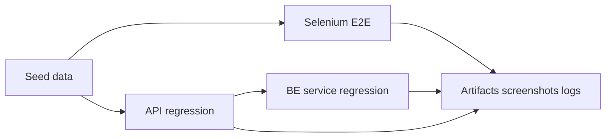

# Full Selenium Regression Plan

## Mục Tiêu
- Chuẩn hóa test pyramid cho repo hiện tại: FE Selenium E2E ở [`nha-dan-pos-c091ee5b`](c:/Work/NhaDanShopBT/nha-dan-pos-c091ee5b), backend Spring Boot ở [`NhaDanShop`](c:/Work/NhaDanShopBT/NhaDanShop).
- Biến Selenium từ smoke runner hiện tại thành suite full-flow có helpers, seed data, screenshots/logs, retry có kiểm soát và chạy được local/CI.
- Bổ sung API/BE regression để mỗi chức năng FE có test HTTP/backend tương ứng, không chỉ click UI.

## Scope Cụ Thể
- Trong scope FE Selenium:
  - Storefront: home, catalog, product detail, combos, cart, checkout, pending payment, account, login/signup/reset password.
  - Admin: dashboard, categories, products, combos, POS, invoices, pending orders, unmatched payments, promotions, vouchers, goods receipts, stock adjustments, inventory report, production, revenue/profit, customers, suppliers, users/security, store settings, shipping settings, GHN logs, Goong test.
  - UI behavior: loading, empty state, validation, toast/error state, role redirect, responsive layout cho flow chính.
- Trong scope API integration:
  - Controller groups dưới `/api/auth`, `/api/account`, `/api/products`, `/api/categories`, `/api/combos`, `/api/sales`, `/api/pos`, `/api/pending-orders`, `/api/invoices`, `/api/payment-events`, `/api/webhooks`, `/api/vietqr`, `/api/shipping`, `/api/store`, `/api/reports`, `/api/revenue`, `/api/receipts`, `/api/stock-adjustments`, `/api/inventory`, `/api/production-*`, `/api/admin/*`, `/api/addresses`, `/api/images`.
  - Contract response shape, status code, validation, pagination/filter/sort, 401/403 role matrix, public endpoint abuse cases.
- Trong scope BE regression:
  - Pricing/quote, invoice allocation, payment reconciliation, batch/expiry, receipt void, stock adjustment reverse, combo component stock, loyalty points, shipping quote/settings, production recipe/order, revenue/profit calculations.
  - Migration smoke với Postgres/Flyway cho schema mới và các version gần nhất.
- Ngoài scope mặc định:
  - Không kiểm thử production third-party thật nếu không có sandbox/stub.
  - Không viết visual snapshot pixel-perfect.
  - Không thay đổi business rule nếu test phát hiện rule chưa rõ; phải ghi blocker và xin quyết định.

## Hiện Trạng Chính
- Selenium đã có runner multi-spec (`automation/selenium/run-selenium.mjs` + `specs/*.spec.mjs`), helpers và smoke cơ bản (storefront, guard `/admin`, login dashboard khi có credential); các journey Phase 3–6 và Critical Watchlist vẫn chưa có đủ scenario — track theo YAML `todos` `storefront-auth-suite`, `admin-sales-suite`, `phase-p5-*`, `watchlist-*`, v.v.
- FE active là [`nha-dan-pos-c091ee5b`](c:/Work/NhaDanShopBT/nha-dan-pos-c091ee5b); các route chính nằm ở `App.tsx`: storefront, auth, account, admin dashboard/catalog/POS/invoices/pending/payment/inventory/production/reports/settings.
- BE có nhiều service integration tests nhưng HTTP MockMvc/API layer còn mỏng so với hơn 30 controller. Cần phủ thêm controller contract, security matrix, Postgres/Flyway path.

## Kiến Trúc Test Đề Xuất


- Selenium: kiểm user journey end-to-end với browser thật, dùng backend thật qua `BASE_URL` và API seed/cleanup.
- API integration: kiểm endpoint contract, validation, role/security, pagination/status mapping, idempotency.
- BE regression: kiểm nghiệp vụ sâu như tồn kho batch, invoice allocation, receipt void, stock adjustment reverse, pricing, loyalty, shipping, production.

## Guardrails / Guardlist
- Test Selenium phải chạy với backend thật hoặc test profile rõ ràng; không pass bằng mock/local storage nếu flow đó yêu cầu API.
- Seed data phải deterministic: dùng prefix test riêng, có cleanup hoặc idempotent setup, không phụ thuộc dữ liệu máy cá nhân.
- Không dùng tài khoản hoặc API key production trong automation. Secret chỉ đọc từ env local/CI.
- Không che lỗi bằng retry vô hạn. Retry chỉ dùng cho wait UI/network có timeout rõ; business assertion fail thì fail ngay.
- Không nới security để test pass. Nếu test cần admin/user thì login đúng role và assert 401/403 khi sai role.
- Không gom nhiều flow lớn vào một test duy nhất. Mỗi scenario phải có mục tiêu rõ, failure chỉ ra được chức năng hỏng.
- Không để Selenium thay thế hết unit/API tests. UI chỉ kiểm journey chính; API/BE kiểm exhaustive validation và edge cases.
- Không tạo dữ liệu làm sai tồn kho thật ngoài test profile. Flow stock/invoice/receipt phải có product/variant/batch riêng cho automation.
- Không phụ thuộc thứ tự chạy test trừ khi suite khai báo setup dependency rõ ràng.
- Third-party GHN/Goong/Casso/VietQR/R2 phải dùng sandbox/stub/fixture hoặc đánh dấu skipped kèm lý do.

## Acceptance Criteria Tổng
- Có file coverage matrix liệt kê đủ route FE, endpoint API, scenario Selenium, API test, BE regression test và trạng thái `covered/skipped/manual/blocker`.
- `npm run test:automation` chạy được smoke suite headless, tạo report pass/fail và lưu screenshot khi fail.
- Full regression Selenium có thể chạy theo tag/scope: `smoke`, `storefront`, `admin-sales`, `admin-ops`, `settings-integrations`, `full`.
- Mỗi route/function chính có ít nhất một trong ba loại coverage: Selenium journey, API contract test, hoặc BE regression; flow user-facing quan trọng phải có cả Selenium và API/BE tương ứng.
- Mỗi controller group có test HTTP cho happy path, validation lỗi, auth/role boundary và response shape quan trọng.
- Các invariant nghiệp vụ critical có regression rõ: không double-deduct stock, void/reverse đúng lock, quote/invoice giữ snapshot, payment idempotent, loyalty không âm điểm, shipping fallback không block checkout.
- Report cuối nêu được số scenario pass/fail/skip, coverage còn thiếu, lỗi phát hiện, test command đã chạy, artifact path và residual risk.

## Bug Fix Bắt Buộc Trước Regression
- Các lỗi dưới đây là blocker trước khi viết full regression vì database clean/create mới nhưng UI vẫn hiện dữ liệu/rate hoặc không load dữ liệu nền đúng.
- **Theo dõi trong Cursor:** các hạng mục này được map sang YAML `todos` ở đầu file plan (`blocker-dashboard-zero-state`, `blocker-pending-notification-mismatch`, `blocker-product-category-dropdown`, `blocker-production-recipe-ui`, `blocker-production-bytea-500`). Ưu tiên làm và đánh dấu xong các todo đó trước các phase regression rộng.

### Dashboard Revenue/Profit Rate Sai Khi DB Trống
- **YAML todo:** `blocker-dashboard-zero-state`
- Hiện tượng:
  - Database đã clean và create mới, chưa có doanh thu/lợi nhuận.
  - Dashboard vẫn hiển thị phần trăm tăng/giảm dưới card doanh thu/lợi nhuận như `+12%`, `+8%` hoặc tương tự.
- File cần rà:
  - [`nha-dan-pos-c091ee5b/src/pages/admin/Dashboard.tsx`](c:/Work/NhaDanShopBT/nha-dan-pos-c091ee5b/src/pages/admin/Dashboard.tsx)
  - Dashboard service/adapter trong [`nha-dan-pos-c091ee5b/src/services`](c:/Work/NhaDanShopBT/nha-dan-pos-c091ee5b/src/services)
  - Revenue/report endpoints trong [`NhaDanShop/src/main/java/com/example/nhadanshop/controller`](c:/Work/NhaDanShopBT/NhaDanShop/src/main/java/com/example/nhadanshop/controller)
- Fix expectation:
  - Khi API trả 0 hoặc không có historical data, rate phải là `0%`, `--`, hoặc ẩn phần trend theo UI decision thống nhất.
  - Không hardcode/demo fallback rate trong production admin dashboard.
  - Không tính rate từ `0` denominator thành số giả.
- Regression bắt buộc:
  - Selenium seed DB trống hoặc test profile không có invoice, mở `/admin`, assert revenue/profit value = `0 đ` và không hiện trend giả.
  - API/BE test revenue summary khi không có invoice trả zero-state rõ ràng.
- Acceptance:
  - DB clean không còn hiển thị phần trăm tăng/giảm giả.
  - Dashboard zero-state nhất quán cho doanh thu ngày/tuần/tháng và lợi nhuận ngày/tuần/tháng.

### Pending Payment Notification Hiển Thị Giả Khi DB Trống
- **YAML todo:** `blocker-pending-notification-mismatch`
- Hiện tượng:
  - Database clean, `/admin/pending-orders` không có đơn.
  - Badge/thông báo topbar vẫn hiển thị `1` hoặc dropdown có một thông báo `Đơn chờ thanh toán`.
  - Page chính lại hiển thị empty state `Không có đơn nào`, gây mismatch.
- File cần rà:
  - [`nha-dan-pos-c091ee5b/src/pages/admin/PendingOrders.tsx`](c:/Work/NhaDanShopBT/nha-dan-pos-c091ee5b/src/pages/admin/PendingOrders.tsx)
  - Topbar/notification/sidebar components trong [`nha-dan-pos-c091ee5b/src/components/admin`](c:/Work/NhaDanShopBT/nha-dan-pos-c091ee5b/src/components/admin)
  - Pending order service/adapter trong [`nha-dan-pos-c091ee5b/src/services`](c:/Work/NhaDanShopBT/nha-dan-pos-c091ee5b/src/services)
  - [`NhaDanShop/src/main/java/com/example/nhadanshop/controller/PendingOrderController.java`](c:/Work/NhaDanShopBT/NhaDanShop/src/main/java/com/example/nhadanshop/controller/PendingOrderController.java)
- Fix expectation:
  - Topbar badge, dropdown notification, sidebar count và page list phải dùng cùng source thật hoặc cùng query contract.
  - Khi API trả `totalElements = 0` hoặc empty array thì badge = 0/hidden, dropdown không hiện notification giả.
  - Không giữ mock/demo notification trong production admin layout.
- Regression bắt buộc:
  - Selenium với DB trống mở admin, assert pending sidebar count = 0/hidden, topbar badge = 0/hidden, dropdown không có pending notification.
  - Selenium tạo pending order thật, assert topbar/sidebar/page cùng tăng lên 1.
  - API test pending order count/list zero-state.
- Acceptance:
  - DB clean không có notification pending giả.
  - Sau khi tạo pending order thật, count và list đồng bộ.

### Tạo Sản Phẩm Mới Không Load Danh Mục
- **YAML todo:** `blocker-product-category-dropdown`
- Hiện tượng:
  - Page tạo sản phẩm mới không load được danh mục để chọn.
  - Dropdown chỉ có placeholder `Chọn danh mục`, không có dữ liệu category thật.
- File cần rà:
  - Product create/edit page trong [`nha-dan-pos-c091ee5b/src/pages/admin`](c:/Work/NhaDanShopBT/nha-dan-pos-c091ee5b/src/pages/admin)
  - Category hooks/services trong [`nha-dan-pos-c091ee5b/src/services`](c:/Work/NhaDanShopBT/nha-dan-pos-c091ee5b/src/services)
  - [`NhaDanShop/src/main/java/com/example/nhadanshop/controller/CategoryController.java`](c:/Work/NhaDanShopBT/NhaDanShop/src/main/java/com/example/nhadanshop/controller/CategoryController.java)
- Fix expectation:
  - Product create page phải gọi đúng category API với auth/header/base URL đúng.
  - Adapter phải parse đúng response dạng `Page`, array, hoặc DTO hiện tại của backend.
  - Nếu DB clean chưa có category, UI phải hiển thị empty state/action rõ: `Chưa có danh mục, hãy tạo danh mục trước`, không để dropdown trống mơ hồ.
  - Nếu đã có category seed/tạo mới, dropdown phải load và chọn được.
- Regression bắt buộc:
  - Selenium tạo category mới, mở `/admin/products/new`, assert category vừa tạo xuất hiện trong dropdown và chọn được.
  - Selenium DB clean chưa có category, mở `/admin/products/new`, assert có empty/help message rõ và submit bị chặn với validation đúng.
  - API test `/api/categories` list response shape khớp FE adapter.
- Acceptance:
  - Không còn case có category trong DB/API nhưng product form không load được dropdown.
  - Khi chưa có category thật, UI hướng admin tạo category trước.

### Production Recipe Create Page Lệch UI Theme / CRUD Pattern
- **YAML todo:** `blocker-production-recipe-ui`
- Hiện tượng:
  - Page `Tạo quy trình sản xuất` đang quá hẹp, lệch bố cục, nhiều field bị dồn nhỏ, không giống các màn CRUD admin khác.
  - Cần đối chiếu trực tiếp với màn [`nha-dan-pos-c091ee5b/src/pages/admin/StockAdjustmentCreate.tsx`](c:/Work/NhaDanShopBT/nha-dan-pos-c091ee5b/src/pages/admin/StockAdjustmentCreate.tsx) vì màn này đang có pattern tốt hơn: `admin-dense`, breadcrumb, `PageHeader`, action buttons rõ, card sections, banner trạng thái, form grid, summary strip, table line items, confirm dialog.
- File cần rà:
  - [`nha-dan-pos-c091ee5b/src/pages/admin/ProductionRecipeFormPage.tsx`](c:/Work/NhaDanShopBT/nha-dan-pos-c091ee5b/src/pages/admin/ProductionRecipeFormPage.tsx)
  - [`nha-dan-pos-c091ee5b/src/pages/admin/Production.tsx`](c:/Work/NhaDanShopBT/nha-dan-pos-c091ee5b/src/pages/admin/Production.tsx)
  - Shared admin components: [`nha-dan-pos-c091ee5b/src/components/shared/PageHeader.tsx`](c:/Work/NhaDanShopBT/nha-dan-pos-c091ee5b/src/components/shared/PageHeader.tsx), status/empty/error components nếu có.
- Fix expectation:
  - Không dùng form `max-w-3xl` nhỏ giữa màn cho CRUD lớn. Production recipe create phải dùng width/layout giống admin CRUD page khác, responsive theo grid/card.
  - Có breadcrumb rõ: `Sản xuất / Tạo quy trình`.
  - Header có title, description ngắn, action `Quay lại`, `Lưu quy trình`; không để action chính chìm trong form nhỏ.
  - Form chia sections rõ: `Thông tin chung`, `Thành phẩm`, `Nguyên liệu`, `Chi phí/tuỳ chọn`, `Trạng thái`.
  - Component nguyên liệu phải là table/line items dễ đọc giống stock adjustment line table, không dồn `SP/Var/Qty/Unit` thành các cột quá nhỏ.
  - Empty/loading/error state cho product/variant list phải rõ ràng; nếu chưa có product/variant thì hướng admin tạo product trước.
- Regression bắt buộc:
  - Selenium mở `/admin/production/recipes/new`, assert page có breadcrumb/header/section labels đúng và không render form bị ép hẹp.
  - Selenium tạo product/variant seed, mở form, chọn thành phẩm và nguyên liệu, lưu recipe thành công, quay lại list thấy recipe mới.
  - Selenium với DB clean không có product/variant, form hiển thị help/empty state rõ và submit bị chặn bằng validation.
- Acceptance:
  - UI production create nhìn và thao tác nhất quán với `StockAdjustmentCreate`, không còn cảm giác là form tạm/demo.
  - Ở desktop 1366px, form tận dụng không gian hợp lý; ở tablet/mobile không overflow và không mất field.
  - Không còn text/label viết tắt khó hiểu như `SP`, `Var`, `SL chuẩn output / recipe` nếu có thể viết rõ bằng tiếng Việt admin đang dùng.

### Production Orders 500 `lower(bytea)` Khi Vào Trang Sản Xuất
- **YAML todo:** `blocker-production-bytea-500`
- Hiện tượng:
  - Vừa vào `/admin/production` là frontend gọi `/api/production-orders?page=...&size=...&sort=createdAt%2Cdesc` và nhận 500.
  - Backend error: `ERROR: function lower(bytea) does not exist` trong query search production orders.
  - Query đang `LOWER(o.orderNo)`, `LOWER(recipe.recipeCode)`, `LOWER(recipe.name)`; một hoặc nhiều cột trong DB/migration bị PostgreSQL xem là `bytea`.
- File cần rà:
  - [`NhaDanShop/src/main/java/com/example/nhadanshop/repository/ProductionOrderRepository.java`](c:/Work/NhaDanShopBT/NhaDanShop/src/main/java/com/example/nhadanshop/repository/ProductionOrderRepository.java)
  - [`NhaDanShop/src/main/java/com/example/nhadanshop/repository/ProductionRecipeRepository.java`](c:/Work/NhaDanShopBT/NhaDanShop/src/main/java/com/example/nhadanshop/repository/ProductionRecipeRepository.java)
  - Production entities trong [`NhaDanShop/src/main/java/com/example/nhadanshop/entity`](c:/Work/NhaDanShopBT/NhaDanShop/src/main/java/com/example/nhadanshop/entity)
  - Flyway migrations trong [`NhaDanShop/src/main/resources/db/migration`](c:/Work/NhaDanShopBT/NhaDanShop/src/main/resources/db/migration)
  - Frontend production API adapter trong [`nha-dan-pos-c091ee5b/src/services`](c:/Work/NhaDanShopBT/nha-dan-pos-c091ee5b/src/services)
- Fix expectation:
  - Audit toàn bộ schema production string/search columns: `production_orders.order_no`, `production_recipes.recipe_code`, `production_recipes.name`, `status`, `note`, `void_reason` và các cột text liên quan.
  - Fix gốc bằng migration idempotent để cột string đúng kiểu `varchar/text`, không chỉ cast tạm trong query nếu schema sai.
  - Entity `@Column` phải khớp kiểu DB; không để field String map vào cột `bytea`.
  - Repository search phải xử lý `q = null`, blank, text thường, text có dấu; không gọi `LOWER()` trên cột không-text.
  - Khi production orders API fail thật, UI phải hiển thị error boundary/toast có retry, không spam request hoặc render stack lỗi lặp.
- Regression bắt buộc:
  - API/BE test `/api/production-orders` với `q` null, blank, `PO`, recipe code, recipe name đều trả 200.
  - API/BE test `/api/production-recipes` với `q` null, blank, code, name đều trả 200.
  - Flyway/Postgres smoke test DB clean từ migration chain xác nhận các cột production search là `varchar/text`, không phải `bytea`.
  - Selenium mở `/admin/production` với DB clean, assert không có toast 500, không có console/backend error visible, list/empty state render đúng.
  - Selenium sau khi tạo recipe/order, filter ở tab `Quy trình` và `Phiếu SX` không 500 và table columns vẫn render đủ: mã, tên, output, bán/POS, archived/status, thao tác.
- Acceptance:
  - Vào trang sản xuất không còn 500 khi DB clean hoặc có data.
  - Fix bao phủ cả production recipes và production orders, không còn lỗi tương tự ở các column search/filter khác.
  - Report cuối phải ghi rõ migration/schema đã kiểm, API cases đã chạy, Selenium production smoke đã pass.

## Critical Coverage Watchlist
- Các phần dưới đây là gate bắt buộc, không được xem là “đã full regression” nếu chỉ có smoke hoặc chỉ có UI click đơn giản.
- **Theo dõi trong Cursor:** mỗi nhóm map YAML `watchlist-*` bên dưới; triển khai test chủ yếu qua các todo phase (`admin-sales-suite`, `phase-p5-*`, `storefront-auth-suite`, `phase-commercial-promotions-vouchers`, `phase-reports-revenue-profit-dashboard-consistency`, `be-domain-regression`). Đánh dấu `watchlist-*` **done** chỉ sau khi có đủ bằng chứng trong repo (spec/test + matrix cập nhật) đúng Selenium + API/BE + negative cases trong từng bullet.
- POS/Tạo Hóa Đơn:
  - **YAML todo:** `watchlist-pos-invoice`
  - Selenium phải cover scan/chọn product variant, chỉnh số lượng, áp khuyến mãi/voucher nếu có, tạo invoice thành công, hiển thị invoice detail.
  - API/BE phải assert quote, invoice snapshot, payment method, stock batch allocation và không trừ tồn hai lần.
  - Negative cases bắt buộc: out-of-stock, inactive variant, invalid quantity, non-admin/user không có quyền tạo POS invoice.
- Hóa Đơn:
  - **YAML todo:** `watchlist-invoice-lifecycle`
  - Selenium phải cover list, detail, search/filter, tạo từ POS, tạo từ pending order, cancel/void/delete theo rule.
  - API/BE phải assert status transition, permission, cancel reversal, delete/admin-only, revenue/profit impact.
  - Negative cases bắt buộc: cancel invoice locked/paid nếu rule cấm, duplicate cancel, user xem invoice không thuộc mình.
- Tồn Kho:
  - **YAML todo:** `watchlist-inventory-truth`
  - Selenium phải cover inventory report/projection sau các event receipt, invoice, stock adjustment, production, combo sale.
  - API/BE phải assert batch là source of truth, expiry/low-stock calculation, stock movement ledger, dashboard card counts.
  - Negative cases bắt buộc: stale UI empty state khi API có data, expired/near-expiry phân loại sai, stock âm ngoài rule.
- Phiếu Nhập / Kiểm Kho / Điều Chỉnh:
  - **YAML todo:** `watchlist-receipts-adjustments`
  - Selenium phải cover create, confirm/void/reverse, list/detail và kiểm tồn kho thay đổi sau mỗi action.
  - API/BE phải assert lock/reversal/idempotency để không đảo tồn nhiều lần.
- Pending Order → Invoice:
  - **YAML todo:** `watchlist-pending-to-invoice`
  - Selenium phải cover guest/user tạo pending order, admin confirm thành invoice, cancel pending order.
  - API/BE phải assert pending snapshot, customer binding, stock delta chỉ xảy ra khi confirm invoice theo rule.
- Combo / Sản Xuất:
  - **YAML todo:** `watchlist-combo-production`
  - Selenium phải cover combo sale và production confirm/void vì cả hai ảnh hưởng nhiều variant/batch cùng lúc.
  - API/BE phải assert component stock, finished stock, cost/profit allocation.
- Doanh Thu / Lợi Nhuận:
  - **YAML todo:** `watchlist-revenue-profit`
  - Selenium report phải dùng seed invoice có paid/canceled/discount/combo để so số liệu.
  - API/BE phải assert revenue/profit không tính sai canceled/void invoice và combo COGS.
- Nếu bất kỳ watchlist item nào chưa automation được vì UI/API thiếu hoặc cần third-party, report cuối phải ghi `blocker` hoặc `manual gap`, không được ghi pass chung chung.

## Automation Coverage Bắt Buộc Theo Module

### Categories
- Selenium CRUD:
  - Admin mở `/admin/categories`, tạo category mới, sửa tên/trạng thái nếu UI hỗ trợ, tìm kiếm/filter, xóa hoặc archive nếu có.
  - Category mới xuất hiện trong product form/filter và storefront catalog nếu business rule cho phép.
- API/BE:
  - `/api/categories` GET public, create/update/delete admin-only.
  - Validate duplicate name, blank name, delete category đang có product.
- Acceptance:
  - User thường không tạo/sửa/xóa được category.
  - Product filter theo category mới trả đúng dữ liệu.

### Product
- Selenium CRUD:
  - Admin tạo product với category, mô tả, ảnh hoặc image placeholder, trạng thái active/inactive.
  - Sửa thông tin product, search/filter/sort, xem detail, xóa/archive nếu có.
  - Storefront chỉ thấy product active và không thấy product inactive/deleted.
- API/BE:
  - `/api/products` list/detail public; create/update/delete admin-only.
  - Validate SKU/name duplicate, missing category, invalid price/status, pagination response shape.
- Acceptance:
  - Product tạo từ admin dùng được trong POS, receipt, combo và storefront theo đúng status.

### Product Variant
- Selenium CRUD:
  - Trong product create/edit, thêm/sửa variant: SKU/barcode/unit/price/min stock/status.
  - Variant active scan được ở POS; inactive không bán được nếu rule yêu cầu.
  - Variant hiển thị đúng tồn kho, giá, barcode trên admin product detail/list.
- API/BE:
  - Contract cho product variant trong product payload/response.
  - Validate duplicate SKU/barcode, invalid unit/price/min stock.
- Acceptance:
  - Variant mới có thể nhập hàng, điều chỉnh tồn, bán POS và xuất hiện trong inventory projection.

### Pending Order
- Selenium business flow:
  - Guest checkout tạo pending order, mở `/pending-payment/:id`, admin thấy trong `/admin/pending-orders`.
  - User checkout tạo pending order gắn customer/account đúng.
  - Admin xem detail, confirm thành invoice, cancel order, filter theo status.
- API/BE:
  - `/api/pending-orders` create public/user, list/confirm/cancel admin, detail permission đúng.
  - Validate missing items, invalid quantity, expired/out-of-stock item, duplicate confirm/cancel.
- Acceptance:
  - Confirm một lần tạo đúng invoice/stock delta; confirm lần hai bị chặn hoặc idempotent theo rule.
  - Cancel không tạo invoice và không trừ tồn.

### Combo
- Selenium CRUD/business flow:
  - Admin tạo combo từ nhiều product variants, set combo price/status/date range nếu có.
  - Sửa combo components/price/status, search/list/detail, archive/delete nếu có.
  - Storefront mua combo, checkout pending, admin confirm invoice.
- API/BE:
  - `/api/combos`, quote/pending/invoice support combo line.
  - Validate component thiếu tồn, inactive variant, duplicate component, invalid combo price.
- Acceptance:
  - Invoice combo giữ snapshot tên/giá combo nhưng trừ stock component đúng một lần.
  - Combo hết hàng hoặc inactive không mua được.

### Sản Xuất
- Selenium CRUD/business flow:
  - Admin tạo recipe, thêm finished variant, component variants, định mức, hao hụt nếu có.
  - Search/filter/list recipe, sửa/archive recipe.
  - Tạo production order từ recipe, preview nguyên liệu, confirm, void/cancel.
- API/BE:
  - `/api/production-recipes`, `/api/production-orders`.
  - Validate component thiếu tồn, recipe inactive, quantity invalid, duplicate confirm/void.
- Acceptance:
  - Confirm production trừ component stock và tăng finished stock đúng.
  - Void/reverse production không double-reverse và giữ ledger/batch trace đúng.

### Giao Dịch Không Khớp
- Selenium business flow:
  - Admin mở `/admin/unmatched-payments`, xem list/detail, search/filter theo trạng thái/ngày.
  - Match giao dịch với pending order/invoice nếu UI hỗ trợ; mark ignored/resolved nếu có.
- API/BE:
  - `/api/payment-events`, `/api/webhooks/casso`.
  - Validate duplicate webhook, invalid signature/token, unmatched amount/content, idempotency.
- Acceptance:
  - Duplicate payment event không tạo trùng invoice/settlement.
  - Event không khớp hiển thị rõ và có action xử lý đúng permission admin.

### Hóa Đơn
- Selenium CRUD/business flow:
  - Admin tạo invoice từ POS và từ pending order, xem list/detail, search/filter theo ngày/status/customer.
  - Cancel/void/delete theo rule, kiểm tra print/export nếu có UI.
  - User/account thấy order/invoice của mình nếu route hỗ trợ.
- API/BE:
  - `/api/invoices` create/list/detail/cancel/delete.
  - Validate empty invoice, invalid quantity, out-of-stock, unauthorized access, cancel after payment/lock.
- Acceptance:
  - Invoice tạo mới trừ tồn đúng batch allocation.
  - Cancel/void hoàn tồn hoặc tạo reversal đúng business rule.
  - Delete admin-only và không phá báo cáo doanh thu/lợi nhuận.

### Phiếu Nhập
- Selenium CRUD/business flow:
  - Admin tạo goods receipt với supplier, variant, batch/expiry/cost/quantity.
  - Xem list/detail, search/filter, void receipt, import Excel nếu UI đang hỗ trợ.
- API/BE:
  - `/api/receipts` create/list/detail/void/import.
  - Validate missing supplier, invalid expiry, negative quantity/cost, duplicate void, receipt đã bán không void được nếu locked.
- Acceptance:
  - Receipt tăng batch stock đúng và xuất hiện trong tồn kho/inventory report.
  - Void receipt đảo tồn đúng hoặc bị chặn khi batch đã được dùng theo rule.

### Tồn Kho
- Selenium business flow:
  - Admin mở inventory report/projections, filter theo product/category/status/expiry.
  - Kiểm dashboard cards: sắp hết hàng, hết hàng, sắp hết hạn, hết hạn.
  - Kiểm batch detail/movement nếu UI có.
- API/BE:
  - `/api/inventory/projections`, reports inventory endpoints, batch endpoints.
  - Regression cho batch source of truth, expiry calculation, low-stock threshold.
- Acceptance:
  - Tồn kho UI khớp API sau receipt, invoice, adjustment, production.
  - Không hiện empty state khi API trả data.

### Kiểm Kho / Điều Chỉnh
- Selenium CRUD/business flow:
  - Admin tạo stock adjustment, thêm item variant/batch, nhập actual quantity/reason.
  - Save draft nếu có, confirm, xem detail/list, reverse adjustment.
- API/BE:
  - `/api/stock-adjustments` create/list/detail/confirm/reverse.
  - Validate invalid quantity, missing reason, duplicate confirm/reverse, adjustment locked.
- Acceptance:
  - Confirm tạo stock movement đúng delta.
  - Reverse hoàn delta đúng một lần; reverse lần hai bị chặn.

### Khuyến Mãi
- Selenium CRUD/business flow:
  - Admin tạo promotion theo rule hiện có: percent/fixed, date range, min order/product scope nếu UI hỗ trợ.
  - Sửa, activate/deactivate, search/filter, evaluate trên cart/POS/checkout.
- API/BE:
  - `/api/promotions` CRUD, active/evaluate/pick-best.
  - Validate date range, invalid discount, overlapping/conflicting rules nếu service có rule.
- Acceptance:
  - Promotion active áp dụng đúng quote; inactive/expired không áp dụng.
  - Best promotion chọn đúng và discount snapshot giữ trong invoice/pending.

### Voucher
- Selenium CRUD/business flow:
  - Admin tạo voucher code, limit, value, min order, date range, active status.
  - Storefront/POS nhập voucher, quote giảm giá, voucher hết hạn/đã dùng báo lỗi rõ.
- API/BE:
  - `/api/vouchers` active/list/CRUD/redeem validation.
  - Validate duplicate code, usage limit, expired code, min order not met, wrong role.
- Acceptance:
  - Voucher hợp lệ giảm đúng tiền và được snapshot vào pending/invoice.
  - Voucher vượt limit hoặc expired không dùng được.

### Cài Đặt Cửa Hàng
- Selenium CRUD/business flow:
  - Admin mở `/admin/store-settings`, xem và cập nhật tên cửa hàng, payment settings, QR/bank settings hoặc fields hiện có.
  - Storefront checkout/pending payment phản ánh payment settings mới.
- API/BE:
  - `/api/store` GET public settings cần thiết, PUT admin-only.
  - Validate missing required fields, invalid bank/payment config, public response không lộ secret.
- Acceptance:
  - User/guest chỉ đọc được public-safe fields.
  - Admin update settings persist sau refresh.

### Cài Đặt Giao Hàng
- Selenium CRUD/business flow:
  - Admin mở `/admin/shipping-settings`, tạo/sửa rule vùng, default parcel, free shipping/fee rule nếu có.
  - Storefront checkout quote shipping theo rule mới.
- API/BE:
  - `/api/shipping` settings admin-only, `/api/shipping/quote` public.
  - Validate invalid fee, missing zone, oversized parcel, fallback khi GHN key/sandbox không có.
- Acceptance:
  - Shipping quote không block checkout khi third-party unavailable nếu manual/fallback rule tồn tại.
  - Settings persist và quote phản ánh rule mới.

### Người Dùng
- Selenium CRUD/security flow:
  - Admin mở `/admin/users`, tạo user/admin nếu UI hỗ trợ, sửa role/status/password reset, deactivate.
  - Non-admin bị chặn khỏi user management.
  - Security/TOTP page flow nếu đang có UI.
- API/BE:
  - `/api/admin/users`, `/api/auth`, security endpoints.
  - Validate duplicate email, weak password, self-deactivate/admin role downgrade nếu rule cấm.
- Acceptance:
  - Role ADMIN/USER áp dụng đúng route guard và API 403.
  - Deactivated user không login được.

### Khách Hàng
- Selenium CRUD/business flow:
  - Admin mở `/admin/customers`, tạo/sửa khách hàng, search/filter, xem lịch sử đơn/điểm nếu UI có.
  - Checkout user/guest bind đúng customer record.
- API/BE:
  - `/api/customers`, `/api/account`, loyalty/customer binding services.
  - Validate duplicate phone/email, invalid contact, customer linked to user.
- Acceptance:
  - Customer mới dùng được trong POS/invoice.
  - Loyalty/account customer binding không tạo trùng sai.

### Nhà Cung Cấp
- Selenium CRUD/business flow:
  - Admin mở `/admin/suppliers`, tạo/sửa supplier, search/filter, deactivate/delete nếu có.
  - Supplier dùng được khi tạo goods receipt.
- API/BE:
  - `/api/suppliers` list/create/update/delete admin-only.
  - Validate duplicate supplier, invalid contact/tax fields, delete supplier đã có receipt.
- Acceptance:
  - Supplier inactive/deleted không được chọn cho receipt mới nếu business rule yêu cầu.
  - Receipt detail giữ supplier snapshot hoặc reference đúng.

### Doanh Thu
- Selenium report flow:
  - Admin mở `/admin/revenue`, filter ngày/khoảng thời gian/status, kiểm summary và rows.
  - So sánh số liệu với seed invoice/payment/cancel test.
- API/BE:
  - `/api/revenue` và report service/repository revenue queries.
  - Regression cho paid/unpaid/cancelled invoices, tax/VAT/discount/shipping nếu có.
- Acceptance:
  - Revenue không tính invoice canceled/void theo rule.
  - Filter date range và grouping trả đúng tổng với dữ liệu seed.

### Lợi Nhuận
- Selenium report flow:
  - Admin mở `/admin/profit`, filter ngày/khoảng thời gian/product/category nếu có.
  - Kiểm profit summary, COGS, discount, shipping/tax handling theo UI hiện tại.
- API/BE:
  - Profit/report endpoints và repository canonical query.
  - Regression cho batch cost allocation, combo COGS, receipt cost, invoice cancel/void.
- Acceptance:
  - Profit = revenue - COGS - discount/fees theo business rule đã có.
  - Combo profit dùng component cost đúng, không dùng sai combo price làm cost.

## Phase 1: Test Infra Và Chuẩn Runner
- **Todo YAML:** `infra-runner` — đánh dấu `completed` khi đạt acceptance Phase 1 (đã có runner multi-spec + helpers trong repo).
- Refactor [`automation/selenium/run-selenium.mjs`](c:/Work/NhaDanShopBT/nha-dan-pos-c091ee5b/automation/selenium/run-selenium.mjs) thành runner load nhiều spec file.
- Thêm helpers Selenium:
  - `driver` setup headless/headed, base URL, timeout chuẩn.
  - `auth` helper login admin/user, logout, assert role redirect.
  - `api` helper gọi backend để seed/cleanup dữ liệu test.
  - `assertions` helper chờ toast, table row, URL, dialog, network-visible state.
  - artifact helper lưu screenshot, HTML snapshot, console log khi fail.
- Thêm config/env mẫu: `BASE_URL`, `API_BASE_URL`, `ADMIN_EMAIL`, `ADMIN_PASSWORD`, `USER_EMAIL`, `USER_PASSWORD`, `RUN_AUTOMATION=1`.
- Giữ `npm run test:automation` là command chính; thêm tag/filter nếu cần: smoke, storefront, admin, regression.

### Acceptance Criteria Phase 1
- Runner auto-discover hoặc khai báo spec list rõ, có summary pass/fail/skip cuối run.
- Fail scenario lưu screenshot và thông tin URL hiện tại.
- Có helper login admin/user dùng API/UI ổn định, không copy-paste login steps trong từng spec.
- Có smoke scenario tối thiểu: storefront load, admin redirect khi chưa login, admin login vào dashboard.

## Phase 2: Ma Trận Coverage FE → API → BE
- **Todo YAML:** `coverage-matrix`.
- Tạo test matrix dạng markdown trong repo để map từng route/function sang:
  - Selenium scenario.
  - API endpoint contract.
  - BE service/regression test.
  - Dữ liệu seed cần có.
- Nhóm route/function cần phủ:
  - Auth/account: signup, login, refresh/logout, forgot/reset password, account profile, account orders, loyalty.
  - Storefront: home, products, product detail, combos, cart, checkout, pending payment, manual/address autocomplete fallback.
  - Admin catalog: categories, products, variants, combos, batches, images.
  - Admin sales: POS scan, quote, invoice create/list/detail/cancel/delete, pending orders, unmatched payments.
  - Inventory: receipts, receipt void, stock adjustments, reverse, inventory projections/report, expiry/low-stock dashboard cards.
  - Commercial: promotions, vouchers, quote pricing, combo stock component allocation.
  - Production: recipes, production orders, preview, confirm/void.
  - Reports: revenue, profit, inventory report.
  - Settings/integrations: store settings, shipping settings, GHN quote logs, Goong address, VietQR, Casso webhook, image upload.
  - Security/admin: users, security/TOTP, role boundaries, unauthorized/forbidden behavior.

### Acceptance Criteria Phase 2
- Matrix có đủ cột: module, FE route/page, action/function, API endpoint, BE service/domain, test file/scenario, seed data, status, note.
- Không có route admin/storefront chính bị bỏ trống mà không có lý do `manual`, `third-party`, hoặc `out-of-scope`.
- Matrix được cập nhật khi thêm spec/test mới, không chỉ là tài liệu một lần.

## Phase 3: Selenium Storefront Và Auth Suite
- **Todo YAML:** `storefront-auth-suite`.
- Viết Selenium scenarios cho guest/user:
  - Guest browse product/combo, add cart, edit quantity, checkout, tạo pending order, mở `/pending-payment/:id`.
  - User login, account page load, profile update validation, xem orders/loyalty.
  - Logout clear cart/session state.
  - Address autocomplete unavailable thì manual checkout vẫn pass.
  - Auth redirects: admin route khi chưa login về `/login?next=...`; user non-admin bị đưa về `/account`.
- API/BE đi kèm:
  - `/api/auth`, `/api/account`, `/api/products`, `/api/combos`, `/api/sales/quote`, `/api/pending-orders`, `/api/shipping/quote`, `/api/loyalty`.

### Acceptance Criteria Phase 3
- Guest checkout tạo pending order thật và admin/API đọc được order đó.
- User checkout không leak cart/session của user trước sau logout/login.
- Address fallback manual pass khi Goong key không có hoặc autocomplete lỗi.
- Auth flow assert đúng redirect và message cho unauthenticated/non-admin.
- API tests đi kèm cover signup/login/reset happy path và validation chính.

## Phase 4: Selenium Admin Sales, POS, Payment Suite
- **Todo YAML:** `admin-sales-suite`.
- Viết Selenium scenarios cho admin:
  - Dashboard load đúng stock/expiry/pending cards.
  - POS scan product/variant/combo, quote, tạo invoice.
  - Pending order list/detail/confirm/cancel.
  - Invoice list/detail/cancel/delete permission.
  - Unmatched payment events và Casso/VietQR visible paths nếu có sandbox/stub.
- API/BE đi kèm:
  - `/api/pos`, `/api/invoices`, `/api/payment-events`, `/api/webhooks/casso`, `/api/vietqr/generate`.
  - Regression cho idempotency, validation, duplicate payment, invoice stock delta.

### Acceptance Criteria Phase 4
- POS tạo invoice làm thay đổi tồn kho đúng một lần và invoice xuất hiện trong list/detail.
- Pending order confirm tạo invoice hoặc chuyển trạng thái đúng, cancel không còn trong queue active.
- Invoice cancel/delete permission đúng role và không phá stock ledger.
- Payment webhook duplicate/idempotency có API regression.
- Dashboard card số liệu khớp seed data test cho low stock, out of stock, near expiry, expired.

## Phase 5: Selenium Admin Catalog, Inventory, Production Suite
- **Todo YAML:** `phase-p5-catalog-combos-images`, `phase-p5-inventory-receipts-adjustments-report`, `phase-p5-production-recipes-orders`; promotion/voucher/store/users báo cáo thuộc các todo `phase-commercial-promotions-vouchers`, `phase-settings-shipping-integrations`, `phase-admin-users-customers-suppliers-security`, `phase-reports-revenue-profit-dashboard-consistency` (xem § Automation Coverage và Scope FE).
- Catalog:
  - Category CRUD, product CRUD, variant/price/stock fields, combo CRUD và storefront visibility.
- Inventory:
  - Goods receipt create/list/detail/void.
  - Stock adjustment create/confirm/reverse/list.
  - Inventory report, batch expiry/low stock dashboard behavior.
- Production:
  - Recipe create/list/search, production order preview/confirm/void.
- API/BE đi kèm:
  - `/api/categories`, `/api/products`, `/api/combos`, `/api/receipts`, `/api/stock-adjustments`, `/api/inventory/projections`, `/api/production-recipes`, `/api/production-orders`.
  - Regression tập trung batch là source of truth, không double-deduct stock, void/reverse lock đúng.

### Acceptance Criteria Phase 5
- Product/category/combo CRUD Selenium pass với dữ liệu seed riêng và cleanup/idempotent update.
- Receipt create/void cập nhật batch stock đúng và không void được khi đã bị khóa bởi invoice/production nếu rule yêu cầu.
- Stock adjustment confirm/reverse cập nhật ledger đúng, reverse lần hai bị chặn.
- Production recipe/order flow không 500 khi search/filter, confirm/void giữ stock component đúng.
- Inventory report hiển thị được dữ liệu thật từ API, không empty state sai khi API có data.

## Phase 6: API Integration Và Security Matrix
- **Todo YAML:** `security-api-regression`, `postgres-flyway-gate`, `be-domain-regression`.
- Bổ sung MockMvc/HTTP integration tests theo controller group trong [`NhaDanShop/src/test/java/com/example/nhadanshop/integration`](c:/Work/NhaDanShopBT/NhaDanShop/src/test/java/com/example/nhadanshop/integration).
- Mỗi endpoint group có tối thiểu:
  - Happy path.
  - Validation lỗi.
  - Pagination/filter/sort nếu có.
  - 401 unauthenticated.
  - 403 wrong role.
  - Public endpoint abuse cases cho checkout/payment/shipping/webhook.
- Thêm Postgres/Flyway smoke suite cho migration path thay vì chỉ H2 `ddl-auto=create-drop`, đặc biệt V26-V29 và shipping/auth/loyalty/production changes.

### Acceptance Criteria Phase 6
- Public endpoint nào `permitAll` đều có test validation/abuse cơ bản, không chỉ happy path.
- Admin endpoint có 401 khi thiếu token và 403 khi role sai.
- Response DTO critical không mất field FE đang dùng.
- Postgres/Flyway smoke chạy được DB mới từ migration chain và boot app context thành công.

## Phase 7: CI/Local Gates Và Báo Cáo
- **Todo YAML:** `ci-reporting`; báo cáo kết quả cuối § Report Sau Khi Done → `regression-final-report`.
- Chuẩn command gates:
  - Backend compile/test: `./gradlew.bat compileJava compileTestJava test --no-daemon`.
  - Frontend: `npm run build`, `npm test`.
  - Selenium: `RUN_AUTOMATION=1 npm run test:automation` against real backend + Vite.
- Output artifacts:
  - `automation-output/screenshots`.
  - failure HTML/logs.
  - summary JSON/markdown theo scenario pass/fail/skip.
- Third-party strategy:
  - GHN/Goong/Casso/VietQR/R2 dùng sandbox, stub, hoặc skip rõ lý do trong CI.
  - Không để test phụ thuộc API key production.

### Acceptance Criteria Phase 7
- Có hướng dẫn local run ngắn gọn: start backend, start frontend, run smoke, run full.
- CI/local không fail vì thiếu production third-party key; thiếu sandbox key thì scenario được skip có lý do.
- Report tự động hoặc bán tự động nêu scenario name, status, duration, artifact path.
- Smoke suite đủ nhanh để chạy thường xuyên; full regression có thể chạy theo schedule/manual.

## Report Sau Khi Done
- **Todo YAML:** `regression-final-report` — đóng sau khi smoke/full regression chạy xong và điền template report đầy đủ.
- Tạo report markdown sau khi hoàn tất, ví dụ [`docs/test-reports/full-selenium-regression-report.md`](c:/Work/NhaDanShopBT/docs/test-reports/full-selenium-regression-report.md) hoặc `automation-output/summary.md`.
- Nội dung report bắt buộc:
  - Thời gian chạy, branch/commit, môi trường, browser, backend profile, DB profile.
  - Commands đã chạy và kết quả exit code.
  - Tổng số Selenium scenarios: pass, fail, skip, duration.
  - Tổng số API/BE tests thêm mới hoặc đã chạy.
  - Coverage summary theo module: auth, storefront, sales/POS, inventory, production, reporting, settings/integrations, security.
  - Danh sách lỗi tìm thấy khi viết/chạy test, phân loại fixed/blocker/deferred.
  - Third-party scenarios bị skip và lý do.
  - Residual risk và manual checks còn lại.
  - Artifact paths: screenshots, logs, HTML snapshots, summary JSON.
- Mẫu report:
```markdown
# Full Selenium Regression Report

## Environment
- Branch/commit:
- Backend profile:
- Frontend base URL:
- API base URL:
- Browser:
- DB:

## Commands
- `./gradlew.bat compileJava compileTestJava test --no-daemon`: pass/fail
- `npm run build`: pass/fail
- `npm test`: pass/fail
- `RUN_AUTOMATION=1 npm run test:automation`: pass/fail

## Summary
- Selenium: 0 pass / 0 fail / 0 skip
- API/BE: 0 pass / 0 fail / 0 skip
- Artifacts:

## Coverage By Module
- Auth/account:
- Storefront:
- Admin sales/POS:
- Inventory:
- Production:
- Reports:
- Settings/integrations:
- Security:

## Findings
- Fixed:
- Blockers:
- Deferred:

## Residual Risk
- 
```

## Definition Of Done
- YAML `todos` đầu file plan đã được đối chiếu với § Scope, Phase 1–7, Automation Coverage theo module, Critical Watchlist và Report — không còn gộp nhầm một todo cho nhiều phase không liên quan.
- Ma trận coverage (`coverage-matrix`) và báo cáo cuối (`regression-final-report`) phản ánh đúng trạng thái `covered/skipped/manual/blocker` và các todo `watchlist-*`.
- Mỗi chức năng FE chính có ít nhất một Selenium scenario hoặc được ghi rõ là manual/third-party skipped.
- Mỗi API controller group có HTTP integration tests cho contract và role/security.
- BE regression giữ các invariant nghiệp vụ: tồn kho batch, pricing, invoice/payment, loyalty, shipping, production.
- Local developer chỉ cần start BE + FE và chạy một command automation chính.
- CI có thể chạy smoke nhanh và regression đầy đủ theo schedule/manual trigger.
- Failure có screenshot/log đủ để debug mà không cần reproduce thủ công ngay.