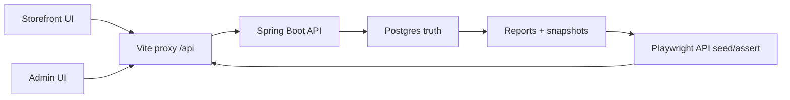

# Full FE-BE Regression Audit Plan

## Nhận Định Nhanh
Coverage hiện tại đã có nền tốt nhưng chưa đủ gọi là “full feature E2E” cho toàn bộ storefront + toàn bộ Admin:

- Backend test khá sâu: `NhaDanShop/src/test` đã cover nhiều invariant ở service/MVC như FEFO, exact batch, production, stock adjustment, Slice 7 commercial allocation, loyalty, auth/account, reports, payment webhook.
- Playwright hiện có 36 tests qua Vite proxy tại `nha-dan-pos-c091ee5b/e2e/specs`, đã cover smoke + full correctness mới: stock sau confirm, expired batch scan, commercial VAT/free-ship/reward, loyalty reserve/redeem/release, POS exact batch, profit UI vs API.
- Gap chính: chưa có Playwright full-domain cho Admin CRUD/commands và các path production/stock adjustment từ UI/API; storefront cart/checkout mới cover happy path và guard cơ bản, chưa cover đầy đủ payment methods, voucher/promo invalid states, stale quote, insufficient stock, account order/points UI sau invoice.
- Theo `docs/backend-integration-pack.md`, business-critical invariants phải khóa thêm ở E2E: `ProductBatch.remainingQty` là stock truth, expiry thuộc batch, pending-order confirm không recompute snapshot, line allocation bucket sum đúng, VAT loại shipping, reward zero revenue but stock-backed COGS, production output cost/expiry từ raw allocation, stock adjustment reverse exact trace.

## Scope Test Sẽ Viết
Tạo hoặc tách thêm các Playwright specs trong `nha-dan-pos-c091ee5b/e2e/specs`, dùng helper tại `nha-dan-pos-c091ee5b/e2e/helpers/api.ts` để seed dữ liệu thật qua API và chỉ dùng browser UI ở các luồng người dùng/Admin quan trọng.

- `full-correctness-api.spec.ts`: giữ các invariant API-first hiện có, bổ sung edge cases pricing/snapshot/report nếu thiếu.
- `full-admin-api.spec.ts` hoặc `admin-domain-api.spec.ts`: API-first regression cho Admin domains: products/categories/suppliers/customers/users, receipts, invoices, pending orders, promotions/vouchers, shipping/store settings, payment events.
- `production-stock-adjustment-api.spec.ts`: gap đã nêu: production orders + stock adjustments, API-first.
- `storefront-checkout-browser.spec.ts`: browser storefront products -> cart -> checkout -> pending payment -> account/order/points UI.
- `admin-workflows-browser.spec.ts`: browser Admin POS, goods receipt label batch, production UI smoke, stock adjustment UI create/list/detail, invoices cancel, pending orders confirm/cancel, reports UI.

## Domain Coverage Plan

### 1. Storefront, Cart, Checkout
- Seed backend catalog with sellable and non-sellable variants, active/inactive products, expiring batches, voucher/promotion fixtures.
- Browser assert product listing/detail only shows sellable variants; raw/non-sellable does not enter sales reads.
- Cart asserts backend numeric `productId`/`variantId`, stock guard, legacy invalid localStorage line removal, quantity upper bound.
- Checkout methods: `bank_transfer`, `cod`, `momo`, `zalopay` where currently supported as pending methods; assert quote -> pending order uses `quotePublicId`, payment reference/code, status, preserved `pricingBreakdownSnapshot`.
- Negative paths: stale/invalid quote, insufficient stock at submit, invalid voucher, free shipping with/without shipping fee, anonymous customer binding restrictions.

### 2. Pricing, Allocation, Snapshot Correctness
- API-first matrix with two paid lines + scoped manual/promo/voucher discounts to verify deterministic bucket allocation.
- Assert exact sums: `allocatedManualDiscount + allocatedPromotionDiscount + allocatedVoucherDiscount = allocatedMerchandiseDiscount`; sum line allocations equals invoice buckets.
- Assert line truth from integration pack: `lineGrossAmount`, `lineOwnDiscountAmount`, `lineNetRevenue`, `unitCostSnapshot`, COGS/profit.
- Assert pending-order confirm preserves snapshots and does not recompute after promotion/voucher/catalog mutation.
- Assert VAT uses merchandise net, excludes shipping, and reports exclude VAT from revenue/profit.

### 3. Inventory, Batch, Expiry, Receipts
- Seed multiple receipt batches with different expiry/cost; assert FEFO fallback consumes earliest valid batch.
- Exact `BATCH:{batchId}` POS/browser and API direct invoice: consumes selected batch, not FEFO; cancel restores exact allocation.
- Expired batch: scan is known but not sellable; sales reject under lock; stock adjustment explicit negative may allow expired per contract where applicable.
- Goods receipt create: confirmed-on-create only; fetch `GET /api/batches/receipt/{id}`; label payload uses `BATCH:{batchId}` and HSD.
- Receipt void/delete: no downstream sale path deletes/voids with proper stock/movement behavior; downstream-consumed receipt cannot be hard-deleted.

### 4. Production Orders Gap
- API-first spec for `POST /api/production-recipes`, `POST /api/production-orders/preview`, `POST /api/production-orders`, `POST /api/production-orders/{id}/void`.
- Assert raw eligibility: active batch, non-expired, active product/variant, raw `isSellable=false` allowed.
- Assert output: one finished batch, `productionOrderId`, expiry = min raw expiry, unit cost = weighted consumed cost + overhead / output qty.
- Assert movements: `production_consume`, `production_output`; inventory projection/report includes production movement.
- Void path: allowed only before downstream consumption; restores exact raw allocations; output batch zeroed/voided; reject partial/guessed void.
- Browser smoke for `/admin/production`: create recipe/preview/order/list/detail, output label `BATCH:{outputBatchId}`, void button path if stable.

### 5. Stock Adjustments Gap
- API-first spec for `/api/stock-adjustments` create/confirm/list/detail/reverse if endpoint supports reverse.
- Negative unsourced: uses `currentAdjustable` active/blocked, no expiry filter, no inactive product/variant requirement as documented.
- Negative explicit source: allows active/blocked/expired, rejects voided/depleted/archived/unknown.
- Positive increase rejects inactive product/variant.
- Reverse: exact inverse from trace, no FEFO guessing; movement source `stock_adjustment`; `ProductBatch.remainingQty` and `ProductVariant.stockQty` remain synced.
- Browser smoke for `/admin/stock-adjustments` create/list/detail and reverse if UI exposes it; otherwise API-only and mark UI gap explicitly.

### 6. Admin Domain Regression
- Products/categories/suppliers/customers/users: CRUD smoke through API and selected browser UI forms; assert role/security restrictions.
- Promotions/vouchers: Admin mutations require ADMIN; public evaluate/pick-best stateless and create no quote/order/invoice/payment/stock rows.
- Pending orders: command endpoints `mark-waiting-confirm`, `change-payment-method`, `confirm`, `cancel`; terminal states reject invalid transitions.
- Invoices: list/detail mapping, cancel logical state only, hard delete not used for completed invoices; cancel restores allocations and does not mutate commercial snapshot.
- Payment events: unmatched/recent/ignored/link flow; Casso only auto-confirms bank transfer with matching reference and amount.
- Shipping/store settings/VietQR: settings persist via backend, quote uses settings, UI has no localStorage-only truth.

### 7. Reports And Reconciliation
- For each seeded business event, compare API reports and Admin UI summaries:
  - inventory report opening/received/sold/adjusted/production/closing;
  - revenue by product/category uses persisted line net revenue;
  - profit excludes VAT and shipping from product/category revenue/profit;
  - production is not revenue until output batch is sold.
- Add cross-report reconciliation assertions: batch sum equals variant projection, invoice line sums equal report row, cancelled/voided rows excluded or reversed per contract.

## Execution Strategy
- Keep Playwright serial where shared seeded state matters; prefer unique prefixes like `E2E-FULL-${Date.now()}`.
- Use API helpers for seeding and invariant reads; use browser only where UI behavior matters.
- Add stable `data-testid` only when existing accessible labels are ambiguous.
- Classify final results per group as `PASS`, `FAIL`, `GAP`, or `CODE BUG`; do not weaken tests to pass.
- Regression commands:
  - Backend: `cd NhaDanShop; .\gradlew.bat test --no-daemon`
  - Frontend: `cd nha-dan-pos-c091ee5b; npm run build; npx vitest run`
  - E2E: backend `:8080` + Vite `:5173`, then `RUN_FE_BE_E2E=1`, `PLAYWRIGHT_BASE_URL=http://127.0.0.1:5173`, `npm run test:e2e`

## Expected Deliverables
- New/expanded Playwright specs for API-first business correctness and browser workflows.
- Expanded API helper library for production, stock adjustment, receipts/void, reports/movements, payment events.
- Minimal UI test ids only where needed.
- Vietnamese final audit report mapping each integration-pack domain to `covered / newly covered / remaining gap`.