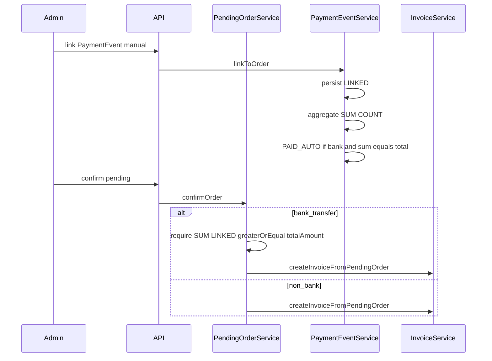

# Kế hoạch triển khai: Cột Pending Order (Hóa đơn) + Guard xác nhận bank (aggregate LINKED)

Tài liệu này là spec handoff: dev không tự quyết định thêm về aggregate, N+1, migration, hay điều kiện claim done.

---

## Ràng buộc dự án (bắt buộc)

- Chỉ local: không push, merge, deploy.
- Không reset DB; không lệnh DB destructive.
- **Không migration** trong slice này (không thêm Flyway/Liquibase). Chỉ DTO + logic + test.
- Không sửa ngoài scope: voucher, receipt, stock adjustment, combo storefront, polling/payment-settings (trừ chỗ compile bắt buộc — tránh).
- Guard backend: `confirmOrder` phải enforce bank; không chỉ FE.
- Manual link: không tự tạo HĐ, không tự trừ kho, không set CONFIRMED; có thể PAID_AUTO khi aggregate == total (đã nêu dưới).
- **Aggregate linked payment là bắt buộc** (sum mọi `PaymentEvent` status `LINKED` gắn `pendingOrderId` đó).
- **Không N+1 là bắt buộc** (list pending, list invoice: số query không tăng tuyến tính theo số dòng cho bước aggregate hoặc batch `pendingOrderCode`).
- **`pendingOrderCode` qua batch lookup là bắt buộc** sau khi load trang invoice (một query `PendingOrder` theo tập `id`).
- **Selenium full-stack** với tag `pending-payment-invoice-followup` là **bắt buộc** để báo cáo hoàn thành slice; không PASS thì không claim done; không chấp nhận skip case UX bắt buộc.

---

## Quyết định đã chốt (không còn “chọn một”)

### Bằng chứng thanh toán bank (API)

- `linkedPaymentTotal`, `linkedPaymentCount`, `paymentDelta`, `paymentLinkStatus` là **source of truth cho bằng chứng thanh toán bank** (`paymentMethod === "bank_transfer"`).
- Công thức backend (sau khi đã lọc chỉ event `LINKED` cho đúng `pendingOrderId`):
  - `linkedPaymentTotal` = SUM(`amount`) (null coalesce 0).
  - `linkedPaymentCount` = COUNT(*).
  - `paymentDelta` = `linkedPaymentTotal - pendingOrder.totalAmount` (dùng `BigDecimal` đồng nhất với entity).
  - `paymentLinkStatus` khi `bank_transfer`:
    - `NONE` nếu `linkedPaymentCount == 0`.
    - `UNDERPAID_LINKED` nếu `linkedPaymentTotal < totalAmount`.
    - `EXACT_PAID` nếu `linkedPaymentTotal == totalAmount`.
    - `OVERPAID_LINKED` nếu `linkedPaymentTotal > totalAmount`.
  - Khi **không** `bank_transfer`: luôn trả `paymentLinkStatus = "NONE"`, `paymentDelta = null`, `linkedPaymentTotal = null`, `linkedPaymentCount = 0` (hoặc null theo convention record — nhưng **không** populate under/over từ link orphan để tránh hiểu thị sai). `linkedPaymentEventId` / `linkedPaymentAmount` (latest) cũng **null** cho non-bank để UI không có dữ liệu “link” để hiển thị banner bank.

### Guard confirm

- **Chỉ** `paymentMethod === "bank_transfer"`: backend `confirmOrder` yêu cầu `linkedPaymentTotal >= totalAmount` và `linkedPaymentCount >= 1`.
- **Non-bank** (COD, `cash_on_delivery`, MoMo, ZaloPay, …): **không** áp dụng điều kiện link; không reject vì thiếu LINKED.
- **Terminal**: mọi method vẫn không confirm khi `CANCELLED` / đã `CONFIRMED` có invoice (giữ logic hiện có).

### FE `canConfirmPendingOrder`

- Chỉ dùng `paymentLinkStatus` / `linkedPaymentTotal` / `linkedPaymentCount` khi `paymentMethod === "bank_transfer"`.
- Non-bank: **không** disable nút vì các field trên (kể cả nếu DB có dữ liệu link bất thường — API đã xóa ý nghĩa link cho non-bank như trên).

### So sánh số tiền FE vs BE

- Guard UI bank: so sánh `linkedPaymentTotal` với **cùng trường** backend expose: `totalAmount` trên `PendingOrder` (adapter map `totalAmount` từ `PendingOrderResponse.totalAmount`). Không dùng `pricingBreakdownSnapshot.total` cho guard trừ khi đã chứng minh byte-identical với `totalAmount` trong mọi case — **mặc định handoff: dùng `totalAmount` từ API.**

### Casso exact

- Trong `PaymentEventService.maybeAutoConfirmCassoBankTransfer`: với đủ điều kiện exact, **bắt buộc** `attachEventToOrder` + `save` + `flush` (hoặc tương đương đảm bảo persistence) **trước** `pendingOrderService.confirmOrder` để aggregate LINKED nhìn thấy trong cùng transaction khi guard chạy.

### Hóa đơn overpaid

- `InvoiceService.createInvoiceFromPendingOrder` tiếp tục lấy tiền HĐ từ **pricing snapshot** / dòng đơn — **không** thay đổi để dùng tổng chuyển khoản dư. Acceptance: `finalAmount` / total HĐ = pending total, không revenue hóa đơn = số chuyển dư.

---

## Acceptance criteria (checklist go/no-go)

### Màn Hóa đơn (`/admin/invoices`)

- Bảng desktop có cột header **`Pending Order`** (tiếng Anh đúng chữ để khớp assert Selenium có thể dùng text hoặc `data-testid` — handoff: thêm `data-testid="invoices-col-pending-order"` trên `<th>` nếu cần assert ổn định).
- Bảng desktop **không** còn cột **`Người tạo`**.
- Hóa đơn nguồn online pending (`sourceType === "online_pending"` hoặc tương đương mapper): hiển thị `pendingOrderCode` nếu có; nếu không có code nhưng có id → **`PO #<pendingOrderId>`**.
- Hóa đơn theo `sourceType` (mapper FE/backend đồng bộ): `online_pending` nhưng không có id/code → `—`; `pos` → chữ **`POS`**; `manual` hoặc giá trị khác không gắn pending → **`—`**. **Không** hiển thị mã PO giả cho các nguồn không phải online pending.
- `createdBy` vẫn có trong API và vẫn hiển thị ở **drawer chi tiết / in** như trước (không xóa khỏi response).

### Bank pending (`bank_transfer`)

- Không có LINKED: nút Xác nhận disabled + tooltip/lý do; `POST` confirm (hoặc endpoint hiện hành) **reject**; **không** tạo HĐ; **không** stock movement.
- Underpaid aggregate: disabled + reject; không HĐ; không stock movement.
- Exact aggregate hoặc overpaid aggregate: confirm **enabled** (đủ điều kiện status); backend **allow**; HĐ một lần qua `createInvoiceFromPendingOrder`; tổng tiền HĐ **bằng** pending total (snapshot), **không** dùng phần dư chuyển khoản làm revenue HĐ.
- Nhiều `PaymentEvent` LINKED: tổng SUM đúng; PAID_AUTO chỉ khi SUM **==** total (không dùng single event).

### Non-bank (COD / `cash_on_delivery` / MoMo / ZaloPay)

- Không disable Xác nhận vì thiếu manual link / vì `paymentLinkStatus`.
- Vẫn tôn trọng terminal (`cancelled`, đã confirmed, …).

### Casso webhook

- Exact: vẫn auto-confirm qua **`PendingOrderService.confirmOrder`** (canonical) sau khi đã link event trong DB (thứ tự ở trên).
- Under / over: **không** auto-confirm; đơn chờ manual link đến khi aggregate `>= totalAmount` mới confirm được.

---

## Hiện trạng code (audit — tham chiếu file)

- [`PendingOrderResponse.java`](c:/Work/NhaDanShopBT/NhaDanShop/src/main/java/com/example/nhadanshop/dto/PendingOrderResponse.java): có `paymentLinkStatus`, `paymentDelta`, latest fields; thiếu aggregate.
- [`PendingOrderService.java`](c:/Work/NhaDanShopBT/NhaDanShop/src/main/java/com/example/nhadanshop/service/PendingOrderService.java): `derivePaymentLink` theo một event; `confirmOrder` chưa guard bank.
- [`PaymentEventService.java`](c:/Work/NhaDanShopBT/NhaDanShop/src/main/java/com/example/nhadanshop/service/PaymentEventService.java): `maybeMarkPaidAutoAfterManualLink` theo một `amount`; Casso gọi `confirmOrder` trước `attachEventToOrder`.
- [`SalesInvoiceResponse`](c:/Work/NhaDanShopBT/NhaDanShop/src/main/java/com/example/nhadanshop/dto/SalesInvoiceResponse.java) / [`DtoMapper`](c:/Work/NhaDanShopBT/NhaDanShop/src/main/java/com/example/nhadanshop/service/DtoMapper.java): chưa `pendingOrderCode`.
- [`Invoices.tsx`](c:/Work/NhaDanShopBT/nha-dan-pos-c091ee5b/src/pages/admin/Invoices.tsx): cột Người tạo.
- [`PendingOrders.tsx`](c:/Work/NhaDanShopBT/nha-dan-pos-c091ee5b/src/pages/admin/PendingOrders.tsx): drawer `isPendingLike` thiếu `paid_auto` so với list.

---

## Thiết kế kỹ thuật (bắt buộc làm đúng)

### Repository

- Thêm method JPQL ví dụ: `SELECT e.linkedPendingOrder.id, COALESCE(SUM(e.amount),0), COUNT(e) FROM PaymentEvent e WHERE e.linkedPendingOrder.id IN :ids AND e.status = LINKED GROUP BY e.linkedPendingOrder.id`.
- Thêm method batch “latest LINKED per order”: có thể dùng query với `linkedAt` MAX per group hoặc fetch list `findByLinkedPendingOrder_IdInAndStatus` một lần rồi **reduce trong Java** theo `orderId` (O(events)) — chấp nhận được vì một trang pending giới hạn `pageSize`; **không** được `find…` trong `for` theo từng id đơn.

### PendingOrderService

- `mapToPendingOrderResponse`: nhận struct aggregate + optional latest event; nếu không bank → zero out link fields như mục “Quyết định đã chốt”.
- `confirmOrder`: sau load order, trước `createInvoiceFromPendingOrder`, branch bank + aggregate (một query sum/count theo `order.getId()` hoặc tái dùng kết quả đã có trong cùng txn nếu refactor cho gọn — **không** loop query).

### PaymentEventService

- `linkToOrder`: sau save, gọi service/repo tính lại aggregate; cập nhật PAID_AUTO theo aggregate == total.
- Casso: reorder attach → flush → `confirmOrder` cho exact path.

### InvoiceService + DTO

- Thêm `pendingOrderCode` vào `SalesInvoiceResponse`; mọi chỗ construct record phải compile (grep constructor).
- `listInvoicesAdmin`: collect distinct `pendingOrderId` từ page content → `pendingOrderRepository.findAllById(ids)` (hoặc custom `findOrderNoByIdIn`) **một query** → map vào response list.

### Frontend

- `canConfirmPendingOrder`: định nghĩa rõ status được phép mở dialog confirm (đồng bộ backend: `pending_payment`, `waiting_confirm`, `paid_auto` cho admin confirm — align list hiện tại); terminal → false; bank thêm điều kiện aggregate.
- `ConfirmDialog`: nếu `!canConfirm` thì nút primary disabled và `onConfirm` no-op (defense in depth).
- Banner bank: copy cố định:
  - No link: `Chưa có giao dịch ngân hàng đã gắn — chưa thể xác nhận`
  - Under: `Đã gắn giao dịch — thiếu Xđ cần đối soát` (X = format VND từ `abs(paymentDelta)`)
  - Exact: `Đã gắn giao dịch — khớp đúng số tiền`
  - Over: `Đã gắn giao dịch — dư Xđ cần hoàn/đối soát`
  - Multi (`linkedPaymentCount > 1`): prefix `Đã gắn N giao dịch · Tổng đã gắn …` + cùng logic under/exact/over (có thể gộp một chuỗi duy nhất để assert Selenium).

---

## Backend tests — tên method / class và assert tối thiểu

Triển khai dưới dạng `@Test void <name>()` (hoặc `@ParameterizedTest` nhưng báo cáo dùng đúng tên dưới). Ưu tiên class hiện có [`PaymentEventIntegrationTest`](c:/Work/NhaDanShopBT/NhaDanShop/src/test/java/com/example/nhadanshop/service/PaymentEventIntegrationTest.java) hoặc tách `PendingOrderBankConfirmIntegrationTest` nếu file quá lớn.

| Tên test | Assert tối thiểu |
|----------|-------------------|
| `bank_no_link_confirm_rejected` | Bank pending, 0 LINKED → `confirmOrder` throw hoặc HTTP layer 4xx; không có `SalesInvoice` mới |
| `bank_underpaid_manual_link_confirm_rejected` | 2 link tổng < total hoặc 1 link < total → reject |
| `bank_exact_manual_link_confirm_allowed` | aggregate == total → confirm OK; đúng 1 invoice |
| `bank_overpaid_manual_link_confirm_allowed_invoice_total_equals_pending` | aggregate > total → confirm OK; `invoice.totalAmount` (hoặc final khớp spec pricing) == `order.totalAmount`, không bằng overpay sum |
| `bank_multiple_manual_links_underpaid_rejected` | Hai event, tổng < total → reject |
| `bank_multiple_manual_links_exact_allowed` | Hai event, tổng == total → OK |
| `bank_multiple_manual_links_overpaid_allowed` | Hai event, tổng > total → OK; invoice total == pending |
| `pending_response_aggregates_linked_payment_total_count_delta` | GET list/detail pending: `linkedPaymentTotal`, `count`, `paymentDelta`, `paymentLinkStatus` khớp fixture |
| `manual_link_exact_sets_paid_auto_no_invoice` | Sau link aggregate == total, status `PAID_AUTO`, `invoice == null` |
| `manual_link_overpaid_links_review_not_paid_auto_no_invoice` | Over aggregate, không PAID_AUTO, chưa invoice |
| `manual_link_underpaid_links_review_not_paid_auto_no_invoice` | Under, không PAID_AUTO |
| `cod_confirm_not_blocked_by_payment_link_guard` | COD không LINKED → confirm OK |
| `momo_confirm_not_blocked_by_payment_link_guard` | MoMo tương tự |
| `zalopay_confirm_not_blocked_by_payment_link_guard` | ZaloPay tương tự |
| `casso_exact_webhook_still_auto_confirms` | Webhook exact → confirmed + có invoice |
| `casso_underpaid_waits_for_manual_link` | Under → không confirmed; sau link đủ tiền mới allow (có thể tách 2 bước hoặc gộp với test dưới) |
| `casso_overpaid_waits_for_manual_link` | Over → không auto-confirm |
| `invoice_response_includes_pending_order_code` | GET invoice có `pendingOrderCode` khi có mapping |
| `invoice_response_keeps_pending_order_id_fallback` | Xóa/không tìm thấy PO row → vẫn có `pendingOrderId`, `pendingOrderCode` null |
| `invoice_list_pending_order_code_no_n_plus_one` | Một page list invoices với K hàng có `pendingOrderId`: assert số query tới `PendingOrder` không vượt ngưỡng cố định (ví dụ ≤ 2) dùng Hibernate Statistics hoặc cách tương đương đã dùng trong repo |

---

## Frontend tests (Vitest / RTL theo convention repo)

- **Adapter pending**: map đúng `linkedPaymentTotal`, `linkedPaymentCount`, `paymentDelta`, `linkedPaymentEventId`, `linkedPaymentAmount` từ JSON thô.
- **Invoice mapper**: `pendingOrderCode` + fallback `pendingOrderId` → field UI.
- **`canConfirmPendingOrder`**: bảng truth bank no-link false; under false; exact true; over true; COD/MoMo/ZaloPay true khi status confirmable và không terminal.
- **`Invoices.tsx`**: có text/header Pending Order; không render header Người tạo trên bảng (có thể assert `queryByText('Người tạo')` null trong desktop table).

---

## Selenium full-stack — tag và artifact paths

- **Tag bắt buộc trên spec module**: `pending-payment-invoice-followup` (khai báo `tags: [...]` trong `export default` của file spec `.spec.mjs`).
- **Thư mục artifact** (theo [`config.mjs`](c:/Work/NhaDanShopBT/nha-dan-pos-c091ee5b/automation/selenium/config.mjs)): repo frontend `nha-dan-pos-c091ee5b/automation-output/`.
- **Sau mỗi lần chạy**: ghi nhận đường dẫn đầy đủ:
  - Summary: `C:\Work\NhaDanShopBT\nha-dan-pos-c091ee5b\automation-output\automation-summary.json`
  - Screenshot/HTML/log lỗi: dưới `automation-output/` (convention [`run-selenium.mjs`](c:/Work/NhaDanShopBT/nha-dan-pos-c091ee5b/automation/selenium/run-selenium.mjs) — ghi đúng path file sinh ra trong báo cáo cuối).
- **Mỗi case dưới đây**: trong code spec, ghi `caseId` trùng tên; emit vào summary matrix (PASS/FAIL, không skip UX bắt buộc).

### Case matrix (bắt buộc implement + assert)

#### `invoices_show_pending_order_column`

- **Route**: `/admin/invoices` (sau login admin).
- **API**: (tuỳ flow) tạo/lấy pending → confirm → `GET /api/invoices` hoặc endpoint list admin đang dùng — assert JSON có `pendingOrderCode` hoặc `pendingOrderId` cho dòng vừa confirm.
- **UI**: header cột Pending Order visible; `Người tạo` không có trên table; một dòng có badge/text mã PO hoặc `PO #id`.
- **Hành vi**: click badge/link → điều hướng `/admin/pending-orders?q=...` và thấy đơn (visible trong list hoặc highlight).
- **Artifact**: screenshot step cuối; dòng tương ứng trong `automation-summary.json`.

#### `bank_pending_no_link_disables_confirm`

- **Route**: `/admin/pending-orders` và mở detail nếu cần.
- **API**: tạo bank pending (API hiện có hoặc fixture); `GET` detail/list → `paymentLinkStatus=NONE`, `linkedPaymentCount=0`; gọi API confirm → 4xx.
- **UI**: nút Xác nhận disabled + tooltip/title chứa ý “chưa gắn” / copy spec.
- **Invoice**: không có HĐ mới (query list/count hoặc API).
- **Artifact**: screenshot + log network snippet trong summary hoặc file log bên cạnh.

#### `bank_manual_link_underpaid_disables_confirm`

- **Setup**: total cố định ví dụ `54000`; link một event `53999`.
- **API**: response pending `UNDERPAID_LINKED`, `linkedPaymentTotal` đúng; confirm reject.
- **UI**: thiếu `1đ` (hoặc đơn vị format VND đúng locale app); confirm disabled.
- **Artifact**: như trên.

#### `bank_manual_link_exact_enables_confirm`

- **Setup**: link đúng `54000`.
- **API**: `EXACT_PAID` hoặc `PAID_AUTO` status sau link; trước confirm không có invoice id trên pending.
- **UI**: confirm enabled; sau confirm toast/route phù hợp.
- **Invoice**: một HĐ; total = pending total.
- **Artifact**: screenshot + summary.

#### `bank_manual_link_overpaid_enables_confirm`

- **Setup**: link `54001`.
- **API/UI**: delta +1đ; cảnh báo dư; confirm enabled.
- **Invoice**: total HĐ vẫn `54000`.
- **Artifact**: đầy đủ.

#### `bank_multiple_links_underpaid_still_disabled`

- **Setup**: link `20000` + `30000` vs total `54000`.
- **API**: `linkedPaymentCount=2`, total `50000`, under; confirm reject.
- **UI**: disabled.
- **Artifact**: đầy đủ.

#### `bank_multiple_links_exact_enables_confirm`

- **Setup**: `30000` + `24000`.
- **API**: count 2, total `54000`; confirm OK; đúng 1 invoice.
- **Artifact**: đầy đủ.

#### `bank_multiple_links_overpaid_enables_confirm`

- **Setup**: `30000` + `25000`.
- **API/UI**: dư `1000đ`; enabled.
- **Invoice**: total `54000`.
- **Artifact**: đầy đủ.

#### `cod_confirm_not_disabled_without_link`

- **Route**: pending orders.
- **API/UI**: COD (hoặc `cash_on_delivery`) không link → confirm enabled; gọi confirm thành công (hoặc mock đến bước cho phép).
- **Artifact**: đầy đủ.

#### `momo_confirm_not_disabled_without_link`

- Giống COD với `paymentMethod=momo`.

#### `zalopay_confirm_not_disabled_without_link`

- Giống với `zalopay`.

#### `casso_exact_webhook_auto_confirms`

- **Route**: có thể chỉ cần API webhook + assert DB/UI sau refresh; nếu UI bắt buộc thì thêm bước admin list.
- **API**: `POST /api/webhooks/casso` với secure token đọc từ `application-local.properties` (không hardcode token vào repo — đọc env `CASSO_WEBHOOK_SECURE_TOKEN` lúc chạy từ file local theo Run Procedure).
- **Assert**: order `CONFIRMED` + có invoice; event LINKED.
- **Artifact**: log request/response mẫu (mask token trong log báo cáo nếu cần).

#### `casso_underpaid_requires_manual_link_before_confirm`

- Webhook underpaid → không confirmed; UI confirm disabled; sau manual link aggregate đủ → enabled và confirm tạo HĐ.

#### `casso_overpaid_requires_manual_link_before_confirm`

- Webhook overpaid → không auto-confirm; manual link event (aggregate >= total) → confirm enabled, cảnh báo dư; invoice total = pending.

---

## Run procedure (bắt buộc trước Selenium)

### Preflight: kill chỉ port 8080 và 5173

- Dùng script PowerShell user đã cung cấp (Get-NetTCPConnection → Stop-Process).
- **Không** stop Docker / Postgres / Redis / dịch vụ khác.

### Backend

```powershell
cd C:\Work\NhaDanShopBT\NhaDanShop
.\gradlew bootRun --args="--spring.profiles.active=local"
```

```powershell
Invoke-WebRequest http://127.0.0.1:8080/actuator/health
```

### Frontend

```powershell
cd C:\Work\NhaDanShopBT\nha-dan-pos-c091ee5b
npm run dev -- --host 127.0.0.1 --port 5173
```

```powershell
Invoke-WebRequest http://127.0.0.1:5173
```

### Casso token (nếu spec gọi webhook)

- Đọc `casso.webhook-secure-token` từ `C:\Work\NhaDanShopBT\NhaDanShop\src\main\resources\application-local.properties`.
- Export `CASSO_WEBHOOK_SECURE_TOKEN` (hoặc header tương ứng test đang dùng) **không tự bịa**.

### Selenium

```powershell
cd C:\Work\NhaDanShopBT\nha-dan-pos-c091ee5b
$env:RUN_AUTOMATION = "1"
$env:BASE_URL = "http://127.0.0.1:5173"
$env:API_BASE_URL = "http://127.0.0.1:8080"
$env:ADMIN_USERNAME = "admin"
$env:ADMIN_PASSWORD = "admin123"
npm run test:automation -- --run --tags=pending-payment-invoice-followup
```

---

## Lệnh test bắt buộc (báo cáo PASS/FAIL theo đúng lệnh)

```powershell
cd C:\Work\NhaDanShopBT\NhaDanShop
.\gradlew compileJava
.\gradlew test --tests "*PendingOrder*" --tests "*PaymentEvent*" --tests "*SalesInvoice*" --tests "*Invoice*"
```

```powershell
cd C:\Work\NhaDanShopBT\nha-dan-pos-c091ee5b
npm run build
npm run test:automation -- --run --tags=pending-payment-invoice-followup
```

Vitest (bắt buộc khi có test file mới hoặc cập nhật):

```powershell
cd C:\Work\NhaDanShopBT\nha-dan-pos-c091ee5b
npm run test
```

Nếu chỉ chạy một file (ví dụ sau khi thêm `canConfirmPendingOrder.test.ts`):

```powershell
cd C:\Work\NhaDanShopBT\nha-dan-pos-c091ee5b
npm run test -- path/to/file.test.ts
```

---

## Final report format (tiếng Việt, sau khi implement)

1. **Summary từng mục**: cột PO Hóa đơn (xong/chưa); guard bank (xong/chưa); non-bank không block (xong/chưa); multi-link aggregate (xong/chưa); Casso exact/under/over (xong/chưa).
2. **Root cause**: ngắn gọn 3 dòng (visibility invoice; guard confirm; aggregate link).
3. **Files changed**: nhóm backend / frontend / test / migration: **none**.
4. **API evidence**: paste hoặc file nhỏ JSON mẫu: pending no-link; under/exact/over; multi-link; confirm reject/allow; invoice list có `pendingOrderCode`; Casso ba nhánh.
5. **Selenium evidence**: bảng case → PASS/FAIL; route; path screenshot/log; path `automation-output\automation-summary.json`; không có case UX bắt buộc bị skip mà vẫn PASS.
6. **Business truth**: đối chiếu từng bullet acceptance ở trên (câu xác nhận có/không).
7. **Tests run**: dán nguyên lệnh PowerShell đã chạy + PASS/FAIL từng lệnh.
8. **Remaining debt**: chỉ nợ thật; **không** ghi “debt” để che FAIL.

---

## Nguyên nhân gốc (tóm tắt bảng)

| Vấn đề | Gốc trong code |
|--------|----------------|
| Multi-link / under-over sai | Chỉ xét một `PaymentEvent` mới nhất; PAID_AUTO theo amount lần link cuối |
| Bank thiếu chứng từ vẫn ra HĐ | `confirmOrder` không kiểm tra `bank_transfer` + aggregate |
| Casso exact có thể gãy sau guard | `confirmOrder` trước `attachEventToOrder` |
| Cột Hóa đơn / mã PO | UI Người tạo; API thiếu `pendingOrderCode` trên list |
| Drawer `paid_auto` | `isPendingLike` cục bộ trong detail khác list |

---

## Luồng sau thay đổi (mermaid)



---

## Việc làm theo thứ tự (execution checklist)

1. Repository: aggregate query + batch latest (một lần fetch list rồi reduce, hoặc query nhóm — không query trong for theo orderId).
2. `PendingOrderResponse` + mapping + non-bank zeroing + `confirmOrder` guard.
3. `PaymentEventService`: aggregate PAID_AUTO; Casso reorder.
4. `SalesInvoiceResponse` + `InvoiceService` batch `pendingOrderCode`.
5. FE: adapters, `canConfirmPendingOrder`, `Invoices`, `PendingOrders` (kể cả drawer `paid_auto`), banner copy.
6. Tests: JUnit matrix → `npm run build` → Vitest → full-stack Selenium với env ở trên.
7. Viết Final Report theo format mục trên.
