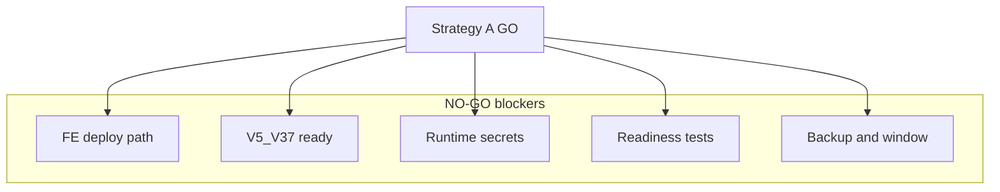

# Gộp sub-plan secrets vào plan rollout chính

**Phạm vi duy nhất:** [`.cursor/plans/update-deploy-pos-fe-prod-rollout_09f46bac.plan.md`](c:/Work/NhaDanShopBT/.cursor/plans/update-deploy-pos-fe-prod-rollout_09f46bac.plan.md)

**Không sửa:** code, [`.github/workflows/deploy.yml`](c:/Work/NhaDanShopBT/.github/workflows/deploy.yml), config, secrets thật, test/backup/deploy/push, hay tạo plan file mới.

**Nguồn gộp:** [`.cursor/plans/update_rollout_plan_doc_558614f4.plan.md`](c:/Work/NhaDanShopBT/.cursor/plans/update_rollout_plan_doc_558614f4.plan.md) (chỉ dùng làm spec; file sub-plan giữ nguyên).

**Repo facts (đã xác minh, ghi trong plan):**
- [`deploy.yml`](c:/Work/NhaDanShopBT/.github/workflows/deploy.yml): `bootJar -x test`, `npm ci` + `npm run build` (không `npm test`); systemd ~209–221 chỉ DB/R2/JWT/CORS.
- [`application.properties`](c:/Work/NhaDanShopBT/NhaDanShop/src/main/resources/application.properties): SMTP + Goong hardcoded; GHN/Casso đã placeholder env; `app.public-base-url` đã `${APP_PUBLIC_BASE_URL:...}`.

---

## 1. Frontmatter todos

Cập nhật YAML đầu file:

| Todo id | Nội dung |
|---------|----------|
| `edit-deploy-yml` | Giữ: FE path `NhaDanShopUi` → `nha-dan-pos-c091ee5b`; **note** follow-up: thêm systemd `Environment=` cho runtime secrets (mục Production runtime secrets plan). |
| `edit-dev-start` | Giữ nguyên. |
| `pre-push-tests` | **Tách rõ:** readiness gate trước push — `.\gradlew.bat test` / `./gradlew test`, `npm ci` + `npm test` trong `nha-dan-pos-c091ee5b`; **không** nhầm với deploy artifact build (skip tests). |
| `prod-runtime-secrets` | **Mới:** chuẩn hóa `application.properties` placeholders; plan/deploy workflow env lines; GitHub Secrets checklist; runtime verify SMTP/GHN/Casso/Goong/VietQR (B.1–B.4 trong plan). |
| `prod-rollout` | Giữ Strategy A A→E; **bổ sung gate:** secrets checklist + NO-GO cho tới backup/window/tests. |

`overview` frontmatter: thêm một câu — Strategy A hiện **NO-GO** cho tới secrets + readiness + backup/window.

---

## 2. Mục 1 Summary — thêm readiness + blocker

Sau đoạn **Lưu ý pipeline** (hoặc cuối Summary), thêm:

**Readiness (Strategy A): `NO-GO`** — không push/coi GO cho tới khi đủ [Readiness classification](#readiness-classification-strategy-a) (mục mới trước Deliverable).

**Blocker: Production runtime secrets**
- [`application.properties`](c:/Work/NhaDanShopBT/NhaDanShop/src/main/resources/application.properties) còn hardcode SMTP (`spring.mail.*`) và `goong.rest-api-key`.
- [`deploy.yml`](c:/Work/NhaDanShopBT/.github/workflows/deploy.yml) chưa truyền qua systemd: `MAIL_*`, `APP_PUBLIC_BASE_URL`, `MANAGEMENT_HEALTH_MAIL_ENABLED`, `GHN_*`, `CASSO_*`, `GOONG_REST_API_KEY`, optional `VIETQR_IMAGE_BASE_URL` / `GHN_FROM_DISTRICT_ID`.
- Nếu SMTP/Goong trong repo là credential thật → **rotate/revoke** ngoài hệ thống (đã lộ source).

**Deploy artifact build policy (tóm tắt):** deploy workflow không chạy test gate; backend `bootJar -x test`, FE `npm ci` + `npm run build` only — chi tiết mục riêng sau CI/CD.

Giữ nguyên toàn bộ nội dung Summary hiện có (FE path, V4→V37, Strategy A warning).

---

## 3. Sau mục 2 (CI/CD) — hai mục mới

### 3.1 `## Production runtime secrets plan`

Đặt **ngay sau** mục 2 (sau bảng `deploy.yml` + ghi chú YAML), **trước** mục 3 Local dev.

#### 2.x.1 Config changes (plan-level, chưa implement)

Bảng chuẩn hóa `application.properties`:

| Nhóm | Target |
|------|--------|
| SMTP | `spring.mail.host=${MAIL_HOST:}`, `port=${MAIL_PORT:587}`, `username=${MAIL_USERNAME:}`, `password=${MAIL_PASSWORD:}`, `from=${MAIL_FROM:${MAIL_USERNAME:}}`; giữ smtp auth/starttls; `management.health.mail.enabled=${MANAGEMENT_HEALTH_MAIL_ENABLED:true}` — **ghi quyết định** prod: `false` khi SMTP chưa sẵn sàng để tránh `/actuator/health` DOWN |
| Public URL | `app.public-base-url=${APP_PUBLIC_BASE_URL:http://localhost:5173}` — prod = `http://<EC2_HOST>` hoặc HTTPS domain |
| GHN | Giữ `${GHN_TOKEN:}`, `${GHN_SHOP_ID:}`; thêm optional `ghn.from-district-id=${GHN_FROM_DISTRICT_ID:}` |
| Casso | Giữ webhook token/checksum placeholders |
| Goong | `goong.rest-api-key=${GOONG_REST_API_KEY:}` (bỏ hardcode) |
| VietQR | Giữ URL public hoặc `vietqr.image-base-url=${VIETQR_IMAGE_BASE_URL:https://img.vietqr.io/image}` |

Cảnh báo rotate nếu key thật đã commit.

**Gate:** Strategy A không GO cho tới config không hardcode SMTP/Goong.

#### 2.x.2 Deploy workflow systemd env (plan-level)

Liệt kê `Environment=` cần thêm vào block ghi systemd (~209+) trong `deploy.yml`, map từ GitHub Secrets:

**Bắt buộc / gần-bắt-buộc:** `MAIL_HOST`, `MAIL_PORT`, `MAIL_USERNAME`, `MAIL_PASSWORD`, `MAIL_FROM`, `APP_PUBLIC_BASE_URL`, `MANAGEMENT_HEALTH_MAIL_ENABLED`, `GHN_TOKEN`, `GHN_SHOP_ID`, `CASSO_WEBHOOK_SECURE_TOKEN`, `CASSO_WEBHOOK_CHECKSUM_KEY`, `GOONG_REST_API_KEY`

**Optional:** `GHN_FROM_DISTRICT_ID`, `VIETQR_IMAGE_BASE_URL`

Pseudocode YAML (plan only):

```yaml
"Environment=\"MAIL_HOST=${{ secrets.MAIL_HOST }}\"" \
"Environment=\"MAIL_PORT=${{ secrets.MAIL_PORT }}\"" \
# ... full list
```

**Log safety:** giữ `grep -v`; mở rộng pattern: `PASSWORD|SECRET|KEY|TOKEN|GHN|CASSO|GOONG|MAIL`.

#### 2.x.3 GitHub Secrets checklist

Bullet checklist (14 items), ví dụ:
- `MAIL_HOST`, `MAIL_PORT`, `MAIL_USERNAME`, `MAIL_PASSWORD`, `MAIL_FROM`
- `APP_PUBLIC_BASE_URL`, `MANAGEMENT_HEALTH_MAIL_ENABLED`
- `GHN_TOKEN`, `GHN_SHOP_ID`, optional `GHN_FROM_DISTRICT_ID`
- `CASSO_WEBHOOK_SECURE_TOKEN`, `CASSO_WEBHOOK_CHECKSUM_KEY`
- `GOONG_REST_API_KEY`, optional `VIETQR_IMAGE_BASE_URL`

Ghi rõ: tạo trong GitHub **Settings → Secrets**; không sync từ local `.env`.

#### 2.x.4 Runtime verification (tham chiếu checklist D)

- **SMTP:** forgot/reset không fail thiếu config; mail health không làm health DOWN nếu chưa bật SMTP.
- **GHN:** quote shipping — không “missing GHN_TOKEN”.
- **Casso:** `/api/webhooks/casso`; dashboard URL prod đúng; token/checksum configured.
- **Goong:** autocomplete không “Goong API key not configured”.
- **VietQR:** QR image URL đúng.

### 3.2 `## Deploy artifact build policy`

Đặt sau **Production runtime secrets plan** (hoặc cuối mục secrets).

- **Backend deploy build (giữ):** `./gradlew bootJar -x test --no-daemon` — không đổi sang `./gradlew test` trong deploy job.
- **Frontend deploy build (giữ):** `npm ci` + `npm run build` — **không** `npm test` trong deploy EC2.
- Tests = **pre-push readiness** / CI regression riêng; operator có thể override có ý thức — không chặn artifact build.

Align với workflow hiện tại (document policy, không yêu cầu đổi code nếu đã đúng).

---

## 4. Mục 4 Strategy A checklist — bổ sung (không xóa A–E)

### A. Freeze / scope control
- **Trước push:** GitHub Secrets checklist (mục 2.x.3) **hoàn tất**.
- **Không push `main`** nếu chưa secrets + **final backup** + **maintenance window** (B + gate secrets).
- Scope tối thiểu CI/CD: `deploy.yml`, `dev-start.ps1`.
- Khi làm secrets: thêm file được phép `application.properties` + mở rộng `deploy.yml` systemd — **user approve** nếu vượt scope FE-path-only.
- Nếu stage ngoài scope: **liệt kê file** trong runbook/PR và cần user approve.

### C. Push / deploy
- Thêm dòng: chỉ push sau secrets checklist + mục B.

### D. Post-deploy verification
- Thêm bullet tham chiếu runtime verify (mục 2.x.4).

Giữ nguyên toàn bộ A–E hiện có (backup, row counts, failure handling, Strategy B note).

---

## 5. Mục 5 Test plan — tách hai lớp

Cấu trúc mới:

**5.1 Pre-push readiness tests (operator gate — Strategy A)**
- Backend: `gradlew test` (Windows/Linux như hiện tại).
- Frontend: `npm ci`, `npm run build`, **`npm test`**.
- Ghi: đây là gate **trước** quyết định push; test fail → **NO-GO** dù deploy build skip tests.

**5.2 Deploy workflow artifact build (EC2)**
- Backend: `bootJar -x test` only — trỏ mục Deploy artifact build policy.
- Frontend: `npm ci` + `npm run build` only — **không** `npm test`.

**5.3 Sau production deploy** — giữ checklist hiện tại (Actions, health, Flyway).

---

## 6. Mục 6 Risks — sửa + thêm

- **Sửa** dòng “plan này không đụng secrets” → “plan này **lập kế hoạch** secrets; triển khai secrets là **prerequisite** Strategy A”.
- **Thêm:** secrets hardcoded + workflow thiếu env → mail/GHN/Casso/Goong/VietQR/public URL sai hoặc lộ; Strategy A **NO-GO** nếu secrets plan chưa hoàn tất.

Giữ các risk migration/backup/Strategy A/B hiện có.

---

## 7. Mục 7 Acceptance criteria — bổ sung

Thêm bullets:
- Config không hardcode SMTP/Goong secrets.
- Deploy workflow (khi implement) truyền env runtime cần thiết qua systemd.
- GitHub Secrets checklist done.
- Deploy backend vẫn `bootJar -x test`; frontend deploy không chạy `npm test`.
- Readiness Strategy A vẫn **`NO-GO`** cho tới khi đủ 5 điều kiện Readiness classification.

Giữ acceptance FE path, dev-start, runbook A–E, gate backup/window.

---

## 8. Mục mới: `## Readiness classification (Strategy A)`

Đặt **trước** `## Deliverable cho agent triển khai sau`.

**Hiện tại: `NO-GO`** cho tới khi **tất cả**:

1. FE deploy path pass (`deploy.yml` + `dev-start.ps1`).
2. Migration coverage V5..V37 (dry-run PASS; prod chưa migrate).
3. Production runtime secrets: config + deploy env + GitHub Secrets checklist.
4. Readiness tests / override decision xong (`gradlew test`, `npm test` — không trong deploy artifact build).
5. Final backup + maintenance window sẵn sàng.

Optional mermaid (từ sub-plan):



---

## 9. Deliverable — một dòng bổ sung

Item agent: sau khi user duyệt plan doc, triển khai code/workflow theo todos; **không** GO production trước Readiness classification.

---

## 10. Sau khi user duyệt plan này — thực thi doc merge

1. Apply StrReplace/section inserts vào **đúng** file chính theo thứ tự section 1–9.
2. Renumber headings nếu cần (ví dụ mục 2.1 secrets có thể là `## 2.1` hoặc `## Production runtime secrets plan` độc lập — ưu tiên tiêu đề user yêu cầu, không phá numbering 3–7 hiện có).
3. Trả **summary 4 bullet** cho user:
   - Blocker đã cập nhật ở đâu (Summary + Risks + Readiness).
   - Secrets checklist ở đâu (mục Production runtime secrets plan § GitHub Secrets).
   - Deploy skip-test policy ở đâu (Deploy artifact build policy + Test plan §5.2).
   - Còn NO-GO blockers nào (5 điều kiện Readiness classification).

**Không** xóa Strategy A checklist; **không** sửa sub-plan file hay code.
