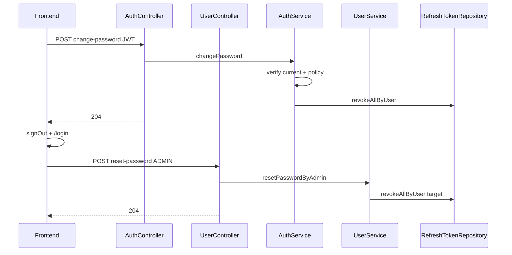

# Plan: Đổi / reset mật khẩu (customer, admin/staff)

## Hiện trạng (đã khảo sát)

| Khả năng | Trạng thái |
|----------|------------|
| Email forgot/reset (`POST /api/auth/reset-password`) | Có — [`AuthService.resetPasswordWithToken`](NhaDanShop/src/main/java/com/example/nhadanshop/service/AuthService.java) đã gọi `refreshTokenRepo.revokeAllByUser` |
| Self-change khi đã login | **Chưa có** |
| Admin reset qua endpoint riêng | **Chưa có** — [`UserService.updateUser`](NhaDanShop/src/main/java/com/example/nhadanshop/service/UserService.java) cho phép set password qua `PUT` nhưng **không** revoke refresh tokens |
| UI admin users “Đổi mật khẩu” | Mở [`UserFormDrawer`](nha-dan-pos-c091ee5b/src/components/shared/UserFormDrawer.tsx) (sai luồng) — cần thay bằng dialog reset riêng |

**Security routing (không cần sửa nếu endpoint đúng prefix):**

- `POST /api/auth/change-password` → rơi vào `.requestMatchers("/api/auth/**").authenticated()` trong [`SecurityConfig`](NhaDanShop/src/main/java/com/example/nhadanshop/security/SecurityConfig.java)
- `POST /api/admin/users/{id}/reset-password` → `.requestMatchers("/api/admin/**").hasRole("ADMIN")`



---

## A. Backend — self-change

### Files mới

- [`NhaDanShop/.../dto/ChangePasswordRequest.java`](NhaDanShop/src/main/java/com/example/nhadanshop/dto/) — record: `currentPassword`, `newPassword`, `confirmPassword` (`@NotBlank` cả 3)

### Files sửa

| File | Thay đổi |
|------|----------|
| [`AuthController.java`](NhaDanShop/src/main/java/com/example/nhadanshop/controller/AuthController.java) | `POST /api/auth/change-password` → `authService.changePassword(authentication.getName(), req)` → `204` |
| [`AuthService.java`](NhaDanShop/src/main/java/com/example/nhadanshop/service/AuthService.java) | Method `@Transactional changePassword(String username, ChangePasswordRequest req)` |

**Logic `AuthService.changePassword` (mirror `resetPasswordWithToken` + verify current):**

1. `userRepo.findByUsername(username)` → không có: `BadCredentialsException` message chung (auth-safe, không leak existence nếu đã authenticated thì luôn có user)
2. `!passwordEncoder.matches(current, hash)` → `BadCredentialsException("Mật khẩu hiện tại không đúng")`
3. `newPassword` ≠ `confirmPassword` → `IllegalArgumentException("Xác nhận mật khẩu không khớp")`
4. `PasswordPolicy.validate(newPassword, username)`
5. `passwordEncoder.matches(newPassword, hash)` → `IllegalArgumentException("Mật khẩu mới phải khác mật khẩu cũ")`
6. `encode`, `save`, `refreshTokenRepo.revokeAllByUser(user)`
7. Không log password/token

---

## B. Backend — admin reset (endpoint chốt)

`UserController` giữ `@RequestMapping("/api/admin/users")` — thêm:

```java
@PostMapping("/{id}/reset-password")
```

**Full path (acceptance):** `POST /api/admin/users/{id}/reset-password` → `204 No Content`.

### Files mới

- [`AdminResetPasswordRequest.java`](NhaDanShop/src/main/java/com/example/nhadanshop/dto/) — `newPassword`, `confirmPassword`

### Files sửa

| File | Thay đổi |
|------|----------|
| [`UserController.java`](NhaDanShop/src/main/java/com/example/nhadanshop/controller/UserController.java) | `@PostMapping("/{id}/reset-password")` trên class mapping `/api/admin/users` |
| [`UserService.java`](NhaDanShop/src/main/java/com/example/nhadanshop/service/UserService.java) | Inject `RefreshTokenRepository`; `resetPasswordByAdmin(...)` |

**Logic `UserService.resetPasswordByAdmin`:**

1. Load target by id → `EntityNotFoundException` nếu không có
2. `target.getUsername().equalsIgnoreCase(actingUsername)` → `IllegalArgumentException("Không thể đặt lại mật khẩu cho chính bạn. Vui lòng dùng mục đổi mật khẩu trong Bảo mật.")`
3. Confirm match + `PasswordPolicy.validate(new, targetUsername)`
4. Reject same-as-old (matches trên hash hiện tại)
5. Encode, save, `refreshTokenRepo.revokeAllByUser(target)`
6. Không đụng `updateUser` / email reset flow

**Controller:** lấy `actingUsername` từ `Authentication.getName()` (giống `logout-all` trong AuthController).

---

## B2. Bịt đường đổi password cũ (bắt buộc)

**Chọn cách A (recommended):** trong `UserService.updateUser`, khi `req.password()` non-blank và hash thực sự đổi → sau `save` gọi `refreshTokenRepo.revokeAllByUser(user)`.

- Mọi flow đổi password qua `PUT /api/admin/users/{id}` cũng revoke sessions.
- Test acceptance: `updateUser` với password mới → refresh token target bị revoke.

**Không** để tồn tại flow đổi password thành công mà không revoke refresh tokens (self-change, email reset, admin reset, `updateUser` đều phải revoke).

UI: vẫn thay action users bằng dialog reset; có thể gỡ field password khỏi **edit** trong `UserFormDrawer` (giữ password khi **tạo** user) để admin reset chỉ qua dialog — tùy chọn nhỏ, không thay thế cách A trên BE.

---

## C. Backend tests (targeted)

Mở rộng [`AuthAccountMvcIntegrationTest.java`](NhaDanShop/src/test/java/com/example/nhadanshop/integration/AuthAccountMvcIntegrationTest.java) (hoặc class nhỏ cùng profile H2):

| Case | Kỳ vọng |
|------|---------|
| change-password success | `204`; login cũ `401`; login mới `200`; refresh cũ `401` sau revoke |
| wrong current | `401` |
| weak password | `400` |
| confirm mismatch | `400` |
| same-as-old | `400` |
| admin reset other user | `POST /api/admin/users/{id}/reset-password` → `204`; target refresh revoked |
| admin reset self | `400` |
| staff/customer gọi admin reset | `403` |
| `updateUser` đổi password | refresh target revoked (cách A) |

Dùng password test kiểu `Secret12!ab` (đã có trong file test).

---

## D. Frontend API

### File mới: [`nha-dan-pos-c091ee5b/src/services/auth/passwordApi.ts`](nha-dan-pos-c091ee5b/src/services/auth/passwordApi.ts)

```ts
// changePassword → adminFetchJson<void> pattern: POST /api/auth/change-password, body JSON
// Trả về khi res.ok (204 body rỗng — parseJsonSafe → {})
```

### Sửa [`adminBackend.ts`](nha-dan-pos-c091ee5b/src/services/adminBackend.ts)

```ts
adminUsers.resetPassword(id, { newPassword, confirmPassword })
  → POST /api/admin/users/{id}/reset-password
```

`adminFetchJson` đã xử lý `204` + body rỗng (trả `{}`) — không cần helper mới.

---

## E. Frontend UI

### Component mới: [`ChangePasswordPanel.tsx`](nha-dan-pos-c091ee5b/src/components/auth/ChangePasswordPanel.tsx)

- Props: `layout?: "comfortable" | "compact"` (giống TOTP), `username` từ `auth.session`
- Fields: current, new, confirm + show/hide (copy pattern [`Signup.tsx`](nha-dan-pos-c091ee5b/src/pages/storefront/Signup.tsx) + [`Login.tsx`](nha-dan-pos-c091ee5b/src/pages/storefront/Login.tsx))
- Checklist: `passwordRuleChecks(newPassword, username)`
- Submit disabled: thiếu current / `!isPasswordValid` / mismatch / pending
- `data-testid="change-password-panel"`, `change-password-submit`
- Success: toast *"Đã đổi mật khẩu, vui lòng đăng nhập lại."* → `auth.signOut()` → `navigate("/login", { replace: true })` (giống [`TotpSettingsPanel`](nha-dan-pos-c091ee5b/src/components/auth/TotpSettingsPanel.tsx) sau enable TOTP)
- Error: map `AdminApiError` / message backend, không hiển thị stack

### Component mới: [`AdminResetPasswordDialog.tsx`](nha-dan-pos-c091ee5b/src/components/admin/AdminResetPasswordDialog.tsx)

- Dùng [`dialog.tsx`](nha-dan-pos-c091ee5b/src/components/ui/dialog.tsx)
- Props: `user`, `open`, `onClose`, `onSuccess`
- Checklist theo `user.username`
- `data-testid="admin-reset-password-dialog"`, `admin-reset-password-submit`, `admin-reset-password-new`, `admin-reset-password-confirm`
- Success toast: *"Đã đặt lại mật khẩu và đăng xuất các phiên của người dùng."*

### Tích hợp trang

| Trang | Vị trí |
|-------|--------|
| [`Account.tsx`](nha-dan-pos-c091ee5b/src/pages/storefront/Account.tsx) | Sau khối “Thông tin cá nhân”, **trước** `TotpSettingsPanel` — section `border` đơn, không lồng card trong card |
| [`Security.tsx`](nha-dan-pos-c091ee5b/src/pages/admin/Security.tsx) | Sau banner TOTP / trước khối demo phiên — thay vùng `Lock` placeholder nếu phù hợp hoặc chèn panel riêng |
| [`UsersManagement.tsx`](nha-dan-pos-c091ee5b/src/pages/admin/UsersManagement.tsx) | Đổi action `KeyRound`: label **"Đặt lại mật khẩu"** → mở dialog; **disabled** + tooltip khi `u.username === auth.session?.username` |

Gỡ field password khỏi **chế độ sửa** trong [`UserFormDrawer`](nha-dan-pos-c091ee5b/src/components/shared/UserFormDrawer.tsx) (giữ khi tạo user mới); admin đặt lại MK qua dialog + `POST .../reset-password`.

---

## F. Selenium E2E

### File mới: [`automation/selenium/specs/admin-password-security.spec.mjs`](nha-dan-pos-c091ee5b/automation/selenium/specs/admin-password-security.spec.mjs)

- Tags: `["admin", "password-security"]`, `order` sau login smoke
- Skip nếu thiếu `ADMIN_USERNAME` / `ADMIN_PASSWORD` hoặc `TOTP_REQUIRED`
- **Ưu tiên submit thật:** trước khi mở UI, dùng admin API tạo staff test local (`E2E-pwd-staff-{ts}`) nếu list không có user khác admin; reset password qua dialog với mật khẩu hợp lệ (không log password).
- Chỉ skip phần submit nếu backend/seed local **thật sự** không cho tạo user hoặc mở dialog — ghi rõ `reason` trong kết quả test.
- Flow:
  1. `loginAsAdmin` → `/admin/security` → `change-password-panel` visible
  2. `/admin/users` → row staff test → "Đặt lại mật khẩu" → dialog
  3. Mismatch confirm → submit disabled / không gọi API
  4. Valid reset submit → dialog đóng, toast (không in credentials)
- Không production; không log password/token.

Chạy: `cd nha-dan-pos-c091ee5b` + `npm run test:automation -- --run --tags=password-security` (FE `:5173` + BE `:8080` local).

---

## G. Verification (sau khi user approve plan)

| Lệnh | Mục đích |
|------|----------|
| `cd NhaDanShop && .\gradlew.bat bootJar -x test --no-daemon` | Compile BE |
| `cd nha-dan-pos-c091ee5b && npm run build` | Build FE |
| `.\gradlew.bat test --tests "*AuthAccountMvc*"` (hoặc class mới) | API tests |
| Selenium command trên | E2E |

**Guardrails:** không `git push`, không `git commit`, không deploy prod, không log credentials.

---

## Rủi ro / giới hạn

- **Access token JWT** vẫn hợp lệ đến hết TTL sau đổi mật khẩu (stateless) — FE **bắt buộc** `signOut` + xóa localStorage; các tab khác hết refresh khi gọi API.
- `updateUser` password path đã revoke (cách A); UI reset qua dialog là đường chính cho admin.
- Selenium: tự tạo staff test khi cần; skip submit chỉ khi API create user fail — phải report rõ.

---

## Changed files (dự kiến)

**Backend (~6):** `ChangePasswordRequest.java`, `AdminResetPasswordRequest.java`, `AuthController.java`, `AuthService.java`, `UserController.java`, `UserService.java`, `AuthAccountMvcIntegrationTest.java` (+ có thể test admin reset)

**Frontend (~8):** `passwordApi.ts`, `ChangePasswordPanel.tsx`, `AdminResetPasswordDialog.tsx`, `adminBackend.ts`, `Account.tsx`, `Security.tsx`, `UsersManagement.tsx`, `admin-password-security.spec.mjs`

**Không sửa:** `SecurityConfig` (nếu path đúng), forgot/reset email flow, `PasswordPolicy`, unrelated dirty files.
