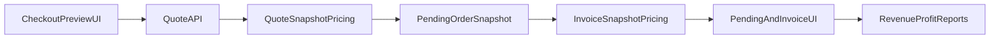

# PLAN 2 - FE/BE Milestones (Không gồm Toast)

## Scope Đã Chốt
- Thực thi theo **phase/milestone**.
- **Không** bao gồm hạng mục Toast UI trong plan này (tách riêng).
- Giữ nguyên nguyên tắc: quote/order/invoice/profit dùng backend snapshot làm source of truth.
- Giữ thứ tự triển khai: M1 trước, M2 sau, M3 sau cùng.

## Business Truth Bắt Buộc (Decision Lock)
- Backend snapshot là source of truth cho quote/pending/invoice/profit; UI không được tự tính lại historical totals từ state hiện tại.
- Loyalty/đổi điểm bắt buộc đọc từ `pricingBreakdownSnapshot.loyaltyDiscount` và `pricingBreakdownSnapshot.loyaltyRedeemedPoints`, không đọc từ balance hiện tại.
- Promotion `eligibleLines` khác `affectedLines`; chỉ line có tác động tài chính thật mới là impacted.
- Gift promotion hiển thị quà tặng ở section riêng, không liệt kê toàn bộ paid lines đủ điều kiện như bị tác động.
- Recipe edit chỉ forward-looking; không hồi tố product batch cũ, invoice item cũ, profit report cũ.
- Delete promotion: nếu từng xuất hiện trong invoice/pending/gift snapshot thì archive/soft-delete, không physical delete.
- Pending confirm là authority duy nhất để materialize invoice từ pending order.
- Payment proof/linking chỉ là bằng chứng đối chiếu thanh toán; không phải business event hoàn tất đơn.
- Payment manual-link decision lock:
  - Manual link payment event chỉ chuyển event sang trạng thái `LINKED` (hoặc tương đương) và attach metadata liên kết.
  - Manual link KHÔNG được tự confirm pending order, KHÔNG tạo invoice, KHÔNG tự trừ kho, KHÔNG mark `CONFIRMED/PAID_AUTO`, KHÔNG bypass confirm flow.
  - Auto-confirm chỉ áp dụng cho auto-match/webhook đủ điều kiện: `bank_transfer`, parse đúng mã đơn, amount >= pending total snapshot, và backend rule cho phép.
  - Payment method không thuộc `bank_transfer` (ví dụ Momo/ZaloPay/COD) không auto-confirm qua Casso/payment event.
- Role truth:
  - `ADMIN`: full admin.
  - `STAFF`: chỉ POS/Tạo hóa đơn và API phục vụ POS.
  - `CUSTOMER`/`ROLE_USER`: storefront/account, không vào admin.
- Address truth: bắt buộc `street` khi tạo quote/pending/order.

## Production Cost Business Truth - Multi Batch Cost (Decision Lock)

### Allocation và costing rule
- Preview và create bắt buộc dùng cùng allocation engine.
- Allocation order: FEFO trước; nếu cùng hạn dùng hoặc không có hạn dùng thì FIFO theo `createdAt/id`.
- Mỗi component được allocate từ nhiều batch.
- Component cost = `Σ(qtyAllocatedFromBatch * batch.unitCost)`.
- Production total cost = `Σ(componentCost) + overheadCost`.
- Output unit cost = `productionTotalCost / outputQty`.
- Output product batch `costPrice` = output unit cost snapshot.
- `ProductVariant.costPrice` chỉ update thành giá vốn tham khảo cho tương lai; không làm đổi batch/invoice lịch sử.

### Shortage và transactional consistency rule
- Nếu thiếu bất kỳ component nào, preview phải trả đủ:
  - `requiredQty`
  - `availableQty`
  - `missingQty`
  - `allocations` hiện có.
- Không cho create production order khi thiếu.
- Sau khi nhập batch mới, bắt buộc preview lại để tính cost theo allocation mới.
- Create order phải lock batch và re-run allocation trong transaction.
- Nếu allocation sau lock khác preview do tồn kho thay đổi, backend dùng allocation thực tế sau lock và trả snapshot đúng thực tế.
- Nếu sau lock vẫn thiếu thì trả `409` với structured shortage.

### Snapshot required khi create production order
- ProductionOrder/ProductionOrderComponent/Allocation phải lưu snapshot:
  - component `productId/variantId/name/code/unit`
  - `requiredQty`
  - `consumedQty`
  - `batchId`
  - `lotCode`
  - `unitCost`
  - `totalCost`
  - allocation order/index
  - `overheadCost`
  - `outputQty`
  - `outputUnitCost`

### Acceptance sample cho multi-batch
- Given recipe cần `10kg` component `C` và batch `C1` có `4kg @ 50,000/kg`
- When preview trước khi nhập thêm
- Then `feasible=false`, `missingQty=6kg`.
- When nhập batch `C2` `20kg @ 70,000/kg` và preview lại
- Then allocation là `C1 4kg` + `C2 6kg`, component cost C = `620,000`.
- And output unit cost = `(costA + costB + 620,000 + overhead)/outputQty`.
- When create production order
- Then snapshot lưu đúng `C1 4kg @ 50,000` và `C2 6kg @ 70,000`.
- And recipe edit hoặc batch price change về sau không làm đổi cost của production order này.

## Milestone 1 - Money Integrity & Historical Correctness (Critical)

### M1.1 Loyalty snapshot xuyên suốt quote -> pending -> invoice
- **BE**: chuẩn hóa contract và pipeline loyalty trong quote/pending/invoice, tuyệt đối không recompute từ điểm hiện tại.
  - Trọng tâm: [C:/Work/NhaDanShopBT/NhaDanShop/src/main/java/com/example/nhadanshop/service/SalesQuoteService.java](C:/Work/NhaDanShopBT/NhaDanShop/src/main/java/com/example/nhadanshop/service/SalesQuoteService.java), [C:/Work/NhaDanShopBT/NhaDanShop/src/main/java/com/example/nhadanshop/service/PendingOrderService.java](C:/Work/NhaDanShopBT/NhaDanShop/src/main/java/com/example/nhadanshop/service/PendingOrderService.java), [C:/Work/NhaDanShopBT/NhaDanShop/src/main/java/com/example/nhadanshop/service/DtoMapper.java](C:/Work/NhaDanShopBT/NhaDanShop/src/main/java/com/example/nhadanshop/service/DtoMapper.java).
- **FE**: map loyalty từ backend snapshot ở pending payment, admin pending detail, invoice detail/print; fallback legacy = 0.
  - Trọng tâm: [C:/Work/NhaDanShopBT/nha-dan-pos-c091ee5b/src/pages/storefront/Checkout.tsx](C:/Work/NhaDanShopBT/nha-dan-pos-c091ee5b/src/pages/storefront/Checkout.tsx) và các màn pending/invoice liên quan.
- **Kết quả cần đạt**: hiển thị chuẩn `Đổi điểm (N điểm)` và tổng tiền khớp snapshot.
- **Stop condition (không recompute snapshot cũ)**:
  - Pending phải lưu `loyaltyDiscount` và `loyaltyRedeemedPoints` từ quote snapshot.
  - Invoice từ pending phải materialize loyalty snapshot từ pending/quote, không đọc lại point balance hiện tại.
  - Đổi customer balance/loyalty settings sau đó không làm đổi pending/invoice cũ.
  - Legacy fallback chỉ `0`/display-safe, không dùng current balance để suy đoán.
- **Test bổ sung**:
  - BE: Given quote redeem `388` points; When tạo pending rồi đổi balance/settings; Then pending snapshot không đổi.
  - BE: When confirm invoice rồi đổi balance/settings lần nữa; Then invoice snapshot vẫn giữ `388` points và discount tương ứng.
  - FE: Render `Đổi điểm (388 điểm) -388đ` từ snapshot ở PendingPayment/Admin PendingOrder/Invoice detail-print; không render theo current balance.

### M1.2 Payment manual-link safety không bypass pending confirm
- **Criticality**: M1 blocker vì tác động trực tiếp authority pending -> invoice, stock movement, invoice snapshot và lịch sử thanh toán.
- **BE requirements**:
  - Rà soát flow trong payment event linking (controller/service) để tách rõ 2 nhánh:
    1. Auto-match/webhook eligible flow (`bank_transfer`, parse order code đúng, amount >= pending total snapshot, rule cho phép) có thể auto-confirm.
    2. Manual-link/admin flow chỉ link event -> pending, set `LINKED`/metadata, không confirm/order materialization.
  - Manual-link flow KHÔNG gọi confirm flow (`confirmOrder` hoặc path tương đương), KHÔNG tạo SalesInvoice, KHÔNG tạo inventory movement, KHÔNG đổi pending status sang `CONFIRMED/PAID_AUTO`.
  - Idempotency/conflict:
    - Event đã linked cùng order: no-op success hoặc `409` business message (chốt 1 hành vi rõ ràng).
    - Event linked order khác: `409`, không relink âm thầm.
    - Pending không còn linkable: `409` business conflict.
  - Không leak SQL/JDBC/raw exception.
- **FE requirements**:
  - Label action phản ánh đúng semantics: `Gắn giao dịch`/`Liên kết thanh toán`, không dùng wording gây hiểu nhầm là confirm.
  - Sau manual-link UI hiển thị trạng thái linked, nhưng không coi order hoàn tất.
  - Nếu cần tạo invoice phải bấm action confirm pending riêng.
- **Stop condition (không recompute snapshot cũ)**:
  - Manual link event đủ tiền vào pending KHÔNG tạo invoice, KHÔNG trừ kho, KHÔNG tạo inventory movement, KHÔNG đổi pending sang `CONFIRMED/PAID_AUTO`.
  - Manual link không mutate hoặc recompute pending/invoice snapshot cũ.
  - Chỉ confirm pending action riêng mới materialize invoice snapshot.
  - Confirm sau manual-link vẫn tạo đúng một invoice (idempotent), không duplicate movement.
  - Auto-match webhook `bank_transfer` đủ điều kiện vẫn giữ behavior auto-confirm đã chốt; manual-link không dùng chung path auto-confirm.
- **Test bổ sung**:
  - BE: Given unmatched event đủ tiền và pending linkable; When admin manual-link; Then event `LINKED`, pending không `CONFIRMED/PAID_AUTO`, không invoice mới, không stock movement mới.
  - BE: Given linked event; When admin confirm pending bằng endpoint riêng; Then invoice tạo đúng một lần, confirm lại không duplicate invoice/movement.
  - BE: Given webhook auto-match `bank_transfer` parse đúng và đủ tiền; Then auto-confirm behavior hiện có vẫn pass nếu rule cho phép.
  - BE: Given pending không hợp lệ hoặc event linked order khác; Then HTTP `409` business message sạch.
  - FE: Manual-link xong chỉ hiển thị linked, không optimistic set completed/confirmed.

### M1.3 Promotion impact trên invoice (eligible != affected)
- **BE**: sửa builder `affectedLines` chỉ giữ line có tác động tài chính thật; tách rõ gift impact.
  - Trọng tâm: [C:/Work/NhaDanShopBT/NhaDanShop/src/main/java/com/example/nhadanshop/service/PromotionEvaluationService.java](C:/Work/NhaDanShopBT/NhaDanShop/src/main/java/com/example/nhadanshop/service/PromotionEvaluationService.java), [C:/Work/NhaDanShopBT/NhaDanShop/src/main/java/com/example/nhadanshop/service/PromotionService.java](C:/Work/NhaDanShopBT/NhaDanShop/src/main/java/com/example/nhadanshop/service/PromotionService.java).
- **FE**: render section invoice theo discounted/gift impact; không liệt kê toàn bộ eligible lines.
- **Stop condition (không recompute snapshot cũ)**:
  - Impact display không recompute từ current promotion config khi pending/invoice đã có snapshot.
  - Gift promotion chỉ hiển thị reward lines thật ở section quà tặng.
  - Percent/fixed chỉ include affected line có allocated discount tài chính thực sự.
  - Free shipping không tạo merchandise affected lines.
  - Invoice cũ vẫn render đúng promotion name/type/discount/gift từ snapshot dù promotion master đổi/archive/delete.
- **Test bổ sung**:
  - BE: Given invoice từ gift promo; When promotion master đổi/archive; Then invoice detail vẫn theo snapshot, không recompute.
  - BE: Given fixed/percent promo; Then `affectedLines` chỉ gồm line được allocate discount.
  - BE: Given free shipping promo; Then merchandise affected lines rỗng/không financial impact.
  - FE: Invoice detail tách discounted lines, gift lines, shipping discount bucket; không render eligible paid lines như affected nếu không discount thật.

### M1.4 Promotion delete/pause/archive an toàn lịch sử
- **BE**:
  - sửa query tham chiếu snapshot (tránh SQL lỗi `SELECT EXISTS`),
  - `DELETE /api/promotions/{id}`: nếu đã referenced -> archive/inactive; chưa referenced -> physical delete,
  - list mặc định ẩn archived.
  - Trọng tâm: [C:/Work/NhaDanShopBT/NhaDanShop/src/main/java/com/example/nhadanshop/repository/PromotionRepository.java](C:/Work/NhaDanShopBT/NhaDanShop/src/main/java/com/example/nhadanshop/repository/PromotionRepository.java), [C:/Work/NhaDanShopBT/NhaDanShop/src/main/java/com/example/nhadanshop/service/PromotionService.java](C:/Work/NhaDanShopBT/NhaDanShop/src/main/java/com/example/nhadanshop/service/PromotionService.java), [C:/Work/NhaDanShopBT/NhaDanShop/src/main/resources/db/migration](C:/Work/NhaDanShopBT/NhaDanShop/src/main/resources/db/migration).
- **FE**: delete modal giải thích archive behavior + refresh list ổn định.
- **Stop condition (không recompute snapshot cũ)**:
  - Promotion đã referenced trong snapshot -> chỉ archive/soft-delete, không physical delete.
  - Delete/archive không rewrite snapshot cũ và không làm mất khả năng render promotion snapshot trên invoice/pending cũ.
  - Archive không cho quote/order mới auto-apply promotion archived.
  - Không trả raw SQL error/500 ra UI.
- **Test bổ sung**:
  - BE: Given referenced promotion; When delete; Then archived/inactive, invoice cũ vẫn đọc snapshot, không 500/SQL error.
  - BE: Given unreferenced promotion; When delete; Then physical delete allowed.
  - BE: Given archived promotion; When create quote mới; Then không auto-apply.
  - FE: Delete modal nêu rõ behavior archive lịch sử; list refresh ẩn archived mặc định; invoice cũ vẫn render snapshot.

### M1.5 Production recipe edit forward-looking, không hồi tố cost/profit
- **BE**:
  - khóa rule snapshot trên production order/product batch/invoice item,
  - recipe edit chỉ ảnh hưởng lệnh mới,
  - không thay cost/profit lịch sử,
  - production actual cost bắt buộc theo batch allocation thực tế (không dùng average cost tùy ý, không dùng `ProductVariant.costPrice` cho actual consumption nếu có allocation).
  - Trọng tâm: [C:/Work/NhaDanShopBT/NhaDanShop/src/main/java/com/example/nhadanshop/service/ProductionOrderService.java](C:/Work/NhaDanShopBT/NhaDanShop/src/main/java/com/example/nhadanshop/service/ProductionOrderService.java), [C:/Work/NhaDanShopBT/NhaDanShop/src/main/java/com/example/nhadanshop/service/ProductionRecipeService.java](C:/Work/NhaDanShopBT/NhaDanShop/src/main/java/com/example/nhadanshop/service/ProductionRecipeService.java), [C:/Work/NhaDanShopBT/NhaDanShop/src/main/java/com/example/nhadanshop/service/InventoryStockService.java](C:/Work/NhaDanShopBT/NhaDanShop/src/main/java/com/example/nhadanshop/service/InventoryStockService.java).
- **FE**: cảnh báo recipe detail “chỉ áp dụng cho lệnh sản xuất mới”.
- **Stop condition (không recompute snapshot cũ)**:
  - Recipe edit không mutate production order cũ, allocation snapshot cũ, output batch cost cũ, invoice item cost/COGS/profit cũ.
  - Profit report lịch sử không đổi sau recipe edit.
  - Create production dùng allocation thực tế sau lock; nếu khác preview thì snapshot theo allocation mới; thiếu thì `409 structured shortage`, không partial order.
  - Thay đổi batch cost/variant cost về sau không làm đổi production/invoice lịch sử.
- **Test bổ sung**:
  - BE: Given production order dùng C1/C2 allocation; When recipe edit, variant cost đổi hoặc thêm batch mới; Then production order cost snapshot cũ không đổi.
  - BE: Given invoice bán output batch cũ; When recipe edit; Then COGS/profit cũ không đổi.
  - BE: Given preview feasible nhưng tồn thay đổi trước create; When lock + re-run; Then snapshot theo allocation thực tế hoặc `409 shortage`.
  - FE: Recipe detail/edit hiển thị cảnh báo forward-looking; production detail hiển thị snapshot đã lưu, không render từ recipe hiện tại.

### M1.6 Signup duplicate phone trả 409 thân thiện
- **BE**: validate trước và fallback `DataIntegrityViolationException` để tránh 500; trả code `PHONE_ALREADY_REGISTERED`.
  - Trọng tâm: [C:/Work/NhaDanShopBT/NhaDanShop/src/main/java/com/example/nhadanshop/service/AuthService.java](C:/Work/NhaDanShopBT/NhaDanShop/src/main/java/com/example/nhadanshop/service/AuthService.java), [C:/Work/NhaDanShopBT/NhaDanShop/src/main/java/com/example/nhadanshop/exception/GlobalExceptionHandler.java](C:/Work/NhaDanShopBT/NhaDanShop/src/main/java/com/example/nhadanshop/exception/GlobalExceptionHandler.java).
- **FE**: map error code ra message tiếng Việt thân thiện.
- **Stop condition**:
  - Signup phone đã thuộc account khác trả HTTP `409`, code `PHONE_ALREADY_REGISTERED`, message tiếng Việt đã chốt.
  - Không leak SQL/JDBC/raw stack trace.
  - Không tạo duplicate user/customer.
  - Nếu phone thuộc customer chưa có user và business cho phép link thì flow hợp lệ vẫn hoạt động.
- **Test bổ sung**:
  - BE: Given phone đã có linked user; When signup; Then `409 PHONE_ALREADY_REGISTERED`.
  - BE: Given race condition kích hoạt DB unique constraint; Then fallback handler vẫn trả business error sạch, không 500/raw SQL.
  - FE: Signup form hiển thị message thân thiện theo error code, không hiển thị raw constraint message.

## Milestone 2 - Commerce Behavior & Admin UX Data Correctness

### M2.1 Gift promotion repeatable cho QUANTITY_GIFT + BUY_X_GET_Y
- **BE**:
  - enforce repeatable logic + cap `maxGiftApplications`,
  - promo gift mới default `repeatable=false`,
  - promo legacy thiếu field giữ behavior cũ, không làm sai lệch ngoài ý muốn.
- **FE**: checkbox repeatable, mapping create/edit đúng, summary rõ “Không lặp/Lặp theo bội số”.

### M2.2 Pending orders server-side pagination/sort/filter + tab counts đúng nghĩa
- **BE**: mở rộng `GET /api/pending-orders` theo page/size/sort/filter/search; trả total + counts theo tab business.
- **FE**: tab count lấy từ backend, không tự đếm từ page hiện tại; query lại khi đổi tab/filter.

### M2.3 Unmatched payments pagination/sort/search
- **BE**: endpoint unmatched hỗ trợ page/size/sort/status/search + total toàn bộ.
- **FE**: table/card responsive + sort theo thời gian/số tiền/trạng thái/ref.

### M2.4 Voucher list pagination/sort + hyperlink detail
- **BE**: `GET /api/vouchers` chuẩn page/sort/search/status; bổ sung detail endpoint nếu thiếu.
- **FE**: mã voucher click vào detail route/drawer.

### M2.5 Promotion list API/UI wiring hoàn chỉnh
- **BE**: list có page/sort/search/status/type, ẩn archived mặc định, không còn SQL error banner.
- **FE**: debounce search + filter/sort đầy đủ.

## Milestone 3 - Access Control & Checkout Data Quality

### M3.1 Role/permission chuẩn hóa theo business role
- **BE**: policy `ROLE_ADMIN`, `ROLE_STAFF`, `ROLE_USER/ROLE_CUSTOMER`; staff chỉ quyền POS/invoice create API cần thiết.
- **FE**: sidebar theo role; route guard admin pages; map label `ROLE_USER` -> `Khách hàng`.

### M3.2 Checkout address requirement bắt buộc street
- **FE**: bỏ helper text vô dụng; disable submit khi thiếu province/district/ward/street; lỗi street rõ nghĩa.
- **BE**: validate address khi create quote/pending để không tạo order thiếu street.

## API Contract Cần Ghi Rõ

### Pending orders
- Endpoint: `GET /api/pending-orders`
- Query params: `page`, `size`, `sort`, `status`, `paymentMethod`, `paymentState`, `search`.
- Response yêu cầu: server-side paging chuẩn, `totalElements` là tổng toàn bộ theo filter (không phải page length), có counts theo tab business nếu endpoint counts/embed được chọn.

### Payment events unmatched
- Endpoint: `GET /api/payment-events/unmatched`
- Query params: `page`, `size`, `sort`, `status`, `search`.
- Response yêu cầu: `totalElements` toàn bộ unmatched theo filter.

### Vouchers
- Endpoint: `GET /api/vouchers`
- Query params: `page`, `size`, `sort`, `search`, `status`.
- Nếu thiếu detail endpoint thì bổ sung: `GET /api/vouchers/{id}`.

### Promotion list
- Endpoint: `GET /api/promotions`
- Query params: `page`, `size`, `sort`, `search`, `status`, `type`, `includeArchived`.
- Mặc định `includeArchived=false`.

### Payment manual-link safety contract
- Manual link endpoint/admin action chỉ cho phép attach event <-> pending order và set trạng thái linked (`LINKED` hoặc tương đương).
- Manual-link response không được imply order confirmed/invoiced.
- Không gọi auto-confirm path trong manual-link handler.
- Pending confirm endpoint riêng vẫn là authority tạo invoice từ pending.
- Conflict semantics:
  - Event linked cùng order: no-op success hoặc `409` business message rõ.
  - Event linked order khác: `409`.
  - Pending không linkable: `409`.

### Delete promotion behavior
- Endpoint: `DELETE /api/promotions/{id}`.
- Nếu promotion referenced trong snapshot: archive/soft-delete + `active=false`, trả success.
- Nếu unreferenced: physical delete được phép, trả success.
- Không bao giờ trả raw SQL error ra client.

### Signup duplicate phone behavior
- Endpoint signup trả:
  - HTTP `409`
  - code `PHONE_ALREADY_REGISTERED`
  - message: `Số điện thoại này đã được đăng ký tài khoản. Vui lòng đăng nhập hoặc dùng số khác.`

### Production preview/create behavior
- Preview allocation bắt buộc có allocation lines theo batch:
  - `batchId`, `lotCode`, `qty`, `unitCost`, `totalCost`, `expiryDate/receivedAt` (nếu có).
- Create order khi thiếu sau lock trả HTTP `409` với `shortages` list có cấu trúc.

## Luồng dữ liệu chuẩn (Money Source of Truth)

## Test Strategy Theo Milestone
- **M1 bắt buộc chạy trước merge**
  - BE compile + targeted integration tests: loyalty pipeline snapshot immutability, payment manual-link safety, promotion impact snapshot immutability, delete/archive historical safety, recipe/production historical cost immutability (bao gồm multi-batch), signup duplicate phone.
  - FE test + build; Selenium flows cho loyalty/promotion impact/delete archive/signup/manual-link confirm split.
  - Nếu Selenium payment-event chưa có fixture ổn định: BE integration test cho manual-link safety là bắt buộc để M1 done; browser flow payment-event có thể đánh dấu optional tạm thời nhưng không coi là full done UI coverage.
- **M2/M3 chạy regression theo feature block**
  - Pagination/sort/filter contract tests (BE) + UI list behavior (FE).
  - Role guard tests + address validation e2e.

## Acceptance Criteria Chi Tiết Theo Milestone

### M1
- Loyalty checkout `388 điểm` -> PendingPayment, Admin PendingOrder, Invoice detail đều hiển thị `Đổi điểm (388 điểm) -388đ`.
- Tổng tiền các màn khớp `pricingBreakdownSnapshot.total`.
- Manual link payment event đủ tiền vào pending chỉ chuyển event sang `LINKED`; không tạo invoice, không trừ kho, không mark pending `CONFIRMED/PAID_AUTO`.
- Admin confirm pending sau manual-link mới tạo invoice, đúng một lần, idempotent.
- Auto-match `bank_transfer` đủ tiền vẫn hoạt động theo rule đã chốt; manual-link không dùng chung path auto-confirm.
- Invoice gift promotion chỉ hiện gift line ở section quà tặng; không list toàn bộ sản phẩm đủ điều kiện trong section tác động.
- Delete paused promotion đã referenced không trả 500; promotion archive/ẩn; invoice cũ vẫn đọc snapshot được.
- Recipe edit xong: batch cũ/profit cũ không đổi.
- Production multi-batch cost tính theo allocation thực tế từng batch, không dùng average cost tùy ý.
- Signup duplicate phone trả `409 PHONE_ALREADY_REGISTERED`, FE hiển thị message thân thiện.
- Sau khi invoice/pending/production đã có snapshot, thay đổi loyalty settings, customer balance, promotion config, recipe, product variant cost hoặc batch mới không làm đổi historical snapshot/profit/cost cũ.

### M2
- Gift `QUANTITY_GIFT` có repeatable checkbox.
- Gift promo mới default `repeatable=false`.
- Promo legacy thiếu field giữ behavior cũ.
- Pending orders/unmatched/voucher/promotion list hỗ trợ page/sort/search/filter server-side.
- Tab count không tính từ page hiện tại.

### M3
- Staff chỉ vào POS/Tạo hóa đơn.
- Customer không vào admin.
- Thiếu street không tạo được quote/pending/order.

## Test Plan Cụ Thể (Given/When/Then)

### BE tests
- Loyalty pipeline:
  - Given checkout quote dùng `388` points
  - When tạo pending order rồi confirm invoice
  - Then pending response và invoice response có `loyaltyDiscount` và `loyaltyRedeemedPoints`.
- Promotion affected lines:
  - Given gift promo áp dụng cho order có nhiều paid products
  - When build invoice detail
  - Then `affectedLines` không chứa toàn bộ eligible paid lines như impacted và `giftLines` chỉ chứa reward thực.
- Delete/archive promotion SQL:
  - Given paused promotion đã được reference bởi invoice snapshot
  - When delete promotion
  - Then không có SQL error, promotion bị archive/hidden, invoice snapshot vẫn đọc được.
- Recipe historical cost/profit:
  - Given batch sản xuất trước khi recipe edit
  - When recipe thay đổi và tạo batch mới
  - Then old batch cost và old invoice profit không đổi.
- Production multi-batch cost:
  - Given component `C` có `C1 4kg @ 50k` và sau đó có `C2 20kg @ 70k`
  - When recipe cần `10kg C`
  - Then allocation là `C1 4kg + C2 6kg` và component cost = `620k`.
- Signup duplicate:
  - Given phone đã thuộc account khác
  - When signup với cùng phone
  - Then HTTP `409` và code `PHONE_ALREADY_REGISTERED`.
- Pagination count:
  - Given số bản ghi lớn hơn page size
  - When request page đầu
  - Then `totalElements` là full count, không phải số dòng của page hiện tại.
- Payment manual-link safety:
  - Given unmatched payment event đủ tiền và pending đang linkable
  - When admin manual-link event vào pending
  - Then event `LINKED`, pending không `CONFIRMED/PAID_AUTO`, không có invoice mới, không stock movement mới.
  - Given event đã linked và admin confirm pending qua endpoint riêng
  - When confirm lần 1 và confirm lặp lại
  - Then invoice/movement chỉ materialize đúng một lần (idempotent).
  - Given event linked vào order khác hoặc pending không linkable
  - When manual-link
  - Then HTTP `409` business conflict sạch.

### FE tests
- Render loyalty đúng ở PendingPayment, Admin PendingOrder, InvoiceDetailDrawer.
- Invoice impact tách discounted lines và gift lines đúng semantics.
- Manual link xong chỉ hiển thị linked state; không tự hiển thị completed/confirmed.
- Pending detail vẫn yêu cầu confirm riêng để tạo invoice.
- Role guard ẩn admin menu cho customer và giới hạn staff vào POS.
- Address validation chặn submit khi thiếu street.

### Selenium/browser flows
- Loyalty -> pending -> invoice.
- Gift promo invoice detail.
- Delete promotion archive flow.
- Signup duplicate phone.
- Manual link payment event không auto-create invoice; admin confirm pending riêng mới tạo invoice.
- Pending tab count `Đã nhận CK`.
- Production multi-batch preview/create (nếu test data setup hỗ trợ).

## Done Definition
- Pass toàn bộ acceptance criteria tương ứng từng milestone.
- Không có recompute lịch sử tiền/cost/profit từ state hiện tại.
- Không lộ SQL/constraint raw ra UI.
- Không phá testid automation hiện có cho promotion/checkout.
- M1 chỉ được công nhận done khi từng task M1 có stop condition “không recompute snapshot cũ” được cover bằng test hoặc có lý do rõ ràng nếu thiếu UI coverage.
- Không có flow manual-link nào tạo invoice/stock movement trước pending confirm.
- Historical invoice/pending/production snapshots bất biến trước thay đổi master data hiện tại.

## Guardlist
- Không recompute historical invoice/pending/profit từ current promotion/recipe.
- Không physical delete promotion đã referenced trong snapshot.
- Không để raw SQL/constraint error lộ ra UI.
- Không phá testid automation hiện có.
- Không dùng dữ liệu page hiện tại để tính tab total count.
- Không thay đổi behavior Toast trong plan này.
- Không refactor ngoài file/scope liên quan milestone.
- Không dùng `ProductVariant.costPrice` để tính production order actual cost khi đã có batch allocation.
- Không dùng average variant cost cho component có nhiều batch giá khác nhau.
- Không cho create production order khi preview/create allocation còn thiếu nguyên liệu.
- Không để manual payment link tự confirm pending order.
- Không để manual payment link tự tạo invoice.
- Không để manual payment link tự trừ kho hoặc tạo inventory movement.
- Không gọi auto-confirm path từ manual-link handler.
- Không recompute loyalty snapshot cũ từ current customer balance/settings.
- Không recompute promotion impact invoice cũ từ current promotion config.
- Không recompute production/invoice cost cũ từ current recipe/`ProductVariant.costPrice`/current average cost.
- Không dùng current master data để rebuild historical quote/pending/invoice/production snapshots.
- Không dùng pagination/UX work M2 để trì hoãn payment manual-link safety của M1.

## Thứ Tự Triển Khai
- Chỉ triển khai tuần tự: hoàn thành và verify M1 trước khi sang M2; hoàn thành M2 trước khi sang M3.
- Thứ tự ưu tiên trong M1:
  1. Loyalty snapshot pipeline.
  2. Payment manual-link safety.
  3. Promotion impact semantics + delete/archive.
  4. Production recipe historical cost + multi-batch allocation cost.
  5. Signup duplicate phone.
- Payment manual-link safety là M1 blocker, không được dời sang sau M2 pagination/list UX.
- M2: pagination/list server-side + gift repeatable.
- M3: role/address.

## Out of Scope cho plan này
- Toast UI revamp (variant + close icon + overlay tuning) sẽ tách plan riêng sau khi M1 ổn định.