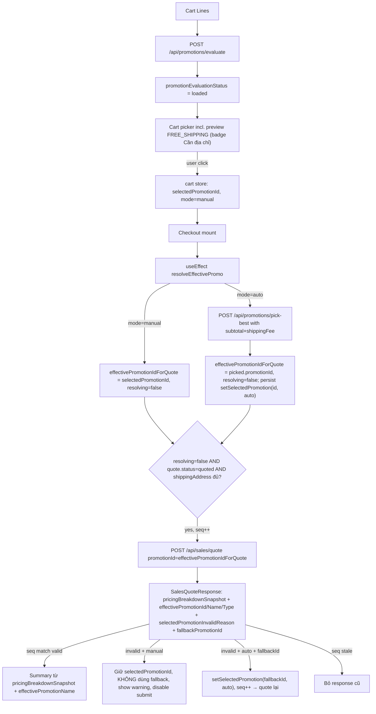

# Kế hoạch sửa lỗi Promotion Checkout end-to-end

## 1. Bug đã trace trực tiếp từ code

**FE Cart/Checkout**
- [`nha-dan-pos-c091ee5b/src/lib/cart.ts`](nha-dan-pos-c091ee5b/src/lib/cart.ts) lines 140-142: `setSelectedPromotionId` luôn ép `selectedPromotionMode = "manual"` kể cả khi truyền null → khoá fallback.
- [`nha-dan-pos-c091ee5b/src/pages/storefront/Cart.tsx`](nha-dan-pos-c091ee5b/src/pages/storefront/Cart.tsx) lines 75-86: auto-clear chạy ngay first render lúc `allPromos = []` (chưa fetch xong) → xoá manual selection. FREE_SHIPPING không xuất hiện ở danh sách selectable nên user không thể pre-select.
- [`nha-dan-pos-c091ee5b/src/pages/storefront/Checkout.tsx`](nha-dan-pos-c091ee5b/src/pages/storefront/Checkout.tsx) lines 191-220, 746-751: `bestPromo` lấy từ `promotions.pickBest(ctx)` không truyền `selectedPromotionId` → label hiển thị sai promo. Lines 261-265 gửi `selectedPromotionId` trực tiếp; ở auto-mode chưa pick gì thì gửi null → BE bỏ promotion.
- Lines 276-285: handler fallback chỉ check `selectedPromotionMode === "auto"` nhưng setSelectedPromotionId(null) trước đó đã ép manual.

**BE quote / pricing**
- [`NhaDanShop/src/main/java/com/example/nhadanshop/service/SalesQuoteService.java`](NhaDanShop/src/main/java/com/example/nhadanshop/service/SalesQuoteService.java) lines 70-84 + 195: `req.promotionId() == null` ⇒ `appliesPromo = null`, không pick best. Đây là root cause "FREE_SHIPPING không apply" khi FE không gửi promotionId.
- [`NhaDanShop/src/main/java/com/example/nhadanshop/service/CommercialPricingEngine.java`](NhaDanShop/src/main/java/com/example/nhadanshop/service/CommercialPricingEngine.java) lines 366-368 (`validatePromotionEligibilityFromLines` cho CATEGORY): NPE nếu `l.product().getCategory()` null. Logic CATEGORY/ELIGIBLE_ITEMS/WHOLE_ORDER và FREE_SHIPPING cap (lines 130-186 trong `PromotionEvaluationService.evalFreeShipping`) đã đúng.

**Pending / Invoice UI thiếu loyalty**
- [`nha-dan-pos-c091ee5b/src/pages/storefront/PendingPayment.tsx`](nha-dan-pos-c091ee5b/src/pages/storefront/PendingPayment.tsx) lines 600-621: không có row loyalty.
- [`nha-dan-pos-c091ee5b/src/pages/admin/PendingOrders.tsx`](nha-dan-pos-c091ee5b/src/pages/admin/PendingOrders.tsx) lines 531-540: không có row loyalty.
- [`nha-dan-pos-c091ee5b/src/components/shared/InvoiceDetailDrawer.tsx`](nha-dan-pos-c091ee5b/src/components/shared/InvoiceDetailDrawer.tsx): không có row loyalty.
- Type [`nha-dan-pos-c091ee5b/src/services/types.ts`](nha-dan-pos-c091ee5b/src/services/types.ts) lines 390-391 đã có `loyaltyDiscount?` + `loyaltyRedeemedPoints?` trên `PricingBreakdownSnapshot` nên chỉ cần render.

## 2. Quyết định kiến trúc đã chốt với user

### 2.1 Effective-promo race-safe (Checkout)
- KHÔNG để quote effect chỉ đọc `selectedPromotionId` từ cart store sau khi setState (race: setState async ⇒ quote dùng store cũ ⇒ gửi promotionId=null).
- Checkout giữ STATE RIÊNG:
  - `effectivePromotionIdForQuote: number | null`
  - `effectivePromotionMode: "manual" | "auto"`
  - `effectivePromotionResolving: boolean`
- Manual mode: `effectivePromotionIdForQuote = selectedPromotionId`, không gọi pickBest.
- Auto mode: gọi `promotions.pickBest(ctx)` → set `effectivePromotionIdForQuote = picked?.promotionId ?? null` ngay tại tick đó. Có thể persist `cartActions.setSelectedPromotion(pickedId,"auto")` để Cart UI đồng bộ, NHƯNG quote luôn đọc state cục bộ, không chờ store.
- Quote effect chỉ chạy khi: `shippingAddress` đầy đủ + `quote.status === "quoted"` + `effectivePromotionResolving === false`.
- Quote request: `promotionId = effectivePromotionIdForQuote`.
- Cancel token / sequence id: mỗi quote effect tăng `quoteSeqRef.current`; response cũ bị bỏ nếu seq != current. Tương tự cho pickBest.

### 2.2 No-stack rule (1 promotion chính/đơn)
- Mỗi order có duy nhất 1 `selectedPromotionId` chính.
- 5 promotion types mutually exclusive trong selectedPromotionId: `FREE_SHIPPING`, `PERCENT_DISCOUNT`, `FIXED_DISCOUNT`, `BUY_X_GET_Y`, `QUANTITY_GIFT`.
- Chọn FREE_SHIPPING ⇒ không áp percent/fixed merchandise discount; `pb.promotionDiscount = 0` + `pb.shippingDiscount > 0`.
- Chọn PERCENT/FIXED ⇒ `pb.promotionDiscount > 0` + `pb.shippingDiscount` từ promotion = 0 (voucher shipping discount riêng nếu user dùng voucher).
- Voucher là luồng độc lập (`voucherCode` riêng) — vẫn được áp đồng thời với promotion chính theo logic hiện tại.

### 2.3 Cart eval-loaded flag (chống premature clear)
- Cart.tsx thêm `promotionEvaluationStatus: "idle" | "loading" | "loaded"`.
- KHÔNG auto-clear `selectedPromotionId` khi status ≠ "loaded".
- Chỉ clear khi status = "loaded" AND chosen promo:
  - không có trong `allPromos` (expired / deactivated / out of cart scope), HOẶC
  - có nhưng promotion entity không còn tồn tại (BE 404).
- KHÔNG clear FREE_SHIPPING vì pendingShippingAddress / thiếu địa chỉ.
- Manual selected mà ineligible thật sự (cart đổi line / min order không đạt): GIỮ selectedPromotionId, show reason rõ. Server quote sẽ trả `selectedPromotionInvalidReason` ⇒ disable submit.

### 2.4 Manual invalid behavior
- BE quote trả `selectedPromotionInvalidReason` + (có thể) `fallbackPromotionId`.
- `selectedPromotionMode === "manual"`:
  - KHÔNG đổi `selectedPromotionId`.
  - KHÔNG dùng `fallbackPromotionId`.
  - Show warning rõ (toast + inline cảnh báo trong summary).
  - Disable nút "Tạo đơn chờ thanh toán".
  - User có thể quay Cart đổi promo khác.
- `selectedPromotionMode === "auto"`:
  - Nếu `fallbackPromotionId` có giá trị: `cartActions.setSelectedPromotion(fallbackId, "auto")` ⇒ effect tự re-quote với fallback.
  - Sau switch phải QUOTE LẠI (kích `quoteSeqRef`).

### 2.5 Cart selectable rule (chốt cứng)
- **CHỈ FREE_SHIPPING** được phép xuất hiện trong block "Khuyến mãi áp dụng được" như preview-selectable khi chưa có địa chỉ/shippingFee, có badge "Cần địa chỉ giao hàng". Click ⇒ persist `selectedPromotionId` + `mode="manual"`. KHÔNG cộng `shippingDiscount` vào Cart preview total.
- **PERCENT_DISCOUNT / FIXED_DISCOUNT / BUY_X_GET_Y / QUANTITY_GIFT** nếu hiện tại `eligible=false` ⇒ nằm trong block "Sắp đạt khuyến mãi" (không clickable). Không cho user pre-select promo đang ineligible cho 4 type này.
- Block "Khuyến mãi áp dụng được" chỉ render:
  - `promo.eligible === true` (mọi type), HOẶC
  - `promo.type === "free_shipping"` AND lý do ineligible duy nhất là `pendingShippingAddress` (BE trả reason cụ thể "Cần đủ địa chỉ và phí vận chuyển..."). Mọi reason khác (e.g. min order chưa đạt) ⇒ block "Sắp đạt".
- Sang Checkout, sau khi có shippingFee, `/api/sales/quote` sẽ apply discount đúng cho FREE_SHIPPING preview-selected.

### 2.5b Manual selected sau đó invalid (cart/address đổi)
- Nếu user đã manual chọn promo, sau đó cart/địa chỉ/quote làm promo invalid:
  - **KHÔNG auto-clear** `selectedPromotionId`, **giữ** `selectedPromotionMode === "manual"`.
  - Cart UI render reason inline (không clear UI).
  - Checkout quote trả `selectedPromotionInvalidReason` ⇒ disable submit (xem §2.4).
  - User tự về Cart đổi promo khác, hoặc bấm clear button (nếu có).

### 2.6 BE quote response source-of-truth
- `SalesQuoteResponse` thêm:
  - `effectivePromotionId: Long | null`
  - `effectivePromotionName: String | null`
  - `effectivePromotionType: String | null` (`PERCENT_DISCOUNT` | `FIXED_DISCOUNT` | `FREE_SHIPPING` | `BUY_X_GET_Y` | `QUANTITY_GIFT`)
- Lấy từ `appliedPromo` cuối cùng (sau validation). Nếu `appliedPromo == null` ⇒ cả 3 = null AND `pricingBreakdownSnapshot.promotionDiscount = 0` AND `shippingDiscount` từ promotion = 0.
- FE label/số tiền luôn ưu tiên `beQuote.pricingBreakdownSnapshot.*` + `effectivePromotionName/Type`.

## 3. Kiến trúc effective-promo race-safe (FE)



## 4. Phạm vi thay đổi cụ thể

### 4.1 FE — cart store + helpers
- [`nha-dan-pos-c091ee5b/src/lib/cart.ts`](nha-dan-pos-c091ee5b/src/lib/cart.ts):
  - Sửa `cartActions.setSelectedPromotionId` chỉ phục vụ user-click → giữ mode = "manual" đúng nghĩa.
  - Tách `cartActions.clearSelectedPromotion()` set `{id: null, mode: "auto"}` cho path "promo expired/cart đổi line".
  - Giữ `setSelectedPromotion(id, mode)` cho fallback auto.
  - Đảm bảo persist key `nhadan.cart.v1` lưu cả `selectedPromotionMode`.

### 4.2 FE — Cart picker (eval-loaded flag)
- [`Cart.tsx`](nha-dan-pos-c091ee5b/src/pages/storefront/Cart.tsx):
  - Thêm state `promotionEvaluationStatus: "idle" | "loading" | "loaded"`. Set `"loading"` khi effect (lines 42-56) bắt đầu fetch, `"loaded"` khi response về (kể cả empty).
  - Effect auto-clear (lines 75-86) viết lại theo §2.3:
    - Chỉ chạy khi `promotionEvaluationStatus === "loaded"`.
    - Clear khi chosen promo KHÔNG có trong `allPromos` (BE đã expired/deactivated/cart đổi line khiến BE không trả promo) — dùng `cartActions.clearSelectedPromotion()` (mode=auto).
    - KHÔNG clear khi promo TỒN TẠI trong `allPromos` nhưng `eligible=false` — kể cả lý do là `pendingShippingAddress` (FREE_SHIPPING) hoặc min-order chưa đạt.
    - Manual selected ineligible thật sự ⇒ giữ `selectedPromotionId`, render reason inline (Cart hiển thị "Khuyến mãi đã chọn chưa đủ điều kiện: <reason>"). Submit qua Checkout sẽ dùng server quote `selectedPromotionInvalidReason` để chặn.
  - **FREE_SHIPPING preview-selectable** (theo §2.5):
    - `promo.type === "free_shipping"` AND lý do ineligible duy nhất là pendingShippingAddress: render TRONG block "Khuyến mãi áp dụng được" với badge "Cần địa chỉ giao hàng", click ⇒ `cartActions.setSelectedPromotionId(promotionId)` (manual). KHÔNG cộng `discountAmount`/`shippingDiscountAmount` vào `total`.
    - `promo.type === "free_shipping"` ineligible vì lý do KHÁC (min order chưa đạt, scope không đúng): nằm trong block "Sắp đạt khuyến mãi", không clickable.
  - **Promotion type khác (PERCENT/FIXED/BUY_X_GET_Y/QUANTITY_GIFT)** nếu `eligible=false`: nằm trong block "Sắp đạt khuyến mãi", **KHÔNG render thành nút clickable**. Code path render selectable chỉ có 2 nhánh: type=free_shipping+pendingAddress, hoặc eligible=true.
  - Manual selected promo (đã có persistedPromoId) mà BE trả `eligible=false` (vì cart đổi line, min order không đạt, address không phù hợp): GIỮ trong UI, không clear (xem §2.5b). Render warning dưới picker: "Khuyến mãi đã chọn hiện chưa đủ điều kiện: <reason>". Vẫn giữ visual "selected" cho đến khi user click promo khác hoặc clear thủ công.
  - Thêm `data-testid`:
    - `cart-promo-option-{promotionId}` cho từng option clickable.
    - `cart-promo-selected-id` (hidden span hiển thị `selectedPromotionId ?? ""`).
    - `cart-promo-selected-mode` (hidden span hiển thị `selectedPromotionMode`).
    - `cart-promo-eval-status` (hidden span hiển thị `promotionEvaluationStatus`) — Selenium dùng để wait đến "loaded" trước khi assert.

### 4.3 FE — Checkout impl rules (CHỐT CỨNG, không được skip)
1. **KHÔNG dùng `promotions.pickBest(ctx)` để render label khi `selectedPromotionMode === "manual"`**. Manual mode chỉ tra `evaluatedList.find(p => p.promotionId === selectedPromotionId)` cho preview; pickBest chỉ chạy ở auto mode.
2. **Quote effect KHÔNG được chạy khi `effectivePromotionResolving === true`**. Guard điều kiện cứng trong useEffect; nếu `resolving=true` thì early-return không gọi `postSalesQuote`.
3. **Quote request body lấy `promotionId` từ state cục bộ `effectivePromotionIdForQuote`**, KHÔNG đọc trực tiếp `selectedPromotionId` từ store sau khi vừa `cartActions.setSelectedPromotion(...)` (race: setState async, store có thể chưa update khi quote effect re-run).
4. **Manual quote invalid**: KHÔNG dùng `fallbackPromotionId`, KHÔNG đổi `selectedPromotionId`, render warning, **disable nút "Tạo đơn chờ thanh toán"**.
5. **Auto quote invalid + có fallback**: `cartActions.setSelectedPromotion(fallbackId, "auto")` ⇒ resolveEffectivePromo effect re-runs ⇒ quote effect re-runs với fallback id (sequence id mới).
6. Mỗi pickBest call và mỗi quote call đều phải kiểm `seq !== ref.current` để bỏ stale response.

### 4.3.1 FE — Checkout effective-promo state riêng + race-safe quote
- [`Checkout.tsx`](nha-dan-pos-c091ee5b/src/pages/storefront/Checkout.tsx):
  - **State riêng (không phụ thuộc store sau setState):**
    - `effectivePromotionIdForQuote: number | null`
    - `effectivePromotionResolving: boolean` (default true)
    - `effectivePromotionPreview: EvaluatedPromotion | null` (preview obj cho label trước khi quote)
    - `quoteSeqRef = useRef(0)` cho /api/sales/quote sequence.
    - `pickBestSeqRef = useRef(0)` cho /api/promotions/pick-best sequence.
  - **Effect resolveEffectivePromo** chạy khi `(cartItems, subtotal, shippingAddress, quote, voucherCode, selectedPromotionId, selectedPromotionMode)` đổi:
    - Set `effectivePromotionResolving = true`.
    - Nếu `selectedPromotionMode === "manual"`:
      - `effectivePromotionIdForQuote = selectedPromotionId` (Number hoặc null).
      - `effectivePromotionPreview = evaluatedList.find(p => p.promotionId === selectedPromotionId) ?? null` (manual giữ nguyên dù ineligible).
      - `effectivePromotionResolving = false` ngay tick này.
    - Nếu `selectedPromotionMode === "auto"`:
      - `seq = ++pickBestSeqRef.current`.
      - `await promotions.pickBest(ctx)` (ctx có `shippingAddress` + `shippingQuote` post-address).
      - Nếu `seq !== pickBestSeqRef.current`: drop response (race).
      - Set `effectivePromotionIdForQuote = picked?.promotionId ? Number(picked.promotionId) : null`.
      - Set `effectivePromotionPreview = picked ?? null`.
      - Persist `cartActions.setSelectedPromotion(picked?.promotionId ?? null, "auto")` để Cart UI đồng bộ (nhưng quote KHÔNG đợi store).
      - `effectivePromotionResolving = false`.
  - **Effect quote** (rewrite lines 222-309):
    - Phụ thuộc: `[cartItems, voucherCode, quote.status, shippingAddress, effectivePromotionIdForQuote, effectivePromotionResolving, requestedRedeemPoints, auth.session]`.
    - Guard: chạy chỉ khi `cartItems.length > 0 && quote.status === "quoted" && shippingAddress != null && !effectivePromotionResolving`.
    - `seq = ++quoteSeqRef.current`.
    - Body: `promotionId: effectivePromotionIdForQuote ?? undefined` (KHÔNG đọc store).
    - Trên response: nếu `seq !== quoteSeqRef.current`: drop. Else `setBeQuote`.
    - Trên `selectedPromotionInvalidReason`:
      - `selectedPromotionMode === "manual"`: chỉ toast.warning + render inline trong summary; KHÔNG `setSelectedPromotion`. Submit disable (xem `canSubmit`).
      - `selectedPromotionMode === "auto"` + `fallbackPromotionId != null`:
        - `cartActions.setSelectedPromotion(String(fallbackPromotionId), "auto")` ⇒ resolveEffectivePromo effect re-runs ⇒ quote effect re-runs với `effectivePromotionIdForQuote = fallbackId`.
      - `selectedPromotionMode === "auto"` + no fallback: `cartActions.setSelectedPromotion(null, "auto")`.
  - **Summary label trước khi BE quote về (`!serverOk`)**:
    - Manual: lấy `effectivePromotionPreview?.name` (đó là promo user click).
    - Auto: `effectivePromotionPreview?.name` (kết quả pickBest).
    - KHÔNG dùng `bestPromo` from blind pickBest cũ.
  - **Summary label sau khi BE quote về (`serverOk`)**:
    - Label: `beQuote.effectivePromotionName ?? beQuote.promotionSnapshot?.name`.
    - Type: `beQuote.effectivePromotionType` để quyết định row nào hiện (free_shipping ⇒ KHÔNG hiện row "Khuyến mãi sản phẩm"; chỉ hiện row "Giảm phí giao hàng").
    - Số tiền: 100% từ `pricingBreakdownSnapshot.*`.
  - **No-stack rule (§2.2) áp ở UI**:
    - Render row "Khuyến mãi sản phẩm" CHỈ khi `pb.promotionDiscount > 0` AND `effectivePromotionType !== "FREE_SHIPPING"`.
    - Render row "Giảm phí giao hàng" CHỈ khi `pb.shippingDiscount > 0`.
    - Manual selected FREE_SHIPPING + cart subtotal đủ ⇒ `pb.promotionDiscount = 0`, `pb.shippingDiscount > 0`.
    - Manual selected percent/fixed ⇒ `pb.promotionDiscount > 0`, `pb.shippingDiscount` từ promotion = 0 (voucher shipping discount riêng nếu có).
  - **Loyalty row** (đã có khung lines 763-768): giữ — render khi `pb.loyaltyDiscount > 0`. Label: `Đổi điểm (${redeemedPoints} điểm)`.
  - **Submit disable** điều kiện thêm: `!(beQuote && !beQuote.selectedPromotionInvalidReason)` (manual-invalid không cho tạo đơn).
  - **data-testid mới (cho Selenium):**
    - `checkout-subtotal`, `checkout-promotion-discount`, `checkout-voucher-discount`, `checkout-loyalty-discount`, `checkout-loyalty-redeemed-points`, `checkout-shipping-fee`, `checkout-shipping-discount`, `checkout-total`.
    - `checkout-effective-promotion-id`, `checkout-effective-promotion-name`, `checkout-effective-promotion-type` (hidden spans hoặc data attributes).
    - `checkout-selected-promotion-mode`, `checkout-promo-resolving` (hidden) cho test wait.
    - `checkout-promo-warning` khi có `selectedPromotionInvalidReason`.
    - `checkout-name-input`, `checkout-phone-input`, `checkout-street-input`, `checkout-province-select`, `checkout-district-select`, `checkout-ward-select`, `checkout-create-pending` (đã có).

### 4.4 FE — Pending / Invoice loyalty UI scope
Các màn cần render loyalty:
- **Storefront PendingPayment** [`PendingPayment.tsx`](nha-dan-pos-c091ee5b/src/pages/storefront/PendingPayment.tsx) sau row voucher (line 614) thêm:

```tsx
{(breakdown.loyaltyDiscount ?? 0) > 0 && (
  <SummaryRow
    label={`Đổi điểm (${breakdown.loyaltyRedeemedPoints ?? 0} điểm)`}
    value={`-${formatVND(breakdown.loyaltyDiscount ?? 0)}`}
  />
)}
```

  data-testid: `pending-summary-loyalty-discount`, `pending-summary-loyalty-redeemed-points`.

- **Admin PendingOrders detail** [`PendingOrders.tsx`](nha-dan-pos-c091ee5b/src/pages/admin/PendingOrders.tsx) sau line 534 thêm row tương tự. data-testid: `pending-detail-loyalty-discount`.
- **InvoiceDetailDrawer** [`InvoiceDetailDrawer.tsx`](nha-dan-pos-c091ee5b/src/components/shared/InvoiceDetailDrawer.tsx) thêm row loyalty trong block summary (sau row voucher). data-testid: `invoice-detail-loyalty-discount`.
- **Receipt / print** scan FE cho component dùng `pricingBreakdownSnapshot` để in (e.g. `nha-dan-pos-c091ee5b/src/lib/pos-quote-receipt.ts`, `Account.tsx` order detail). Nếu có summary tiền: thêm loyalty row hoặc ghi note rõ "không nằm trong scope" vào plan và final report.

Quy tắc chung:
- Row label: `Đổi điểm (X điểm)` (storefront) / `Đổi điểm` + giá trị X điểm bên cạnh (admin) — thống nhất tiếng Việt.
- Chỉ render khi `loyaltyDiscount > 0` (không hiển thị `-0 đ`).
- KHÔNG gộp loyalty vào row "Khuyến mãi" — phải là row riêng.

### 4.5 BE — quote response source-of-truth + null-safe
- [`SalesQuoteResponse`](NhaDanShop/src/main/java/com/example/nhadanshop/dto/SalesQuoteResponse.java): thêm 3 field nullable:
  - `effectivePromotionId: Long`
  - `effectivePromotionName: String`
  - `effectivePromotionType: String` (`PERCENT_DISCOUNT` | `FIXED_DISCOUNT` | `FREE_SHIPPING` | `BUY_X_GET_Y` | `QUANTITY_GIFT`)
- Cập nhật constructor / mapping ở [`SalesQuoteService.quote(...)`](NhaDanShop/src/main/java/com/example/nhadanshop/service/SalesQuoteService.java) lines 413-425: gán theo `appliedPromo` cuối cùng:
  - `appliedPromo == null` ⇒ cả 3 = null AND đảm bảo `pricingBreakdownSnapshot.promotionDiscount = 0` AND `actualPromoShippingDiscount = 0`.
  - `appliedPromo != null` ⇒ id/name/type lấy từ entity.
- [`CommercialPricingEngine.validatePromotionEligibilityFromLines`](NhaDanShop/src/main/java/com/example/nhadanshop/service/CommercialPricingEngine.java) lines 365-374: filter `l.product().getCategory() != null` trước khi `.getId()` để tránh NPE khi line ngoài category.
- KHÔNG đổi BE auto-pick (FE chịu trách nhiệm). Verify:
  - `appliedPromo` = `selectedPromo` lúc tính `pd` (lines 280-292/319-333) — đã đúng, chỉ cần fix DTO + null-safe.
  - `resolveFallbackPromotionId` (lines 432-471) giữ nguyên: chỉ trả khi `req.promotionId != null` và invalid — FE manual sẽ NHẬN nhưng KHÔNG dùng (xem §2.4).
- Map `effectivePromotionId/Name/Type` sang FE type [`SalesQuoteApiResult`](nha-dan-pos-c091ee5b/src/services/sales/salesQuoteApi.ts).
- Test BE phải assert (xem §6):
  - free_shipping applied ⇒ `promotionDiscount=0` AND `shippingDiscount>0`.
  - percent/fixed applied ⇒ `promotionDiscount>0` AND promotion-shipping-discount=0 (voucher có thể có shipping discount riêng).

### 4.6 BE — Pending/Invoice mapping (verify, không đổi)
- Đã kiểm `PricingBreakdownSnapshotDto` có `loyaltyDiscount`, `loyaltyRedeemedPoints` (lines 250-252 CommercialPricingEngine). Cần verify `PendingOrderResponse` + `SalesInvoiceResponse` JSON serialize cả 2 field — nếu thiếu phải bổ sung mapper trong `PendingOrderService` + `InvoiceService` (read-only).

## 5. Selenium browser tests (extend harness có sẵn)

### 5.1 Scope + npm script
- [`automation/selenium/config.mjs`](nha-dan-pos-c091ee5b/automation/selenium/config.mjs): thêm `scope === "promotion-checkout"` ⇒ `scopeTags = ["promotion-checkout"]`. Trong `full`/`regression` scope cũng include vì `scopeTags=[]`.
- [`nha-dan-pos-c091ee5b/package.json`](nha-dan-pos-c091ee5b/package.json) thêm script (cross-env vì Windows):

```json
"e2e:promo": "cross-env RUN_AUTOMATION=1 AUTOMATION_SCOPE=promotion-checkout node automation/selenium/run-selenium.mjs --run"
```

  Nếu repo chưa có `cross-env`, document command thuần:
  - PowerShell: `$env:RUN_AUTOMATION="1"; $env:AUTOMATION_SCOPE="promotion-checkout"; node automation/selenium/run-selenium.mjs --run`
  - CMD: `set RUN_AUTOMATION=1 && set AUTOMATION_SCOPE=promotion-checkout && node automation/selenium/run-selenium.mjs --run`

### 5.2 Helpers mới
[`automation/selenium/helpers/storefrontFlows.mjs`](nha-dan-pos-c091ee5b/automation/selenium/helpers/storefrontFlows.mjs) bổ sung:
- `clearCartLocalStorage(driver)` — `driver.executeScript('window.localStorage.removeItem("nhadan.cart.v1")')`.
- `setCartLocalStorage(driver, items)` — set `nhadan.cart.v1` JSON với `selectedPromotionId=null`, `selectedPromotionMode="auto"` (giống output `loadInitial()` của cart.ts).
- `selectCartPromotionById(driver, promotionId)` — wait `cart-promo-eval-status` = "loaded", click `[data-testid="cart-promo-option-${promotionId}"]`, assert `cart-promo-selected-id` đổi đúng.
- `fillCheckoutContact(driver, {name, phone, street})` — reuse `fillCheckoutContactAndStreet`.
- `pickAddressByCodes(driver, {provinceCode, districtCode, wardCode})` — fixture select theo `value`, không text fuzzy.
- `readCheckoutSummary(driver)` — đọc tất cả `data-testid="checkout-*"` (subtotal/promotion-discount/voucher-discount/loyalty-discount/loyalty-redeemed-points/shipping-fee/shipping-discount/total/effective-promotion-id/effective-promotion-name/effective-promotion-type/promo-resolving). Trả về object đã parse number.
- `waitForQuoteSettled(driver, timeoutMs=20000)` — chờ `checkout-promo-resolving === "false"` AND có ít nhất 1 `/api/sales/quote` response trong network tap với seq mới nhất.

[`automation/selenium/helpers/networkTap.mjs`](nha-dan-pos-c091ee5b/automation/selenium/helpers/networkTap.mjs) (mới):
- `installNetworkTap(driver)` — inject `fetch` wrapper lưu vào `window.__promoTap__ = { calls: [{url, method, requestBody, status, responseBody, ts}] }` cho path matches `/api/promotions/evaluate`, `/api/promotions/pick-best`, `/api/sales/quote`, `/api/pending-orders`.
- `dumpPromoTap(driver)` — `executeScript("return JSON.stringify(window.__promoTap__)")` parse về object.
- `lastQuoteCall(tap)`, `lastPickBestCall(tap)`, `lastPendingOrderCall(tap)` — tiện access.

### 5.3 Promotion fixtures (id-based + cleanup)
[`automation/selenium/helpers/promotionFixtures.mjs`](nha-dan-pos-c091ee5b/automation/selenium/helpers/promotionFixtures.mjs) (mới):
- Mọi tên promotion phải UNIQUE per test run: prefix `E2E_PROMO_${Date.now()}_${slug}`.
- Mọi spec dùng IDs trả về (productId / categoryId / promotionId) — KHÔNG dùng text fuzzy match cho element promotion. Cart picker selector dùng `cart-promo-option-{promotionId}`.
- Helpers:
  - `findOrCreateBanhTrangCategory(api)` ⇒ trả `{categoryId}`. Tìm category tên chứa "Bánh Tráng" trước; nếu không có thì POST `/api/admin/categories`.
  - `findEligibleProductsInCategory(api, categoryId, minTotal)` ⇒ chọn product+variant có stock đủ và priced sao cho cart đạt `minTotal`.
  - `findOutsideCategoryProduct(api, excludeCategoryId)` ⇒ outside item.
  - `seedPercentCategoryPromotion(api, {categoryId, percent, minOrder, minOrderScope, maxDiscount, suffix})` ⇒ POST `/api/admin/promotions` (or appropriate route). Trả về `{promotionId, name}`.
  - `seedFreeShippingPromotion(api, {minOrder, maxDiscount, suffix})`.
  - `seedFixedCategoryPromotion(api, {categoryId, fixedAmount, minOrder, suffix})`.
  - `seedBuyXGetYPromotion(api, {buyProductId, getProductId, buyQty, getQty, suffix})` cho PROMO-12.
- Cleanup: register `ctx.seed.registerCleanup(async () => api.fetch("/api/admin/promotions/${promotionId}", {method:"DELETE"}))`. Nếu BE không có DELETE thì ít nhất `PATCH active=false`. Document trong README spec.

### 5.4 Spec file `storefront-promotion-checkout.spec.mjs`
- Tag `promotion-checkout` + `storefront`. Order ≥ 100.
- Mỗi case là 1 sub-test trong cùng spec hoặc tách thành nhiều spec files (PROMO-01..12). Recommend tách: dễ debug, parallel-friendly nếu sau này CI cần.
- Mỗi case làm:
  1. Login storefront user (nếu cần) qua `ctx.auth.loginAsStorefrontUser`.
  2. Seed BE data via `ctx.api` (categories/products/promotions).
  3. Mở browser, `clearCartLocalStorage`, `installNetworkTap`.
  4. Set cart (qua localStorage hoặc UI add-to-cart).
  5. Navigate `/cart`. Wait `cart-promo-eval-status === "loaded"`.
  6. (Nếu manual) `selectCartPromotionById(promotionId)`.
  7. Navigate `/checkout`.
  8. (Nếu cần address) `fillCheckoutContact` + `pickAddressByCodes`.
  9. `waitForQuoteSettled`.
  10. **Assert NETWORK** (mandatory, không phải UI-only):
      - `lastQuoteCall(tap).requestBody.promotionId === expectedPromotionId` (number hoặc undefined).
      - `lastQuoteCall(tap).responseBody.pricingBreakdownSnapshot.{subtotal, promotionDiscount, voucherDiscount, loyaltyDiscount, shippingFee, shippingDiscount, total}` khớp expected.
      - `lastQuoteCall(tap).responseBody.effectivePromotionName/Id/Type` khớp expected.
      - (Nếu auto) `lastPickBestCall` có promotionId trả về khớp `effectivePromotionId` cuối.
  11. **Assert UI summary** từ `readCheckoutSummary`:
      - `checkout-effective-promotion-id` khớp BE response.
      - `checkout-promotion-discount` value khớp `pricingBreakdownSnapshot.promotionDiscount`.
      - `checkout-shipping-discount`, `checkout-shipping-fee`, `checkout-loyalty-discount`, `checkout-total` khớp.
  12. **Assert no-stack** (cho PROMO-03/04 vs PROMO-06/07):
      - free_shipping: `pb.promotionDiscount === 0` AND `pb.shippingDiscount > 0`.
      - percent/fixed: `pb.promotionDiscount > 0` AND `pb.shippingDiscount === 0` (nếu không dùng voucher).
- Trên fail (try/catch toàn case):
  - Capture `screenshot path` (qua `ctx.artifacts.saveFailure()` đã có).
  - Capture extra (in error message + log file):
    - `current URL` = `await driver.getCurrentUrl()`.
    - `localStorage["nhadan.cart.v1"]` = parse string.
    - Visible checkout summary text (innerText của block summary).
    - Last `/api/sales/quote` request body + response JSON từ `dumpPromoTap`.
    - Last `/api/promotions/pick-best` request/response (nếu auto).
    - Console errors `await driver.manage().logs().get("browser")`.
  - Lưu các thông tin trên thành `automation-output/<slug>.context.json`.

### 5.5 Cases concrete (data + assert)
- **PROMO-01 Manual persists pre-address**: cart có ≥2 eligible promo. Click promo NOT first/best. Assert `localStorage.selectedPromotionMode === "manual"`. Sang Checkout (chưa chọn address) ⇒ `checkout-effective-promotion-id` = clicked. KHÔNG có quote network call.
- **PROMO-02 Manual persists post-address**: tiếp PROMO-01 + fill address ⇒ assert quote.requestBody.promotionId = clicked + UI vẫn hiện đúng.
- **PROMO-03 Percent CATEGORY ELIGIBLE_ITEMS post-address**: cart `bánh tráng ≥ minOrder` + outside item. Manual select promo. Quote.responseBody.promotionDiscount > 0. UI `checkout-promotion-discount` > 0. shippingDiscount = 0.
- **PROMO-04 Percent CATEGORY WHOLE_ORDER post-address**: cart eligible-subtotal < minOrder, whole-order ≥ minOrder. Quote.promotionDiscount > 0.
- **PROMO-05 Exploit guard ELIGIBLE_ITEMS** (đã chỉnh theo §2.5):
  - Setup: bánh tráng 7k + outside 100k. Seed promo PERCENT_DISCOUNT scope=CATEGORY (bánh tráng), min 100k, minOrderScope=ELIGIBLE_ITEMS.
  - Cart: assert promo NẰM trong block "Sắp đạt khuyến mãi" (xem `data-testid="cart-promo-near-miss-{id}"` — thêm khi implement) với progress current=7k / required=100k. Promo KHÔNG xuất hiện trong block "Khuyến mãi áp dụng được" (`data-testid="cart-promo-option-{id}"` không tồn tại).
  - KHÔNG click promo (không thể click vì không phải button).
  - Sang Checkout, fill address, wait quote settled.
  - Assert `lastQuoteCall(tap).requestBody.promotionId` undefined (auto mode, pickBest cũng trả null vì promo ineligible).
  - Assert `lastQuoteCall(tap).responseBody.pricingBreakdownSnapshot.promotionDiscount === 0` AND `effectivePromotionId === null`.
  - Assert UI `checkout-effective-promotion-id` rỗng, `checkout-promotion-discount` row không render.
- **PROMO-06 Free shipping full**: maxDiscount null/0. Cart đủ min. User select free_shipping ở Cart (preview-selectable, badge "Cần địa chỉ"). Sang Checkout pre-address: row `Cần địa chỉ` hiện. Fill address ⇒ shippingFee>0. Quote.responseBody.shippingDiscount === shippingFee. UI `checkout-shipping-discount` = shippingFee. `checkout-promotion-discount` = 0 (no-stack).
- **PROMO-07 Free shipping capped**: maxDiscount=20k. Address có shippingFee>20k. Quote.shippingDiscount = 20k. UI khớp.
- **PROMO-08 Manual invalid no-fallback**: 2 promo eligible (A, B). Manual select A. Sau quote BE trả invalidReason cho A + fallbackPromotionId = B (nếu khó tạo invalid bằng data, mock bằng cách: set min order rất cao via PATCH ngay sau click — hoặc tạo promo A min cao + B đủ điều kiện; lúc cart `evaluateAll` thì A mới `eligible=true`? Cần chuẩn bị data hoặc dùng admin API patch min order). Assert: `checkout-effective-promotion-id` vẫn = A, `checkout-selected-promotion-mode === "manual"`, `checkout-promo-warning` visible, `checkout-create-pending` disabled.
- **PROMO-09 Auto fallback**: KHÔNG select manual. Setup 2 promo, A invalid, B valid. Auto pickBest có thể chọn A trước, sau quote BE trả fallback=B ⇒ `checkout-effective-promotion-id` đổi sang B, mode vẫn `auto`. (Đơn giản hơn: sau khi auto-pick A, gọi admin PATCH min order của A lên cao trước khi click checkout.)
- **PROMO-10 Pending order rows**: tạo pending với promo + voucher + loyalty (login user, đổi N điểm). Mở `/pending-payment/:id`. Assert UI rows: subtotal, promotion, voucher, loyalty (X điểm), shipping, shipping discount, total. Mỗi row khớp `pricingBreakdownSnapshot` của API `GET /api/pending-orders/:id`.
- **PROMO-11 Invoice loyalty**: confirm pending order ⇒ invoice. Mở admin Invoices ⇒ open detail drawer. Assert `invoice-detail-loyalty-discount` row + value. Total khớp `pricingBreakdownSnapshot.total`.
- **PROMO-12 Gift regression**: BUY_X_GET_Y promo. Cart đủ điều kiện. Quote response `rewardLines` non-empty + promotionDiscount=0 + UI hiện reward block. Pending order giữ giftLinesSnapshot.

- **PROMO-13 Manual category percent survives address selection** (regression bắt buộc cho bug hiện tại):
  - Setup: cart có ≥ 1 item bánh tráng đủ ngưỡng + outside item. Seed ≥ 2 promo eligible đồng thời:
    - Promo A: PERCENT_DISCOUNT CATEGORY (bánh tráng), 5%, min 100k, ELIGIBLE_ITEMS, KHÔNG phải best.
    - Promo B: PERCENT_DISCOUNT ALL hoặc CATEGORY khác, discount value lớn hơn ⇒ best.
  - Cart: assert cả A và B đều trong block "Khuyến mãi áp dụng được" (selectable). Click promo A (`cart-promo-option-${A}`).
  - Assert `localStorage["nhadan.cart.v1"]` parse ra `selectedPromotionId === A`, `selectedPromotionMode === "manual"`.
  - Sang `/checkout` (CHƯA chọn địa chỉ):
    - Assert `checkout-effective-promotion-id === A`.
    - Assert `checkout-effective-promotion-name === A.name` (KHÔNG phải B.name / pickBest result).
    - Assert KHÔNG có call `/api/promotions/pick-best` cho preview label trong network tap (vì manual mode không gọi pickBest).
  - Fill name/phone/street + `pickAddressByCodes` (3 cấp đầy đủ).
  - `waitForQuoteSettled`.
  - Assert `lastQuoteCall(tap).requestBody.promotionId === Number(A)` (KHÔNG phải B).
  - Assert `lastQuoteCall(tap).responseBody.effectivePromotionId === A`.
  - Assert `lastQuoteCall(tap).responseBody.effectivePromotionName === A.name`.
  - Assert `lastQuoteCall(tap).responseBody.pricingBreakdownSnapshot.promotionDiscount > 0` AND khớp = `eligibleSubtotal × percent` (rounded).
  - Assert UI: `checkout-promotion-discount` row visible với value > 0, label chứa `A.name`.
  - Assert UI KHÔNG đổi label sang B.name sau khi address về.

- **PROMO-14 Manual free shipping preview then apply after address** (regression bắt buộc):
  - Setup: cart đủ min order cho FREE_SHIPPING. Seed promo FREE_SHIPPING (có thể `maxDiscount = null` hoặc `maxDiscount = 50000`).
  - Cart (chưa địa chỉ): wait `cart-promo-eval-status === "loaded"`. Assert promo FREE_SHIPPING NẰM trong block "Khuyến mãi áp dụng được" (selectable) với badge "Cần địa chỉ giao hàng" visible (`data-testid="cart-promo-needs-address-${freeShipId}"`).
  - Click promo. Assert:
    - `localStorage["nhadan.cart.v1"].selectedPromotionId === freeShipId`.
    - `localStorage["nhadan.cart.v1"].selectedPromotionMode === "manual"`.
    - Cart summary "Tổng cộng" KHÔNG bị trừ shippingDiscount (chưa có shipping).
  - Sang `/checkout` (CHƯA địa chỉ):
    - Assert `checkout-effective-promotion-id === freeShipId`.
    - Assert KHÔNG có quote call (chưa địa chỉ).
    - Assert UI hiển thị note hoặc warning kiểu "Phí ship sẽ áp dụng sau khi nhập địa chỉ" (đã có ở Cart, có thể append ở Checkout).
  - Fill address. `waitForQuoteSettled`.
  - Assert `lastQuoteCall(tap).requestBody.promotionId === Number(freeShipId)`.
  - Assert `lastQuoteCall(tap).responseBody.effectivePromotionType === "FREE_SHIPPING"`.
  - Assert `lastQuoteCall(tap).responseBody.pricingBreakdownSnapshot.shippingDiscount === min(shippingFee, maxDiscount ?? shippingFee)`.
  - Assert `lastQuoteCall(tap).responseBody.pricingBreakdownSnapshot.promotionDiscount === 0` (no-stack: free_shipping ⇒ merchandise discount = 0).
  - Assert UI:
    - `checkout-shipping-discount` row visible, value khớp.
    - `checkout-promotion-discount` row KHÔNG render (vì = 0).
    - `checkout-effective-promotion-name === freeShip.name`.
    - `checkout-total` = subtotal + shippingFee - shippingDiscount.

## 6. Backend tests (Gradle)
File mới: `NhaDanShop/src/test/java/com/example/nhadanshop/service/SalesQuotePromotionFlowIntegrationTest.java`:
- `quote_percentCategoryEligibleItems_survivesShippingQuote` — pb.promotionDiscount khớp percent×eligibleSubtotal, pb.shippingDiscount=0.
- `quote_percentCategoryWholeOrder_survivesShippingQuote` — eligibleSubtotal < min, wholeOrder ≥ min ⇒ apply trên eligibleSubtotal.
- `quote_outsideCategory_zeroAllocation` — assert `commercialSnapshot` line ngoài category có `promoAllocation=0`.
- `quote_freeShipping_full_appliesAfterShippingFee` — pb.shippingDiscount = shippingFee, pb.promotionDiscount=0, effectivePromotionType=FREE_SHIPPING.
- `quote_freeShipping_capped_clampsToCap` — pb.shippingDiscount = min(shippingFee, maxDiscount).
- `quote_freeShipping_subtotalBelowMin_notApplied` — pb.shippingDiscount=0 + selectedPromotionInvalidReason không null.
- `quote_manualSelectedInvalid_returnsInvalidReasonAndFallback` — response chứa `selectedPromotionInvalidReason` + `fallbackPromotionId` (nhưng test này KHÔNG decide FE behavior).
- `quote_returnsEffectivePromotionIdNameType_whenApplied` — id/name/type khớp entity.
- `quote_returnsNullEffectiveFields_whenNoPromotion` — req.promotionId=null ⇒ effective fields=null + pb.promotionDiscount=0 + pb.shippingDiscount=0.
- `quote_noStackRule_freeShippingHasZeroPromotionDiscount` — assert `pb.promotionDiscount===0` khi promo type=FREE_SHIPPING.
- `quote_noStackRule_percentHasZeroPromotionShippingDiscount` — assert promotion-shipping-discount=0 khi type=PERCENT_DISCOUNT (voucher có thể có shipping discount riêng).
- `quote_pricingBreakdown_includesLoyalty` — request có `requestedRedeemPoints`, response `pb.loyaltyDiscount > 0` AND `pb.loyaltyRedeemedPoints > 0`, `loyaltySnapshot` non-null.
- `quote_categoryPromo_outsideLineWithNullCategory_doesNotNPE` — regression cho fix CommercialPricingEngine null-safe.

Mở rộng:
- `Slice7CommercialFlowIntegrationTest`: thêm test `pendingOrderResponse_includesLoyalty` + `salesInvoiceResponse_includesLoyalty` (assert JSON có `pricingBreakdownSnapshot.loyaltyDiscount` / `loyaltyRedeemedPoints` round-trip qua DB).
- `Slice6cQuotePaymentIntegrationTest`: thêm test `quote_thenCreatePending_thenPendingResponse_keepsEffectivePromotionAndLoyalty`.

## 7. FE unit tests (Vitest)
- `nha-dan-pos-c091ee5b/src/lib/cart.test.ts` (mới):
  - `setSelectedPromotion(id, "auto")` ⇒ store mode="auto" (không bị ép manual).
  - `setSelectedPromotionId(x)` ⇒ mode="manual" + id=x.
  - `clearSelectedPromotion()` ⇒ id=null + mode="auto".
  - localStorage key `nhadan.cart.v1` round-trips cả `selectedPromotionMode`.
- `nha-dan-pos-c091ee5b/src/pages/storefront/Cart.test.tsx`:
  - first render với persistedPromoId KHÔNG clear khi `promotionEvaluationStatus !== "loaded"`.
  - `evaluateAll` resolve về list không chứa selected promo ⇒ clear (mode về auto).
  - `evaluateAll` resolve về list có selected promo nhưng `eligible=false` reason "Cần đủ địa chỉ và phí vận chuyển..." ⇒ KHÔNG clear (FREE_SHIPPING preview).
  - manual selected ineligible vì cart đổi line nhưng promo vẫn tồn tại trong response: KHÔNG clear, render reason.
  - FREE_SHIPPING `eligible=false` due to `pendingShippingAddress` ⇒ vẫn render trong block "Khuyến mãi áp dụng được" với badge.
- `nha-dan-pos-c091ee5b/src/pages/storefront/Checkout.test.tsx`:
  - **manual mode**: `/api/sales/quote` payload chứa `promotionId === selectedPromotionId` (đã chuyển number).
  - **auto mode race-safe**: mock pickBest resolve sau 0ms; assert quote KHÔNG chạy trong khi `effectivePromotionResolving=true`; sau pickBest về, quote chạy với `promotionId = pickBestResult.promotionId`.
  - **auto mode race-safe stale drop**: bắn 2 lần pickBest (lần 1 kéo dài), lần 2 trả khác; chỉ lần 2 được dùng (seq).
  - **manual invalid no-fallback**: BE trả `selectedPromotionInvalidReason` + `fallbackPromotionId`; assert `selectedPromotionId` không đổi, `cartActions.setSelectedPromotion` KHÔNG được gọi, `checkout-promo-warning` render, `canSubmit=false`.
  - **auto invalid + fallback**: BE trả invalidReason + fallbackId; assert `cartActions.setSelectedPromotion(fallback,"auto")` được gọi và quote effect chạy lại.
  - **no-stack rule UI**: với `effectivePromotionType="FREE_SHIPPING"` + `pb.promotionDiscount=0` + `pb.shippingDiscount=N` ⇒ row "Khuyến mãi sản phẩm" KHÔNG render, row "Giảm phí giao hàng" render.
  - **label source-of-truth**: serverOk=true ⇒ label = `effectivePromotionName`; serverOk=false + manual ⇒ label = selected promo name (không phải pickBest); serverOk=false + auto ⇒ label = pickBest name.
  - row `checkout-loyalty-discount` render khi `loyaltyDiscount > 0`.
- `nha-dan-pos-c091ee5b/src/pages/storefront/PendingPayment.test.tsx`: render row loyalty khi snapshot có loyaltyDiscount>0.
- `nha-dan-pos-c091ee5b/src/components/shared/InvoiceDetailDrawer.test.tsx`: render row loyalty.

## 8. Lệnh verify cuối (mandatory — báo cáo phải chạy + paste)

**FE:**
- `cd nha-dan-pos-c091ee5b && npm run test`
- `cd nha-dan-pos-c091ee5b && npm run build`

**E2E (BẮT BUỘC pass):**
- BE local + PostgreSQL phải chạy. FE Vite dev server phải chạy.
  - PowerShell start FE: `cd nha-dan-pos-c091ee5b; npm run dev`
  - PowerShell start BE: `cd NhaDanShop; .\gradlew.bat bootRun`
- Chạy: `cd nha-dan-pos-c091ee5b && npm run e2e:promo`
- Yêu cầu: scope=promotion-checkout, RUN_AUTOMATION=1, AUTOMATION_NO_SKIP enforced (full/regression scope). Artifacts: `nha-dan-pos-c091ee5b/automation-output/` (đã .gitignore).
- **Verification gate**:
  - Final report KHÔNG được báo "done" nếu `e2e:promo` chưa chạy hoặc chưa pass.
  - Nếu environment chưa lên (BE/FE down, GHN/Goong/PostgreSQL fail): báo rõ "BLOCKED BY ENV: <reason>", KHÔNG coi là pass. User phải khởi động lại env và chạy lại.
  - Nếu spec skip vì TOTP_REQUIRED hoặc fixture seed fail: cũng coi là FAIL khi scope = promotion-checkout (set `AUTOMATION_NO_SKIP=1`).

**BE:**
- `cd NhaDanShop && .\gradlew.bat test --tests com.example.nhadanshop.service.Slice6cQuotePaymentIntegrationTest`
- `cd NhaDanShop && .\gradlew.bat test --tests com.example.nhadanshop.service.Slice7CommercialFlowIntegrationTest`
- `cd NhaDanShop && .\gradlew.bat test --tests com.example.nhadanshop.service.SalesQuotePromotionFlowIntegrationTest`

**Final report yêu cầu**:
- Liệt kê từng command + pass/fail.
- Liệt kê **từng PROMO-01..PROMO-14** với pass/fail status (14 cases bắt buộc, không được skip case nào).
- Nếu fail bất kỳ case nào: paste lỗi chính + screenshot path từ `automation-output/<slug>.png` + context JSON path `automation-output/<slug>.context.json` (chứa `localStorage["nhadan.cart.v1"]`, current URL, visible checkout summary innerText, last `/api/sales/quote` request/response JSON, last `/api/promotions/pick-best` request/response, browser console errors).
- Liệt kê BE test pass/fail per test method.
- Nếu blocked-by-env: liệt kê env service nào fail + cách reproduce. Coi là FAIL, không phải PASS.

**Done gate**: KHÔNG báo "done" nếu `npm run e2e:promo` chưa chạy pass đầy đủ **PROMO-01..PROMO-14**. Bất kỳ case nào skipped/failed cũng coi như chưa done.

## 9. Acceptance check (chốt cuối — auto-verify từ Selenium specs)
- **PROMO-01..02**: manual selected promo persists pre/post-address; quote.requestBody.promotionId = user-clicked id; UI label = clicked promo name.
- **PROMO-03..04**: percent CATEGORY (ELIGIBLE_ITEMS / WHOLE_ORDER) `pb.promotionDiscount > 0` sau address; outside category line `commercialSnapshot.promoAllocation = 0` (qua quote response).
- **PROMO-05**: exploit guard ELIGIBLE_ITEMS — promo NẰM TRONG block "Sắp đạt khuyến mãi", KHÔNG render selectable button. Quote requestBody.promotionId undefined; response.effectivePromotionId=null; pb.promotionDiscount=0; UI không có row promotion.
- **PROMO-06**: free-ship full sau shippingFee — `pb.shippingDiscount === pb.shippingFee`, `pb.promotionDiscount === 0` (no-stack).
- **PROMO-07**: free-ship capped — `pb.shippingDiscount === min(pb.shippingFee, maxDiscount)`.
- **PROMO-08**: manual invalid — `selectedPromotionId` không đổi, mode="manual", warning visible, submit disabled, KHÔNG dùng `fallbackPromotionId`.
- **PROMO-09**: auto invalid + fallback — `effectivePromotionId` đổi sang fallback, mode="auto", quote re-run.
- **PROMO-10**: pending order summary có rows: subtotal, promotion (nếu applied), voucher (nếu có), loyalty (nếu có), shipping fee, shipping discount (nếu có), total. Mỗi row khớp `pricingBreakdownSnapshot` từ API.
- **PROMO-11**: invoice detail có row loyaltyDiscount + loyaltyRedeemedPoints khi user dùng đổi điểm; total khớp `pricingBreakdownSnapshot.total`.
- **PROMO-12**: BUY_X_GET_Y reward lines hiện ở Cart preview + quote response `rewardLines` non-empty + pending order `giftLinesSnapshot` không mất.
- **PROMO-13** (regression bug hiện tại — manual percent CATEGORY survives address): cart có ≥2 promo eligible, click promo NOT-best, qua Checkout pre-address label đúng promo clicked, sau address quote.requestBody.promotionId = clicked id (KHÔNG nhảy sang best/first), response.effectivePromotionId/Name = clicked, pb.promotionDiscount > 0, UI row "Khuyến mãi sản phẩm" không mất, không đổi label sang best.
- **PROMO-14** (regression FREE_SHIPPING): FREE_SHIPPING preview-selectable ở Cart với badge, click ⇒ localStorage manual + correct id, Cart total chưa trừ ship, qua Checkout pre-address effectivePromotionId đúng, sau address quote.requestBody.promotionId = freeShipId, response.effectivePromotionType=FREE_SHIPPING, pb.shippingDiscount=min(fee,cap), pb.promotionDiscount=0, UI hiện shipping-discount row + ẩn promotion-discount row.

## 10. Risk & rollback
- BE thêm field nullable trên SalesQuoteResponse — backward compatible (Jackson deserialize tolerate).
- Migration không cần cho changes này (chỉ DTO).
- Nếu phát hiện regression với promo cũ trong DB không có `minOrderScope`: PromotionEvaluationService.minOrderScope (line 426-431) đã default ELIGIBLE_ITEMS — verify lại.
- Rollback bằng git revert per todo (mỗi todo nên là 1 commit khi execute).