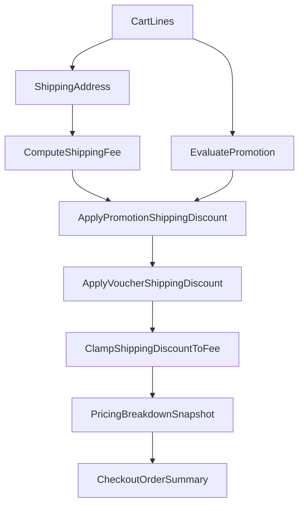

# Kế hoạch triển khai FE/BE cho Promotion-Checkout-Production-Inventory

## Mục tiêu thực thi
- Đảm bảo backend quote là source of truth cho tổng tiền checkout, bao gồm promotion + voucher + shipping discount.
- Chuẩn hóa rule `minOrderScope` cho promo product/category, không để merchandise discount áp dụng ngoài phạm vi eligible.
- Đồng bộ contract FE/BE (DTO/API mapping/UI behavior/tests) cho promotion progress, free shipping, raw address, production shortage, inventory pagination semantics.

## Hiện trạng code quan trọng (để bám khi triển khai)
- Promotion progress DTO hiện còn mỏng (`type`, `remainingAmount`, `requiredAmount`, `items`) tại [C:/Work/NhaDanShopBT/NhaDanShop/src/main/java/com/example/nhadanshop/dto/PromotionProgressSnapshotDto.java](C:/Work/NhaDanShopBT/NhaDanShop/src/main/java/com/example/nhadanshop/dto/PromotionProgressSnapshotDto.java).
- Shipping address DTO chưa có `rawAddress` tại [C:/Work/NhaDanShopBT/NhaDanShop/src/main/java/com/example/nhadanshop/dto/ShippingAddressDto.java](C:/Work/NhaDanShopBT/NhaDanShop/src/main/java/com/example/nhadanshop/dto/ShippingAddressDto.java).
- Query inventory đang `JOIN FETCH p.category` (có nguy cơ drop product không phân loại) tại [C:/Work/NhaDanShopBT/NhaDanShop/src/main/java/com/example/nhadanshop/repository/ProductVariantRepository.java](C:/Work/NhaDanShopBT/NhaDanShop/src/main/java/com/example/nhadanshop/repository/ProductVariantRepository.java).
- FE inventory report đã có client pagination + tổng trang/tổng lọc ở [C:/Work/NhaDanShopBT/nha-dan-pos-c091ee5b/src/pages/admin/InventoryReport.tsx](C:/Work/NhaDanShopBT/nha-dan-pos-c091ee5b/src/pages/admin/InventoryReport.tsx), cần chốt thêm row key/map field/filter semantic để khớp BE.
- Admin promotion mapping hiện chưa parse/serialize `minOrderScope` ở [C:/Work/NhaDanShopBT/nha-dan-pos-c091ee5b/src/services/admin/adminPromotionsApi.ts](C:/Work/NhaDanShopBT/nha-dan-pos-c091ee5b/src/services/admin/adminPromotionsApi.ts).

## Lộ trình triển khai theo phase

### Phase 1 — Promotion schema + contract baseline (BE)
- Tạo migration thêm `promotions.min_order_scope VARCHAR(32) NOT NULL DEFAULT 'ELIGIBLE_ITEMS'`, backfill dữ liệu cũ.
- Dùng migration number kế tiếp trong repo; tên migration mục tiêu: `V34__promotion_min_order_scope.sql` (chỉ dùng khi chưa có migration mới hơn để tránh trùng số).
- Mở rộng entity `Promotion` với field `minOrderScope`; defensive default `ELIGIBLE_ITEMS` ở lifecycle/service layer nếu null.
- Mở rộng DTO:
  - [C:/Work/NhaDanShopBT/NhaDanShop/src/main/java/com/example/nhadanshop/dto/PromotionRequest.java](C:/Work/NhaDanShopBT/NhaDanShop/src/main/java/com/example/nhadanshop/dto/PromotionRequest.java)
  - [C:/Work/NhaDanShopBT/NhaDanShop/src/main/java/com/example/nhadanshop/dto/PromotionResponse.java](C:/Work/NhaDanShopBT/NhaDanShop/src/main/java/com/example/nhadanshop/dto/PromotionResponse.java)
- Cập nhật create/update/toggle/get/list promotion API/service để normalize null/omitted thành `ELIGIBLE_ITEMS`.

### Phase 2 — Promotion engine logic chặt chẽ (BE)
- Tạo helper dùng chung trong promotion pricing path:
  - `eligibleSubtotal(promo, lines)`
  - `orderSubtotal(lines)`
  - `minOrderBasis(promo, lines)`
- Áp dụng cho các touchpoint:
  - [C:/Work/NhaDanShopBT/NhaDanShop/src/main/java/com/example/nhadanshop/service/PromotionEvaluationService.java](C:/Work/NhaDanShopBT/NhaDanShop/src/main/java/com/example/nhadanshop/service/PromotionEvaluationService.java)
  - [C:/Work/NhaDanShopBT/NhaDanShop/src/main/java/com/example/nhadanshop/service/CommercialPricingEngine.java](C:/Work/NhaDanShopBT/NhaDanShop/src/main/java/com/example/nhadanshop/service/CommercialPricingEngine.java)
  - [C:/Work/NhaDanShopBT/NhaDanShop/src/main/java/com/example/nhadanshop/service/SalesQuoteService.java](C:/Work/NhaDanShopBT/NhaDanShop/src/main/java/com/example/nhadanshop/service/SalesQuoteService.java)
  - legacy invoice promotion path (nếu còn active).
- Rule bắt buộc:
  - `appliesTo=ALL` => min-order luôn trên toàn đơn.
  - `PRODUCT/CATEGORY + ELIGIBLE_ITEMS` => min-order trên eligible subtotal.
  - `PRODUCT/CATEGORY + WHOLE_ORDER` => min-order trên order subtotal, nhưng discount vẫn chỉ apply/cap trên eligible subtotal.
  - Không allocate merchandise discount cho line ngoài scope.
- Chuẩn hóa reason i18n message theo 2 nhánh basis (`trong phạm vi` vs `toàn đơn`).

### Phase 3 — Promotion progress DTO + free shipping consistency (BE)
- Mở rộng `PromotionProgressSnapshotDto` thêm `basis`, `currentAmount`.
- Giữ nguyên các field cũ để backward compatibility: `remainingAmount`, `requiredAmount`, `items`.
- Thống nhất `basis` enum values: `ELIGIBLE_ITEMS`, `WHOLE_ORDER`, `ITEM_QUANTITY`, `SHIPPING_ADDRESS`.
- Free shipping:
  - `maxDiscount <= 0 || null` => full shipping fee.
  - `maxDiscount > 0` => cap theo max.
  - Chưa có address/fee => ineligible + previewable state cho UI.
- Quote composition order:
  - compute shipping fee
  - apply promotion shipping discount
  - apply voucher shipping discount
  - clamp tổng shipping discount <= shipping fee
- Đồng bộ snapshot fields trong quote response:
  - `pricingBreakdownSnapshot.shippingFee`
  - `pricingBreakdownSnapshot.shippingDiscount`
  - `promotionSnapshot.shippingDiscountAmount`
  - `voucherSnapshot.shippingDiscountAmount`

### Phase 4 — Raw address preservation end-to-end
- BE:
  - Mở rộng [C:/Work/NhaDanShopBT/NhaDanShop/src/main/java/com/example/nhadanshop/dto/ShippingAddressDto.java](C:/Work/NhaDanShopBT/NhaDanShop/src/main/java/com/example/nhadanshop/dto/ShippingAddressDto.java) với `rawAddress`.
  - Persist rawAddress trong quote payload, pending-order shipping snapshot, invoice/order response mapping (`DtoMapper`, `PendingOrderService`, `SalesQuoteService`, response DTOs).
  - Shipping fee calc vẫn dùng province/district/ward/street; thiếu hierarchy thì reject như hiện tại.
  - Backward compatibility bắt buộc: snapshot cũ không có `rawAddress` vẫn deserialize bình thường (null-safe).
- FE:
  - Mở rộng shipping types tại [C:/Work/NhaDanShopBT/nha-dan-pos-c091ee5b/src/services/types.ts](C:/Work/NhaDanShopBT/nha-dan-pos-c091ee5b/src/services/types.ts) và [C:/Work/NhaDanShopBT/nha-dan-pos-c091ee5b/src/lib/shipping.ts](C:/Work/NhaDanShopBT/nha-dan-pos-c091ee5b/src/lib/shipping.ts).
  - Cập nhật [C:/Work/NhaDanShopBT/nha-dan-pos-c091ee5b/src/components/shared/AddressAutocomplete.tsx](C:/Work/NhaDanShopBT/nha-dan-pos-c091ee5b/src/components/shared/AddressAutocomplete.tsx), state checkout, payload quote/pending-order tại [C:/Work/NhaDanShopBT/nha-dan-pos-c091ee5b/src/pages/storefront/Checkout.tsx](C:/Work/NhaDanShopBT/nha-dan-pos-c091ee5b/src/pages/storefront/Checkout.tsx).
  - UI hiển thị địa chỉ: ưu tiên `rawAddress`; nếu `rawAddress` null thì fallback chuỗi ghép `street, ward, district, province`.

### Phase 5 — FE promotion behavior + API mapping
- Mở rộng FE promotion model + admin form shell:
  - `minOrderScope?: "ELIGIBLE_ITEMS" | "WHOLE_ORDER"`
  - Selector `Đơn tối thiểu tính theo`, default `ELIGIBLE_ITEMS`.
  - Promo cũ thiếu field normalize về `ELIGIBLE_ITEMS`.
- Mapping API:
  - [C:/Work/NhaDanShopBT/nha-dan-pos-c091ee5b/src/services/admin/adminPromotionsApi.ts](C:/Work/NhaDanShopBT/nha-dan-pos-c091ee5b/src/services/admin/adminPromotionsApi.ts)
  - [C:/Work/NhaDanShopBT/nha-dan-pos-c091ee5b/src/services/promotions/promotionEvaluationApi.ts](C:/Work/NhaDanShopBT/nha-dan-pos-c091ee5b/src/services/promotions/promotionEvaluationApi.ts)
- Cart state thêm `selectedPromotionMode?: "auto" | "manual"`.
- Luật cập nhật mode:
  - User click chọn promo => set `selectedPromotionMode = "manual"`.
  - Hệ thống tự chọn best/fallback promo => set `selectedPromotionMode = "auto"`.
- Cart/Checkout behavior:
  - Giữ selected promo ngay cả khi ineligible (show `selectedPromotionInvalidReason`).
  - Checkout gửi `promotionId`; chỉ auto-switch sang `fallbackPromotionId` khi `selectedPromotionMode === "auto"`.
  - Nếu `selectedPromotionMode === "manual"` và promo invalid, giữ nguyên selection và hiển thị reason.
  - Order summary ưu tiên tuyệt đối `beQuote.pricingBreakdownSnapshot` khi quote sẵn sàng.
- Promotion progress parser phía FE phải tolerant:
  - Nếu thiếu `basis` thì default theo `type` hoặc `ELIGIBLE_ITEMS`.
  - Nếu thiếu `currentAmount` thì suy ra từ `requiredAmount - remainingAmount` khi đủ dữ liệu.
  - Không parse string reason để dựng progress mới.

### Phase 6 — Production FE/BE parity
- BE production:
  - Preview DTO thêm `productName`, `variantName`, `variantCode`, `missingQty`.
  - `simulate`: tính `requiredQty`, `availableQty`, `missingQty`, `allocations`; `feasible=false` nếu thiếu.
  - `create`: thiếu tồn pre/post lock => structured shortage error + `409 Conflict`.
  - Unit cost thống nhất preview/create: `(consumedCost + overheadCost) / outputQty`; persist unit cost cho variant và output batch.
- FE production:
  - [C:/Work/NhaDanShopBT/nha-dan-pos-c091ee5b/src/components/production/QuickCreateProductModal.tsx](C:/Work/NhaDanShopBT/nha-dan-pos-c091ee5b/src/components/production/QuickCreateProductModal.tsx): thêm `isSellable`, default theo mode, validate giá.
  - Preview UI highlight thiếu + disable tạo lệnh.
  - Parse structured shortage error để hiển thị list thiếu chi tiết.
  - Recipe edit route `/admin/production/recipes/:id/edit`, wire từ detail page đến form page, patch đúng allowed fields.
  - Save thành công recipe edit => điều hướng về recipe detail page.
  - Validation/API error khi save => giữ nguyên form, hiển thị lỗi tại chỗ.
  - Edit flow chỉ patch recipe hiện tại, không archive recipe cũ và không tạo recipe mới.
  - Field read-only bắt buộc trong màn edit: `recipeCode`, `outputProductId`, `outputVariantId`, `outputQty`.

### Phase 7 — Product/Variant sellable rules + storefront
- BE product/variant service: persist và validate đầy đủ `isSellable`, `costPrice`, `sellPrice`, `sellUnit`, `importUnit`, `piecesPerImportUnit`.
- Public catalog chỉ trả active + sellable variants.
- FE storefront:
  - Product card/modal/spotlight hiển thị stock + CTA disable khi hết.
  - Spotlight có CTA add-to-cart thật.
  - Reuse helper add-to-cart; không tạo picker mới trong lượt này.
  - Nếu product có nhiều variants, CTA `Thêm vào giỏ` điều hướng sang product detail để user chọn variant.
  - Nếu product có đúng 1/default variant, CTA add cart trực tiếp.
  - Modal variant switching cập nhật giá/stock/CTA.

### Phase 8 — Inventory report semantics (FE/BE)
- BE:
  - Report tồn kho chỉ lấy `product.active = true` và `variant.active = true`.
  - Đổi query `findAllActiveWithProductAndCategory` sang `LEFT JOIN FETCH p.category` để không drop sản phẩm không có danh mục.
  - Đảm bảo row payload gồm `productId`, `categoryId`, `variantId`, `categoryName` (null/blank hợp lệ).
  - Filter server: `categoryId` ưu tiên hơn `categoryName`; `categoryName=Không phân loại` match null/blank.
- FE:
  - Giữ phân trang client-side, thêm option page size value `"all"`.
  - Khi chọn `"all"`, truyền `pageSize = Math.max(filtered.length, 1)` vào `useTableControls`.
  - Không sửa `useTableControls` trong phase này.
  - Hiển thị rõ `X-Y / N`.
  - Stat cards luôn tính từ `filtered`; footer tách `Tổng trang hiện tại` vs `Tổng theo bộ lọc` khi nhiều trang.
  - Pagination chỉ ảnh hưởng rows hiển thị; stat cards và `Tổng theo bộ lọc` luôn tính trên toàn bộ `filtered`.
  - Row key ưu tiên `variantId`, fallback `${productId}-${variantCode}`.
  - `adminReports.inventory()` map thêm id fields + `minStockQty`; không drop row category null.
  - FE hiển thị sản phẩm category null/blank là `Không phân loại`.
  - Excel export giữ filter/search/category/sort và độc lập page.

## Thứ tự test & verification
- BE integration/unit tests theo nhóm: promotion basis, free shipping cap, quote/evaluate parity, rawAddress persistence + backward deserialize, production shortage/unit-cost, inventory uncategorized/filter với `product.active=true` + `variant.active=true`.
- FE tests theo nhóm: admin promotion mapping/form, cart `selectedPromotionMode` manual/auto, checkout fallback switch rule, progress parser tolerant fallback, quote breakdown usage, production preview/quick-create validation + recipe edit UX, inventory pagination+totals với page size `"all"`.
- Regression gates:
  - BE test suite.
  - FE `npm run test`.
  - FE `npm run build`.
  - Manual scenarios: checkout (address + ship fee + promo + pending order), inventory report (all categories + pagination + totals consistency).

## Mermaid luồng tính giá checkout (chuẩn source-of-truth)

## Rủi ro chính và chốt kỹ thuật
- Rủi ro lệch số tiền khi áp promotion/voucher shipping theo thứ tự khác nhau giữa evaluate/quote: cần shared calculator hoặc 1 source function dùng chung.
- Rủi ro break contract FE với DTO progress mới: rollout bằng parse tolerant + defaulting, sau đó mới tighten assertions test.
- Rủi ro dữ liệu cũ thiếu field mới (`minOrderScope`, `rawAddress`): xử lý bằng migration defaults + null-safe mapping xuyên suốt.
