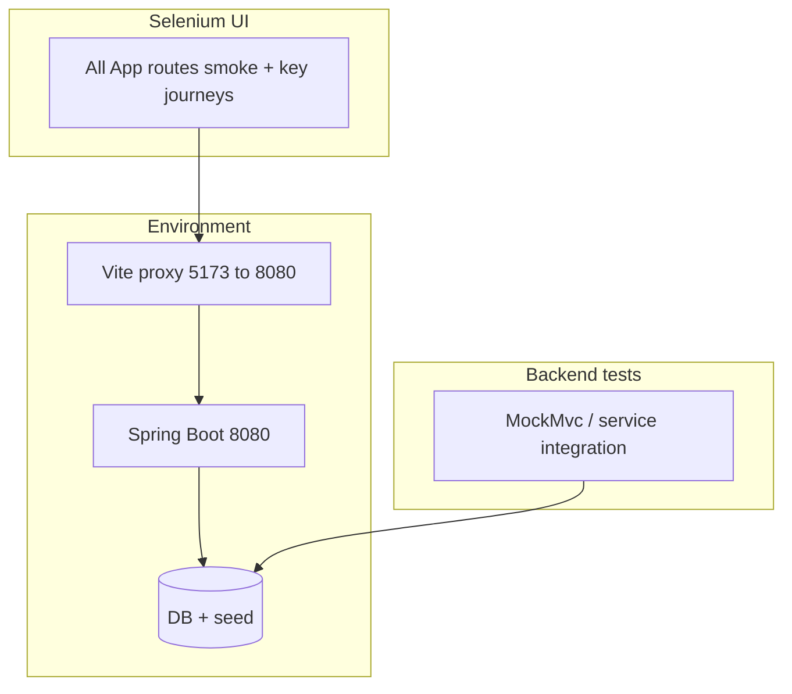

# Full functional coverage — Selenium + BE (ma trận theo App)

## Ý nghĩa “full test tất cả function”

- **FE**: Mọi **route** trong [`nha-dan-pos-c091ee5b/src/App.tsx`](c:/Work/NhaDanShopBT/nha-dan-pos-c091ee5b/src/App.tsx) có ít nhất **một** kịch bản (thường **smoke load** + **một happy path** khi cần đăng nhập/dữ liệu).
- **BE**: Mọi **hành vi và edge** (quota Goong, batch, void, v.v.) chủ yếu do **test Java** (`*IntegrationTest`, `*MvcIntegrationTest`) và tài liệu [`docs/backend-integration-pack.md`](c:/Work/NhaDanShopBT/docs/backend-integration-pack.md). Selenium **không** cố gắng tái hiện từng endpoint — chỉ bám luồng người dùng đi qua nhiều API cùng lúc.

## Ma trận route → hành vi tối thiểu cần automation

### Storefront (`StorefrontLayout`)

| Route | Chức năng cần phủ | Ghi chú |
|-------|-------------------|--------|
| `/` | Home load; link tới sản phẩm/combo | |
| `/products` | Danh sách từ BE; vào detail | |
| `/products/:id` | Chi tiết; thêm giỏ (nếu có stock seed) | |
| `/combos` | List active; thêm combo vào giỏ khi có `defaultVariantId` | |
| `/cart` | Hiển thị line; chỉnh qty/remove | |
| `/checkout` | Địa chỉ → quote shipping → BE quote → submit pending hoặc assert lỗi rõ | Tránh phụ thuộc Goong: manual/fallback |
| `/pending-payment`, `/pending-payment/:id` | Trang chờ thanh toán load sau tạo đơn | |
| `/account` | User đăng nhập: điểm/đơn snapshot (theo BE) | Cần user seed |
| `/login`, `/signup` | Đăng nhập/đăng ký storefront (happy + 1 lỗi validation tùy) | |
| `/forgot-password`, `/reset-password` | Form gửi + reset (có thể mock email hoặc chỉ smoke field) | Tùy môi trường |

### Auth admin (ngoài layout)

| Route | Chức năng |
|-------|-----------|
| `/admin` (guard) | Redirect login khi chưa auth; sau login vào dashboard | Dùng [`AdminAuthGuard`](c:/Work/NhaDanShopBT/nha-dan-pos-c091ee5b/src/components/layout/AdminAuthGuard.tsx) — có thể cần flow `/login` với `?next=` |

> **Lưu ý**: Storefront login và admin có thể dùng cùng [`AdminAuthProvider`](c:/Work/NhaDanShopBT/nha-dan-pos-c091ee5b/src/lib/admin-auth.tsx) — spec cần xác định đúng URL login admin thực tế ([`AdminLogin`](c:/Work/NhaDanShopBT/nha-dan-pos-c091ee5b/src/pages/admin/AdminLogin.tsx) nếu được mount qua guard).

### Admin (sau khi đăng nhập admin)

| Route | Chức năng tối thiểu |
|-------|---------------------|
| `/admin` (index) | Dashboard 4 cảnh báo + pending snippet load |
| `categories` | List + tạo/sửa nhẹ hoặc chỉ load |
| `products`, `products/new`, `products/:id` | List; filter category; mở form (không bắt buộc save mọi trường trong P0) |
| `combos` | List/toggle path smoke |
| `pos` | Mở POS; thêm line (product đã biết) — **pha sau** nếu phụ thuộc scan |
| `invoices` | List + mở detail |
| `pending-orders` | List, tab; mở detail; **confirm** chỉ trên DB throwaway hoặc skip |
| `unmatched-payments` | Load bảng |
| `promotions`, `vouchers` | List CRUD smoke (1 create nhỏ hoặc chỉ load) |
| `goods-receipts`, `goods-receipts/create` | List; mở create (confirm full = pha sâu) |
| `stock-adjustments`, `stock-adjustments/create` | List; mở create/drawer |
| `inventory-report` | Report load theo khoảng ngày |
| `production`, `production/recipes/new` | Tab recipe; form new |
| `revenue`, `profit` | Báo cáo load |
| `customers`, `suppliers` | List CRUD smoke |
| `users`, `security` | List / security screen load |
| `store-settings`, `shipping-settings` | Load; đổi 1 field optional (pha sau) |
| `ghn-quote-logs`, `goong-test` | Dev tools: smoke load hoặc skip trong CI nếu không cần |

## Gói spec đề xuất (file / suite)

- `suites/smoke-all-routes.mjs` — chỉ **visit + assert không 5xx / không blank** (admin sau login).
- `suites/storefront-e2e.mjs` — cart → checkout → pending-payment.
- `suites/admin-core.mjs` — dashboard, products filter, pending list, stock list, production.
- `suites/admin-extended.mjs` — phần còn lại của bảng trên theo từng PR hoặc theo tuần.

Runner gộp: `AUTOMATION_SUITE=all|smoke|storefront|admin-core|admin-extended`.

## Điều kiện hoàn thành “full”

- 100% route trong `App.tsx` có entry trong ma trận và **ít nhất một** spec tự động (smoke hoặc journey), trừ route được **ký duyệt loại trừ** (ghi rõ lý do: ví dụ chỉ dùng tay vì cần OTP thật).
- Báo cáo HTML/JSON tùy chọn: pass/fail per route + link screenshot.

## Phụ thuộc (đã nêu trong kế hoạch Selenium FE–BE)

- Seed admin + catalog; `BASE_URL` / `BACKEND_URL`; preflight `actuator/health`.
- Third-party (Goong/GHN/Casso): trong môi trường automation nên **cấu hình fallback** hoặc key test để không flake.

## Không nằm trong Selenium “full function”

- **Load/performance**, **bảo mật** (OWASP), **i18n đầy đủ** — kênh kiểm tra khác.
- **Mọi nhánh catch** trong Java — thuộc unit/integration BE.

---

*File này bổ sung yêu cầu “full test tất cả function” vào hướng triển khai Selenium; thực thi code khi bạn chuyển sang Agent mode và ra hàng lệnh thực hiện.*
