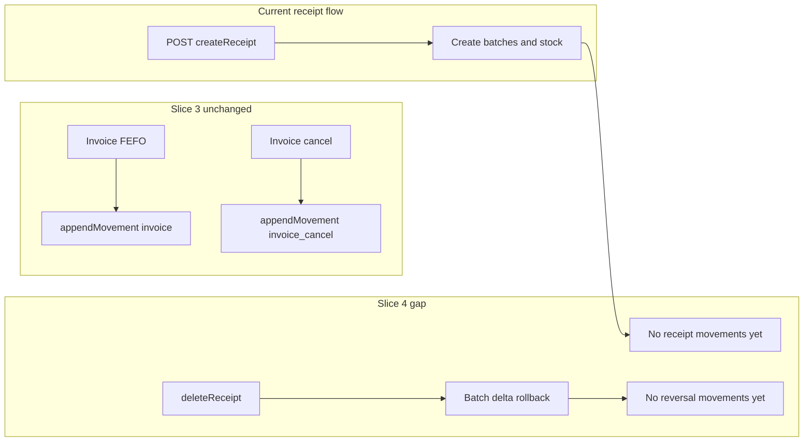

# Slice 4 — Goods receipt lifecycle (audit + plan only)

## Audit — current backend behavior

**Model and create path**

- [`InventoryReceipt`](NhaDanShop/src/main/java/com/example/nhadanshop/entity/InventoryReceipt.java) has **no status** (no draft vs confirmed). A single `POST /api/receipts` in [`InventoryReceiptService.createReceipt`](NhaDanShop/src/main/java/com/example/nhadanshop/service/InventoryReceiptService.java) **immediately**:
  - persists the receipt and line items;
  - creates [`ProductBatch`](NhaDanShop) rows per line with `importQty` / `remainingQty` and links `batch.receipt`;
  - calls [`StockMutationService.updateStockWithBatches`](NhaDanShop/src/main/java/com/example/nhadanshop/service/StockMutationService.java) (batch create path) and updates variant `stockQty` via `recalcAndAssertInvariant`.
- So today, **“receipt = confirmed stock in”** in one step; there is **no** separate confirm step and **no** draft rows that skip batches.

**Delete path and “downstream consumption”**

- [`deleteReceipt`](NhaDanShop/src/main/java/com/example/nhadanshop/service/InventoryReceiptService.java) (used by `DELETE /api/receipts/{id}` in [`InventoryReceiptController`](NhaDanShop/src/main/java/com/example/nhadanshop/controller/InventoryReceiptController.java)):
  - Locks receipt → variants → batches (CRIT-003 / existing test [`ReceiptDeletionLockingIntegrationTest`](NhaDanShop/src/test/java/com/example/nhadanshop/service/ReceiptDeletionLockingIntegrationTest.java)).
  - **Blocks** delete if any batch has `remainingQty < importQty` (interpreted as *any* consumption of that lot, not only sales).
  - If allowed: applies negative batch deltas of `-importQty` (full removal of the batch’s original quantity), deletes batches, `syncVariantStockWithBatches`, deletes receipt.
- **Gap vs movement ledger:** `StockMutationService.appendMovement` is used from [`InvoiceService`](NhaDanShop/src/main/java/com/example/nhadanshop/service/InvoiceService.java) for `invoice` / `invoice_cancel` only. **Receipt create and receipt delete do not append `InventoryMovement` rows**, so the append-only table is **incomplete** for inbound/reversal.

**API/DTO shape**

- [`InventoryReceiptResponse`](NhaDanShop/src/main/java/com/example/nhadanshop/dto/InventoryReceiptResponse.java) has **no** `status` and **no** `canDelete`. Clients must **infer** deletability (e.g. by loading batches) or always call delete and handle `IllegalStateException`.

## Audit — frontend contract (nha-dan-pos)

- [`types.ts`](nha-dan-pos-c091ee5b/src/services/types.ts) already defines a **canonical** [`GoodsReceipt`](nha-dan-pos-c091ee5b/src/services/types.ts) with:
  - `status: "draft" | "confirmed"`;
  - `canDelete: boolean` (documented: true only when no downstream sale consumed any batch from the receipt).
- [`services/index.ts`](nha-dan-pos-c091ee5b/src/services/index.ts) wires `goodsReceipts` to **`LocalGoodsReceiptAdapter`** (local-only). **Backend receipt adapter** is not present in the current thin service tree; Slice 4 will need a **small** `BackendGoodsReceiptAdapter` (or similar) and mapping from BE responses when you choose to cut over—without redesigning screens unless required.

**Important gap:** the POS types say **sale**-driven `canDelete`; the backend rule is **any** reduction of `remainingQty` below `importQty` (includes e.g. batch-scoped [stock adjustment](NhaDanShop/src/main/java/com/example/nhadanshop/service/StockAdjustmentService.java) with `sourceBatchId`). Plan should **align copy and derivation** so UI and API agree (either narrow the rule to “sales only” with extra queries—risky—or broaden FE wording to “downstream consumption”).

## Invariants to preserve (Slice 3 / baseline)

- **Do not change:** invoice deduction/cancel batch logic, `appendMovement` for `invoice` / `invoice_cancel`, pending-order confirm, payment-event link.
- **Keep:** `ProductBatch.remainingQty` as stock truth; `ProductVariant.stockQty` as compatibility sum; `InventoryMovement` **append-only**; `source_id` length fits [`V13`](NhaDanShop/src/main/resources/db/migration/V13__inventory_movements.sql) `VARCHAR(100)`.

## Revised Slice 4 phase order

### Phase A — backend receipt status/canDelete exposure + receipt InventoryMovement coverage

Phase A is the next implementation phase. It keeps the current receipt API semantics and adds read-only receipt metadata plus append-only movement coverage for receipt stock-in and successful receipt delete rollback.

**Scope**

1. Keep current API behavior:
   - `POST /api/receipts` still means immediate confirmed stock-in.
   - `DELETE /api/receipts/{id}` keeps current delete rules.
   - No endpoint rename.
   - No `receipt_status` migration.
   - No draft rows.

2. Add read-only response fields to `InventoryReceiptResponse`:
   - `status = "confirmed"` for current receipts.
   - `canDelete`.
   - `deleteBlockReason` optional/nullable.

3. Define a single backend predicate for `canDelete` that exactly matches the `deleteReceipt` guard:
   - `canDelete = all batches for receipt satisfy remainingQty == importQty`.
   - If any receipt batch has `remainingQty < importQty`:
     - `canDelete = false`.
     - `deleteBlockReason = "downstream_consumption"`.

4. Align FE wording/type comments:
   - Replace "sale consumed" wording with "downstream consumption".
   - Reason: backend blocks delete for any batch reduction/consumption, not only sales.

5. Append `InventoryMovement` rows for receipt create:
   - `sourceType = "goods_receipt"`.
   - `sourceId = "receipt:{receiptId}:batch:{batchId}"`.
   - `qtyDelta = +importQty`.
   - Append after receipt and batch IDs exist.
   - Append inside the same transaction as batch creation and `ProductVariant.stockQty` sync.

6. Append `InventoryMovement` rows for successful receipt delete rollback:
   - `sourceType = "goods_receipt_delete"`.
   - `sourceId = "receipt:{receiptId}:batch:{batchId}:delete"`.
   - `qtyDelta = -importQty`.
   - Append only if delete is allowed and rollback actually happens.
   - If delete is blocked, append no movement.
   - Append inside the same transaction as batch rollback/delete and `ProductVariant.stockQty` sync.

7. Preserve all Slice 3 behavior:
   - `invoice` movements unchanged.
   - `invoice_cancel` movements unchanged.
   - Projection endpoints unchanged.
   - `ProductBatch.remainingQty` remains stock truth.
   - `ProductVariant.stockQty` remains compatibility projection.

**Phase A sourceType/sourceId proposal**

- Receipt create uses `sourceType = "goods_receipt"` because it records the inbound stock event created by the receipt.
- Receipt delete uses `sourceType = "goods_receipt_delete"` because it is explicit and mirrors the existing `invoice` / `invoice_cancel` naming style without using the more ambiguous `receipt_reversal`.
- `sourceId = "receipt:{receiptId}:batch:{batchId}"` and `sourceId = "receipt:{receiptId}:batch:{batchId}:delete"` are deterministic, receipt-scoped, batch-specific, and fit comfortably inside `inventory_movements.source_id VARCHAR(100)`.

**Acceptance checklist for Phase A**

- Receipt response includes `status = "confirmed"`.
- Receipt response includes `canDelete`.
- Receipt response includes `deleteBlockReason = "downstream_consumption"` when blocked.
- `canDelete` uses the same predicate as the `deleteReceipt` guard.
- Receipt create appends positive `goods_receipt` movements.
- Receipt delete appends negative `goods_receipt_delete` movements only when delete succeeds.
- Blocked delete appends no `goods_receipt_delete` movement.
- `ProductVariant.stockQty` remains equal to batch sum.
- Inventory projection remains consistent after receipt create/delete.
- Slice 3 invoice/invoice_cancel movement behavior unchanged.
- Pending-order confirm unchanged.
- Payment-event link unchanged.

**Verification checklist for Phase A**

- Create receipt.
- Verify batches created.
- Verify `ProductVariant.stockQty == SUM(ProductBatch.remainingQty)`.
- Verify `goods_receipt` movement rows exist with positive `qtyDelta`.
- Fetch receipt and verify `status = confirmed`, `canDelete = true`.
- Consume stock from a controlled receipt batch if safely possible.
- Fetch receipt and verify `canDelete = false` and `deleteBlockReason = downstream_consumption`.
- Attempt delete and verify rejection.
- Verify no `goods_receipt_delete` movement for blocked delete.
- Create another unconsumed receipt.
- Delete it.
- Verify `goods_receipt_delete` movement rows with negative `qtyDelta`.
- Verify projection/stock consistency after delete.
- Re-run smoke checks for invoice movement, invoice_cancel movement, projection endpoint, pending-order confirm, and payment-event link.

### Phase B — minimal FE backend goods receipt adapter

Only after Phase A backend fields exist.

**Scope**

1. Add `BackendGoodsReceiptAdapter` or equivalent.
2. Add `HybridGoodsReceiptAdapter` only if consistent with the existing `HybridInventoryAdapter` pattern.
3. Map backend receipt response to `GoodsReceipt`:
   - `status = response.status ?? "confirmed"`.
   - `canDelete = response.canDelete`.
   - `deleteBlockReason = response.deleteBlockReason` if present.
4. Update FE comments/wording from "sale consumed" to "downstream consumption".
5. Keep UI changes minimal.
6. No screen redesign.

### Phase C — draft/confirm lifecycle deferred

Do not implement in the next phase.

Draft/confirm requires explicit later approval because it introduces higher churn:

- `receipt_status` schema migration.
- Draft receipt rows without batches.
- Confirm endpoint that creates batches and movements.
- Idempotency rules.
- FE flow changes.

Keep this as future work only.

## Guardrails

Do not break:

- Slice 3 inventory ledger/projection behavior.
- Invoice deduction/cancel movements.
- Pending-order confirm semantics.
- Payment-event link semantics.
- `ProductBatch.remainingQty` as current stock truth.
- `ProductVariant.stockQty` as compatibility projection.

Do not:

- Reintroduce product-level stock as canonical truth.
- Implement draft/confirm without explicit approval.
- Add `receipt_status` migration in Phase A.
- Rename receipt endpoints in Phase A.
- Redesign receipt UI in Phase A.
- Push/merge/deploy.
