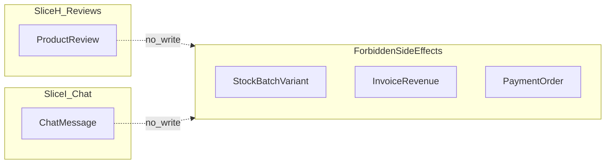

# Slice H — Đánh giá sản phẩm & Slice I — Chat WebSocket (STOMP): Kế hoạch triển khai đầy đủ

## 1. Title + Summary

Tài liệu này mô tả **kế hoạch-only** (không phải trạng thái đã triển khai) cho hai lát cắt:

- **Slice H — Product Reviews / Comments**: đánh giá/bình luận theo `product_id` (catalog parent), kiểm duyệt, tóm tắt rating chỉ hiển thị, **không** đụng tới tài chính/tồn kho/hóa đơn.
- **Slice I — WebSocket Live Chat**: hỗ trợ real-time qua **WebSocket + STOMP**, DB là nguồn sự thật, REST backfill lịch sử, **persist trước broadcast**, **không** thao tác đơn hàng/thanh toán/hóa đơn/tồn kho.

Mục tiêu: dev/Cursor có thể implement sau này **không cần tự đoán hành vi lõi**; các điểm đã audit nằm trong [Blocker Resolution Status](#blocker-resolution-status-audit-repo-2026); gate migration / production được ghi **approval** hoặc **infrastructure**.

---

## 2. Global Guardlist

Áp dụng cho toàn bộ repo **NhaDanShopBT**, local-only:

| Quy tắc | Chi tiết |
|--------|----------|
| Phạm vi | Chỉ làm việc **local**; **không** push, merge, deploy. |
| Cơ sở dữ liệu | **Không** reset DB; **không** chạy lệnh DB phá hoại (DROP/TRUNCATE không kiểm soát, v.v.). |
| Task tạo plan | **Không** sửa application source trong task chỉ tạo plan; **không** tạo migration trong task đó. |
| Source of truth | **Backend + DB persisted** là source of truth cho tính năng production-facing; **không** dùng mock / state chỉ-local làm SoT. |
| Truy vấn | **Không** `findAll` không giới hạn; **không** load full bảng rồi filter trong Java; **không** filter phía client sau khi chỉ load trang đầu; **không** query DB trong vòng lặp; **không** N+1; **không** gọi API per-row từ FE. |
| List/search/filter | **Backend-owned** + **paginated** (hoặc cursor có giới hạn rõ). |
| Business truth | **Không** thay đổi truth của stock, payment, invoice, revenue, promotion, quote từ review/chat. |
| Schema | Nếu cần migration: ghi **migration proposal** + **owner approval required** trước khi tạo migration. |
| Gate hoàn thành | **Không** claim PASS nếu thiếu: backend tests + frontend build/tests + **Selenium full-stack** (backend profile `local`, frontend thật, automation thật). |

---

## Blocker Resolution Status (audit repo 2026)

Kết quả audit mã nguồn backend `NhaDanShop` và cấu hình security hiện tại. Cột **Status**: `Resolved` = đã chốt hành vi/default từ repo; `Approval gate` = chỉ còn bước phê duyệt owner trước khi tạo migration hoặc triển khai production; `Production-only` = không chặn implement local.

| Blocker | Resolution | Status | Evidence from repo | Remaining owner action |
|---------|------------|--------|---------------------|------------------------|
| **H-CUSTOMER** | Principal HTTP = **username** (JWT `sub`); `Customer` lấy qua `AccountService.ensureLinkedCustomer(username)` — load `User` theo username, trả `user.getCustomer()` hoặc **tạo mới** `Customer` + gán `User.customer` (OneToOne). Pattern đã dùng trong [AccountController.java](NhaDanShop/src/main/java/com/example/nhadanshop/controller/AccountController.java) (`auth.getName()`), [AccountService.java](NhaDanShop/src/main/java/com/example/nhadanshop/service/AccountService.java) (`ensureLinkedCustomer`), [User.java](NhaDanShop/src/main/java/com/example/nhadanshop/entity/User.java) (`customer_id`). | **Resolved** | `/api/account/**` chỉ `authenticated()` [SecurityConfig.java](NhaDanShop/src/main/java/com/example/nhadanshop/security/SecurityConfig.java); JWT filter [JwtAuthFilter.java](NhaDanShop/src/main/java/com/example/nhadanshop/security/JwtAuthFilter.java) set `Authentication` principal = username từ access token. | **Tùy chọn sản phẩm:** nếu chỉ muốn role storefront (vd. `ROLE_USER`) được tạo review, thêm check role trong controller/service — **không** bắt buộc để unblock mapping. |
| **H-ROLE** | Moderation review **v1 = ADMIN-only**; endpoint đặt dưới `/api/admin/reviews` khớp `hasRole("ADMIN")` cho mọi `/api/admin/**`. STAFF moderation = **future slice** sau khi owner approve thay đổi security. | **Resolved** | `.requestMatchers("/api/admin/**").hasRole("ADMIN")` trong [SecurityConfig.java](NhaDanShop/src/main/java/com/example/nhadanshop/security/SecurityConfig.java). | Muốn STAFF duyệt review → follow-up: mở matcher mới (vd. `/api/staff/reviews`) + policy — **ngoài** Slice H v1 mặc định. |
| **H-MIGRATION** | Schema/index proposal trong plan đủ để implement sau khi **owner approve** file migration; **không** phải thiếu thiết kế. | **Approval gate** | Chưa có bảng `product_reviews` trong codebase (feature chưa có). | Owner sign-off migration trước khi chạy DDL. **Blocked for code that touches DB** until approval — spec/design không bị block. |
| **I-STAFF** | **v1 chốt:** `ADMIN` xem **mọi** conversation + **hàng đợi chưa assign** (triage); `STAFF` chỉ conversation **`assigned_staff_id` = user id của STAFF**. STAFF **không** được list/subscribe queue unassigned. | **Resolved** | Role `ROLE_STAFF` đã tồn tại trong matcher POS; chat chưa có code — policy ghi trong plan là contract v1. | Muốn STAFF thấy unassigned queue → owner approve + đổi rule list/subscribe/security. |
| **I-AUTH** | **v1 chốt:** tái sử dụng **cùng JWT stateless** như HTTP: handshake STOMP đọc token (header `Authorization: Bearer` hoặc query param thỏa thuận FE), `ChannelInterceptor` kiểm tra `CONNECT` / `SUBSCRIBE` / `SEND`; map principal → `User`/`Customer` giống HTTP (username → `UserRepository`). Customer chỉ room của mình; ADMIN all; STAFF assigned only. | **Resolved** (implementation task) | [JwtAuthFilter.java](NhaDanShop/src/main/java/com/example/nhadanshop/security/JwtAuthFilter.java), [SecurityConfig.java](NhaDanShop/src/main/java/com/example/nhadanshop/security/SecurityConfig.java) `SessionCreationPolicy.STATELESS`. | Cấu hình `SecurityFilterChain` cho endpoint `/ws` + đăng ký interceptor — công việc code, **không** còn ambiguity “có auth hay không”. |
| **I-PROXY** | Chỉ ảnh hưởng **production-ready**; không chứng minh được từ repo. | **Production-only** | N/A trong repo. | Owner/hạ tầng xác nhận proxy/load balancer cho phép **WebSocket upgrade** trước khi claim production-ready. |
| **I-SOCKJS** | **v1 local + full-stack Selenium:** **raw WebSocket + STOMP**; SockJS **out of scope** mặc định; chỉ future nếu proxy bắt buộc. | **Resolved** (not a local blocker) | Không bắt buộc từ codebase. | Nếu deploy sau này không upgrade WS được → xem xét SockJS/fallback — follow-up. |
| **I-MIGRATION** | Tương tự H: proposal trong plan; **owner approve** trước DDL. | **Approval gate** | Chưa có bảng chat trong codebase. | Owner sign-off migration. **Blocked for code that touches DB** until approval. |

---

## Implementation Readiness

- File `C:\Work\NhaDanShopBT\NhaDanShop\src\main\resources\application-local.properties` **có trong repo**; full-stack gate local dùng profile `local` theo **mục 6.2**. **Không** khôi phục blocker `CONFIG-LOCAL`.
- Tài liệu là **spec chi tiết**; phê duyệt slice + migration vẫn là quy trình owner.

## Implementation Readiness After Blocker Review

- **Slice H:** **Ready for implementation under safe defaults** sau khi owner **approve migration proposal** (`H-MIGRATION` gate). Mapping customer đã **resolved** từ repo (`ensureLinkedCustomer`); moderation **ADMIN-only v1** đã **resolved** từ `SecurityConfig`.
- **Slice H blocked** chỉ khi: owner **chưa approve** migration / DDL; hoặc team **từ chối** dùng `ensureLinkedCustomer` (trường hợp không áp dụng — không thấy trong audit hiện tại).
- **Slice I:** **Ready for local implementation** sau khi owner **approve migration proposal** (`I-MIGRATION` gate). Auth model **resolved** (JWT + interceptor là implementation). **Production-ready** phụ thuộc **I-PROXY** (infrastructure), không chặn code local/Selenium trên máy dev.
- **Slice I blocked** chỉ khi: owner **chưa approve** migration; hoặc team không triển khai interceptor đúng contract (lỗi implementation — ngoài phạm vi plan audit).

## Default Safe Assumptions If Owner Does Not Override

**Slice H**

- Moderation review **v1 = ADMIN-only** (`/api/admin/**`); STAFF = **future / owner-approved extension** (slice security riêng).
- Định danh customer cho API review: **`AccountService.ensureLinkedCustomer(authentication.getName())`** (cùng pattern [AccountController](NhaDanShop/src/main/java/com/example/nhadanshop/controller/AccountController.java)).
- Review mới: trạng thái **PENDING**.
- **Một** review active (non-deleted) / customer / product.
- Chỉ review **cấp product** (không variant trong v1).
- Không ảnh / video review trong v1.

**Slice I**

- **Guest chat:** out of scope (v1).
- **ADMIN:** mọi conversation + **hàng đợi triage** (conversation **chưa assign**).
- **STAFF:** **chỉ** conversation **`assigned_staff_id`** trùng user STAFF; **không** list/subscribe queue unassigned (trừ owner approve sau này).
- Transport v1: **raw WebSocket + STOMP**; **SockJS** = tùy chọn tương lai nếu deploy/proxy yêu cầu (không blocker local).
- Conversation **CLOSED:** chặn gửi tin mới; customer tạo conversation mới khi cần.
- **Không** attachment; **không** typing indicator (v1).
- Chat **không** mutate order / payment / invoice / stock.

---

## 3. Slice H — Product Reviews / Comments

### H.0 Chính sách đã chốt sau audit repo (Slice H)

**Tham chiếu:** [Blocker Resolution Status](#blocker-resolution-status-audit-repo-2026).

**H-CUSTOMER (resolved):** API review phía account dùng **`Authentication.getName()`** (username JWT) + **`AccountService.ensureLinkedCustomer(username)`** để lấy `Customer` — đồng bộ với [AccountController.java](NhaDanShop/src/main/java/com/example/nhadanshop/controller/AccountController.java) / [AccountService.java](NhaDanShop/src/main/java/com/example/nhadanshop/service/AccountService.java). Liên kết `User` ↔ `Customer`: [User.java](NhaDanShop/src/main/java/com/example/nhadanshop/entity/User.java) (`@OneToOne` `customer_id`). Đăng ký cũng gán `Customer` trong [AuthService.java](NhaDanShop/src/main/java/com/example/nhadanshop/service/AuthService.java) (`signUp` / `resolveSignupCustomer`). Cột `user_id` trên `product_reviews` **tùy chọn** (denormalize) — không bắt buộc để có `customer_id`.

**H-ROLE (resolved, v1):** Moderation **chỉ ADMIN**; endpoint moderation dưới **`/api/admin/reviews`** khớp [SecurityConfig.java](NhaDanShop/src/main/java/com/example/nhadanshop/security/SecurityConfig.java) (`/api/admin/**` → `hasRole("ADMIN")`). **Không** mở moderation cho `ROLE_STAFF` trong Slice H v1. STAFF moderation → **follow-up slice** + owner approve security.

**H-MIGRATION (approval gate):** Thiết kế **H.5** đủ để viết migration sau khi owner approve. **Blocked for persistence code** (entity/repository/JPA map tới bảng mới) **until** owner approves migration proposal — không phải thiếu thiết kế.

### H.1 Scope

- Thêm đánh giá/bình luận sản phẩm.
- Review **gắn với Product (catalog parent)** trong v1; **không** gắn riêng `ProductVariant`.
- Storefront public chỉ hiển thị review **APPROVED** và **non-deleted**.
- Chỉ **customer đã đăng nhập** được tạo review.
- **Admin** moderation (**v1 = ADMIN-only**, không STAFF); xem **H.0**.
- Rating summary **chỉ UI**; không ảnh hưởng business financial.

### H.2 Out Of Scope

- Không ảnh hưởng giá, tồn kho, batch, quote, promotion, voucher, invoice, payment, báo cáo revenue/profit.
- Không review theo variant trong v1.
- Không review ẩn danh.
- Không hard-delete mặc định (ưu tiên soft delete).
- Không upload ảnh/video review trong v1 **trừ khi owner approve** (mặc định: không).
- Không recompute invoice/report từ dữ liệu review.

### H.3 Business Truth

- Review **không** mutate `ProductBatch.remainingQty`, `ProductVariant.stockQty`.
- Review **không** ảnh hưởng promotion/voucher/quote/checkout.
- Review **không** ảnh hưởng invoice snapshots / revenue / profit.
- **Verified purchase** phải dựa trên **invoice đã persist + dòng hàng (invoice lines) đã persist**, **không** dựa trên trạng thái catalog hiện tại.

**Neo vào domain hiện có (repo):** entity hóa đơn bán là `SalesInvoice` với `Status { COMPLETED, CANCELLED }`; dòng hàng là `SalesInvoiceItem` có `product_id` (bảng `sales_invoice_items`). Verified purchase (v1) được định nghĩa cụ thể: tồn tại ít nhất một `SalesInvoice` **COMPLETED** (không CANCELLED) thuộc **customer** đang xét, và tồn tại `SalesInvoiceItem` của invoice đó với `product_id` trùng sản phẩm được review. Truy vấn phải có điều kiện + index phù hợp (xem H.7).

### H.4 Default Decisions

| Quyết định | Giá trị |
|------------|---------|
| Khóa ngoại | `product_id` → `products(id)` |
| Status mới | `PENDING` |
| Public | Chỉ `APPROVED` |
| Không public | `REJECTED`, `HIDDEN` (và mọi bản ghi `deleted_at != null`) |
| Một review active / khách / sản phẩm | Tối đa **một** bản ghi **non-deleted** cho cặp `(customer_id, product_id)` |
| Customer update | Reset `status` → `PENDING` |
| Customer delete | **Soft delete** (`deleted_at`) |
| Admin actions | `APPROVE`, `REJECT`, `HIDE`, `RESTORE` |
| Summary | Chỉ tính `APPROVED` + `deleted_at IS NULL` |

**RESTORE:** đưa review từ trạng thái moderation về hiển thị public **chỉ khi** sau thao tác logic trạng thái là `APPROVED` (theo quy tắc H.9); nếu restore về `REJECTED` thì vẫn không public.

### H.5 Schema / Migration Proposal

**Điều kiện:** chưa tạo migration cho đến khi **owner approve** schema + index + chiến lược unique partial. Đây là **approval gate** (ký migration / chạy DDL), **không** phải thiếu quyết định thiết kế — proposal dưới đây đủ để viết migration sau khi được sign-off.

**Bảng đề xuất: `product_reviews`**

| Cột | Kiểu | Ràng buộc / ghi chú |
|-----|------|---------------------|
| `id` | `bigint` | PK |
| `product_id` | `bigint` | NOT NULL, FK → `products(id)` |
| `customer_id` | `bigint` | NULLABLE trong DDL có thể cho tương lai; v1 runtime **bắt buộc** có `customer_id` qua `ensureLinkedCustomer` — xem **H.0** |
| `user_id` | `bigint` | NULLABLE nếu mô hình auth cần map `User` ↔ `Customer` |
| `rating` | `int` | NOT NULL, CHECK 1..5 |
| `title` | `varchar(120)` | NULLABLE |
| `comment` | `varchar(1000)` | NOT NULL |
| `status` | `varchar(20)` | NOT NULL: `PENDING`, `APPROVED`, `REJECTED`, `HIDDEN` |
| `verified_purchase` | `boolean` | NOT NULL DEFAULT false |
| `verified_invoice_id` | `bigint` | NULLABLE — FK tới invoice đã dùng để chứng minh (tối thiểu một invoice COMPLETED) |
| `moderation_reason` | `varchar(500)` | NULLABLE |
| `created_at` | `timestamp` | NOT NULL |
| `updated_at` | `timestamp` | NOT NULL |
| `moderated_at` | `timestamp` | NULLABLE |
| `moderated_by` | `varchar` hoặc user id | NULLABLE — format thống nhất với các bảng moderation khác trong project |
| `deleted_at` | `timestamp` | NULLABLE |

**Index đề xuất**

- `idx_product_reviews_product_status_created` `(product_id, status, created_at DESC)`
- `idx_product_reviews_customer_product_active` `(customer_id, product_id, deleted_at)`
- `idx_product_reviews_status_created` `(status, created_at DESC)`
- `idx_product_reviews_verified_invoice` `(verified_invoice_id)`
- **Unique** một review active / khách / SP: nếu DB hỗ trợ partial unique: `UNIQUE (customer_id, product_id) WHERE deleted_at IS NULL`. Nếu không: **service-level guard** (transaction + `SELECT ... FOR UPDATE` hoặc unique constraint từng phần ở tầng ứng dụng) + index hỗ trợ lookup; **ghi rõ trong migration doc**.

### H.6 API Contract

**Public (không auth hoặc auth tùy policy hiện tại của `/api/public/**`):**

- `GET /api/public/products/{productId}/reviews?page=&size=&sort=`  
  - Response: `Page<ProductReviewPublicResponse>`  
  - Filter server: chỉ `status=APPROVED` và `deleted_at IS NULL`  
  - Sort: mặc định `created_at,desc` (ghi rõ trong OpenAPI/controller doc)

- `GET /api/public/products/{productId}/review-summary`  
  - Response: `productId`, `averageRating` (BigDecimal scale cố định, ví dụ 2 chữ số), `reviewCount`, `ratingCounts` cho 1..5 (map hoặc mảng cố định 5 phần tử)

**Customer (account, bắt buộc auth customer):**

- `POST /api/account/products/{productId}/reviews`  
  - Body: `{ "rating", "title?", "comment" }`  
  - Kiểm tra verified purchase (H.3); reject duplicate active; tạo `PENDING`; set `verified_purchase=true`, `verified_invoice_id` = id invoice chứng minh (hoặc rule rõ: chọn invoice **mới nhất** COMPLETED có line chứa product — quyết định cố định trong service, không để FE chọn).

- `PUT /api/account/reviews/{reviewId}`  
  - Owner only; cập nhật rating/title/comment; `status` → `PENDING`; xóa/reset các trường moderation tùy policy (khuyến nghị: giữ `moderation_reason` lịch sử hoặc clear — **chốt một**: clear `moderation_reason` + `moderated_*` khi customer sửa để tránh hiểu nhầm).

- `DELETE /api/account/reviews/{reviewId}`  
  - Owner only; soft delete.

- `GET /api/account/reviews?page=&size=`  
  - Paginated; chỉ review của principal.

**Admin:**

- `GET /api/admin/reviews?status=&productId=&customerId=&q=&page=&size=`  
  - Filter + search + phân trang **trên server**; `q` áp dụng title/comment (LIKE có giới hạn length + index strategy — tránh full scan không kiểm soát).

- `GET /api/admin/reviews/{id}`

- `PATCH /api/admin/reviews/{id}/moderate`  
  - Body: `{ "action": "APPROVE|REJECT|HIDE|RESTORE", "reason"?: string }`  
  - Ghi `moderated_at`, `moderated_by`, `moderation_reason` (và cập nhật `status` tương ứng).

**Quyền moderation (v1):** chỉ **ROLE_ADMIN**; endpoint **`/api/admin/reviews`** khớp [SecurityConfig.java](NhaDanShop/src/main/java/com/example/nhadanshop/security/SecurityConfig.java). Xem **H.0**.

**HTTP codes (mặc định implement):**

- 401: chưa auth (customer/admin)
- 403: sai role / không owner
- 404: review không tồn tại hoặc không visible theo endpoint (tránh leak: có thể 404 thống nhất cho non-owner)
- 409: duplicate active review
- 422/400: không đủ verified purchase, validation rating/comment length

### H.7 Backend Design

**Thành phần:**

- `ProductReviewService` — orchestration, transaction boundaries.
- `ProductReviewRepository` — Spring Data JPA + **custom `@Query` pagination** cho admin filters; **không** load entity graph đệ quy.
- `VerifiedPurchaseService` (hoặc method trong service invoice) — **một** truy vấn (hoặc tối đa hai: exists + optional fetch invoice id) có giới hạn:  
  `EXISTS` join `sales_invoices` + `sales_invoice_items` với `invoice.status = COMPLETED`, `invoice.customer_id = :customerId`, `item.product_id = :productId`.  
  Bổ sung index nếu thiếu: đề xuất migration `(customer_id, status)` trên `sales_invoices` và/hoặc composite phù hợp với query plan — **owner approve**.
- `ProductReviewSummary` — **một** query aggregate (COUNT, SUM rating) scoped `APPROVED` + non-deleted; **không** tính trong loop.
- Mapper DTO-only; response **không** serialize entity recursive.

**N+1:** list public/admin dùng DTO projection hoặc `JOIN FETCH` có kiểm soát một cấp; tránh lazy load trong loop.

### H.8 Frontend UX

**Storefront**

- Trang chi tiết sản phẩm: section/tab **Reviews**.
- Hiển thị: average, count, distribution (1–5), list phân trang.
- Khách **chưa login**: không form submit; có thể ẩn form hoặc CTA login.
- Khách **login** nhưng **không đủ điều kiện**: message cố định: *"Chỉ khách đã mua sản phẩm này mới có thể đánh giá"*.
- Sau submit: thông báo trạng thái **PENDING**; không hiện trên public list cho đến khi APPROVED.

**Account**

- Trang **My Reviews**: list phân trang; edit/delete.

**Admin**

- Danh sách moderation: filter status/product/search; **một** request list; detail drawer/modal từ data đã có hoặc **một** request detail (không per-row khi chỉ scroll list).

### H.9 Acceptance Criteria

- Public list chỉ `APPROVED` + non-deleted.
- Summary chỉ đếm `APPROVED` + non-deleted.
- Không có completed purchase (theo H.3) → không tạo được review.
- Có purchase → tạo được `PENDING`.
- Duplicate active → reject (409).
- Update → `PENDING`, biến mất khỏi public đến khi duyệt lại.
- Soft delete → không public, không đếm.
- Approve → public + đếm; reject/hide → không public.
- Review **không** đổi stock/price/promotion/quote/invoice/revenue.
- Mọi list **paginated backend-owned**; **không** N+1.

### H.10 Backend Tests (tên test bắt buộc)

- `public_reviews_only_approved_non_deleted`
- `review_summary_counts_only_approved`
- `customer_create_review_requires_auth`
- `customer_create_review_requires_verified_purchase`
- `customer_create_review_duplicate_rejected`
- `customer_update_review_resets_to_pending`
- `customer_soft_delete_review_hides_public`
- `admin_approve_review_makes_public`
- `admin_reject_review_not_public`
- `admin_hide_approved_review_removes_public`
- `admin_restore_hidden_review_restores_public_if_approved`
- `admin_review_list_filters_paginated`
- `verified_purchase_query_uses_completed_invoice_lines`
- `review_list_no_n_plus_one`
- `review_does_not_change_invoice_revenue_stock`

### H.11 Frontend Tests (Vitest)

- public review summary render
- public review list pagination
- logged-out cannot submit
- ineligible customer sees blocked message
- eligible customer submit shows pending
- account my reviews edit/delete
- admin moderation filters
- admin approve/reject/hide/restore updates row state
- adapters map review DTOs correctly

### H.12 Selenium Full-stack — tag: `reviews`

**Yêu cầu artifact (mọi case):** không claim PASS nếu thiếu bất kỳ mục nào dưới đây.

| Case ID | Route (UI) | Setup fixture | API assertion | UI assertion |
|---------|------------|---------------|---------------|--------------|
| `storefront_reviews_public_only_approved` | Trang chi tiết SP (public) | Chuẩn bị DB/API: 1 APPROVED, 1 PENDING, 1 REJECTED/HIDDEN, 1 soft-deleted | `GET .../reviews` chỉ thấy APPROVED; `.../review-summary` khớp aggregate | Chỉ thấy nội dung APPROVED |
| `customer_verified_purchase_can_submit_pending_review` | Cùng route + flow account | Customer có `SalesInvoice` COMPLETED + line `product_id` | `POST .../reviews` → 201 + `PENDING` | Form submit thành công; trạng thái PENDING hiển thị |
| `customer_without_purchase_cannot_submit_review` | Cùng | Customer không có invoice line cho SP | `POST` → 4xx | Message *Chỉ khách đã mua...* |
| `duplicate_review_blocked_or_edit_flow` | Account / SP | Đã có 1 active review | `POST` lần 2 → 409; hoặc flow edit hợp lệ | UI báo trùng hoặc chuyển edit |
| `admin_approves_review_then_public_visible` | Admin moderation + public | Review PENDING | `PATCH .../moderate` APPROVE; public GET thấy | Public list có review |
| `admin_rejects_review_not_public` | Admin + public | Review PENDING | `PATCH` REJECT | Public không thấy |
| `admin_hides_review_removed_from_public` | Admin + public | Review APPROVED | `PATCH` HIDE | Public không thấy |
| `reviews_pagination_backend_owned` | Public | > page size reviews APPROVED | Page 1 vs page 2 khác nhau; `totalElements` đúng | UI chuyển trang đúng |
| `review_summary_updates_after_approval` | Public | Trước/sau approve | `review-summary` đổi count/avg | UI đổi stars/count |
| `no_review_affects_invoice_stock_revenue` | Bất kỳ | Snapshot invoice line qty / variant stock trước | Sau toàn flow review | `GET` invoice/stock/report không đổi (dùng API read-only hiện có) |

**Per case — bắt buộc ghi trong báo cáo Selenium:**

- **Screenshot/log path:** dưới [nha-dan-pos-c091ee5b/automation-output/](nha-dan-pos-c091ee5b/automation-output/) (theo convention runner: fail artifacts; pass có thể lưu tối thiểu 1 screenshot nếu policy suite yêu cầu).
- **automation-summary.json:** [nha-dan-pos-c091ee5b/automation-output/automation-summary.json](nha-dan-pos-c091ee5b/automation-output/automation-summary.json)
- **case-results JSON:** [nha-dan-pos-c091ee5b/automation-output/](nha-dan-pos-c091ee5b/automation-output/) — file sidecar theo tag (implementer đặt tên cố định ví dụ `reviews-case-results.json`) và runner phải ghi matrix PASS/FAIL (pattern tương tự các slice khác trong [automation/selenium/runner.mjs](nha-dan-pos-c091ee5b/automation/selenium/runner.mjs)).

### H.13 Stop Conditions

- **H-MIGRATION** chưa owner approve: **dừng** trước migration / entity map vào bảng `product_reviews` chưa tồn tại.
- **H-ROLE:** **không** mở quyền STAFF cho moderation trong v1; vi phạm → **dừng** / revert.
- Không kiểm tra verified purchase từ persisted invoice lines: **dừng**.
- Implementation đụng invoice/revenue/stock/promotion: **dừng**.
- List cần unbounded load / N+1: **dừng**.

---

## 4. Slice I — WebSocket Live Chat

### I.0 Chính sách đã chốt sau audit repo (Slice I)

**Tham chiếu:** [Blocker Resolution Status](#blocker-resolution-status-audit-repo-2026).

**I-STAFF (resolved, v1):** **ADMIN** — mọi conversation + **hàng đợi triage** (`assigned_staff_id IS NULL` hoặc rule tương đương trong query list). **STAFF** — **chỉ** conversation có **`assigned_staff_id` = id user** của STAFF; **không** REST list / WebSocket subscribe tới queue unassigned. Mở unassigned cho STAFF → owner approve + follow-up security.

**I-AUTH (resolved — implementation task):** Handshake STOMP dùng **cùng JWT Bearer** như HTTP ([JwtAuthFilter](NhaDanShop/src/main/java/com/example/nhadanshop/security/JwtAuthFilter.java) pattern); cấu hình `SecurityFilterChain` cho **`/ws`** + **`ChannelInterceptor`** cho `CONNECT` / `SUBSCRIBE` / `SEND`. Không còn blocker “chưa biết dùng auth gì” — chỉ còn việc code đúng contract.

**I-PROXY (production-only):** Không chặn implement **local** / Selenium full-stack trên máy dev. **Unblock production-ready** khi owner/hạ tầng xác nhận proxy hỗ trợ WebSocket upgrade.

**I-SOCKJS (resolved, không blocker local):** **v1 = raw WebSocket + STOMP**; SockJS **out of scope** trừ khi deploy chứng minh cần (follow-up).

**I-MIGRATION (approval gate):** Giống H — **blocked for persistence code until** owner approves migration; thiết kế **I.5** đã đủ.

### I.1 Scope

- Live support chat qua **WebSocket/STOMP**.
- Customer (logged-in) chat với admin/staff.
- Inbox admin/staff.
- **DB source of truth**; **REST backfill** lịch sử; **persist message trước khi broadcast**.

### I.2 Out Of Scope

- Không SSE; không Supabase realtime làm transport chính; không chat chỉ-local-state.
- Không guest chat v1 **trừ owner approve**.
- Không attachment v1.
- Không typing indicator v1 **trừ owner approve sau**.
- Chat **không** mutate order/payment/invoice/stock; không tự động workflow đơn qua chat.

### I.3 Business Truth

- Có thể **metadata** tham chiếu `orderId` / `pendingOrderId` (chỉ payload kèm theo, không side-effect).
- Chat **không** tạo/hủy/xác nhận đơn; **không** xác nhận thanh toán; **không** tạo invoice; **không** mutate stock.
- **Persist message trong transaction** trước khi gửi event ra bus/topic.

### I.4 Default Decisions

| Hạng mục | Quyết định |
|----------|------------|
| Transport | WebSocket + STOMP |
| Endpoint | `/ws` |
| Customer | Chỉ conversation của mình |
| ADMIN | Mọi conversation + **triage** (unassigned / chưa gán staff) |
| STAFF | **Chỉ** conversation **đã assign** cho STAFF (`assigned_staff_id` = principal); **không** triage queue (v1) |
| CLOSED | Chặn gửi mới; customer **mở conversation mới** (POST create) |
| Max body | 2000 ký tự (reject nếu vượt) |
| Idempotency | `clientMessageId` |
| REST history | `beforeId` / `afterId` cursor + `page`/`size` có giới hạn |

**Trạng thái conversation:** `OPEN`, `PENDING`, `CLOSED` — `PENDING` có thể dùng cho “chờ staff nhận”; **định nghĩa chuyển trạng thái** cố định trong service (ví dụ: tạo → OPEN; assign → PENDING hoặc giữ OPEN — **chốt một bảng chuyển trạng thái** trong implementation doc, không để FE tự đoán).

### I.5 Schema / Migration Proposal

**Chờ owner approve** trước khi tạo migration. Đây là **approval gate**, **không** phải thiếu thiết kế — proposal dưới đây decision-complete cho DDL sau sign-off.

**`chat_conversations`**

| Cột | Ghi chú |
|-----|---------|
| `id` | bigint PK |
| `public_id` | varchar/uuid **UNIQUE** NOT NULL — dùng trên URL/WS |
| `customer_id` | bigint NULLABLE nếu sau này có guest — v1 customer logged-in: NOT NULL tại tầng service |
| `customer_name_snapshot` | varchar(150) |
| `status` | OPEN, PENDING, CLOSED |
| `assigned_staff_id` | bigint NULLABLE FK user/staff |
| `last_message_at` | timestamp NULLABLE |
| `last_message_preview` | varchar(200) NULLABLE |
| `unread_customer_count` | int NOT NULL DEFAULT 0 |
| `unread_staff_count` | int NOT NULL DEFAULT 0 |
| `created_at`, `updated_at` | NOT NULL |
| `closed_at` | NULLABLE |

**`chat_messages`**

| Cột | Ghi chú |
|-----|---------|
| `id` | bigint PK |
| `conversation_id` | FK chat_conversations |
| `sender_type` | CUSTOMER, STAFF, ADMIN, SYSTEM |
| `sender_user_id` | bigint NULLABLE |
| `body` | varchar(2000) NOT NULL |
| `client_message_id` | varchar(100) NULLABLE |
| `created_at` | NOT NULL |
| `edited_at`, `deleted_at` | NULLABLE |

**Index**

- `idx_chat_conversation_customer_status` `(customer_id, status, last_message_at DESC)`
- `idx_chat_conversation_assigned_status` `(assigned_staff_id, status, last_message_at DESC)`
- `idx_chat_message_conversation_created` `(conversation_id, created_at, id)`
- Unique: `(conversation_id, client_message_id)` WHERE `client_message_id IS NOT NULL` nếu DB hỗ trợ; else **service idempotency** + unique index fallback doc.

### I.6 Backend REST API

- `GET /api/chat/conversations?page=&size=&status=` — **customer:** chỉ conversation `customer_id` = principal; **ADMIN:** toàn bộ + filter triage (vd. `assigned_staff_id IS NULL`); **STAFF:** chỉ `assigned_staff_id` = user id STAFF (không thấy unassigned).
- `POST /api/chat/conversations` — mở mới hoặc **reuse** conversation đang OPEN/PENDING (rule cố định: ví dụ reuse theo `customer_id` khi tồn tại OPEN; nếu chỉ CLOSED thì tạo mới).
- `GET /api/chat/conversations/{publicId}/messages?beforeId=&afterId=&page=&size=` — cursor + bounded.
- `PATCH /api/chat/conversations/{publicId}/assign` — **v1 = ADMIN-only** (triage gán staff); STAFF self-pick từ queue = follow-up + owner approve.
- `PATCH /api/chat/conversations/{publicId}/close` — theo policy: **ADMIN** mọi hội thoại; **STAFF** chỉ conversation đã assign cho mình (nếu product cho phép staff đóng).
- `PATCH /api/chat/conversations/{publicId}/read` — mark read; cập nhật unread trong transaction.

**Security mapping:** các path `/api/chat/**` phải được khai báo trong [SecurityConfig](NhaDanShop/src/main/java/com/example/nhadanshop/security/SecurityConfig.java) với `hasRole` / `hasAnyAuthority` rõ; **không** để permitAll nhầm.

### I.7 WebSocket / STOMP Contract

- **Endpoint:** `/ws` — **raw WebSocket + STOMP** (v1; Selenium harness cùng mô hình). SockJS chỉ follow-up nếu deploy yêu cầu.
- **Send destination:** `/app/chat.send`
- **Payload:** `{ conversationPublicId, clientMessageId, body }`
- **Topics:**
  - `/topic/chat.conversation.{publicId}` — message trong room (hoặc chỉ participant — **ưu tiên** narrow cast qua `convertAndSendToUser` nếu muốn tránh leak subscription; nếu dùng `/topic/...` bắt buộc interceptor từ chối subscribe nếu không tham gia).
  - `/user/queue/chat.notifications` — inbox events (conversation.updated, v.v.)

**Server events (JSON envelope thống nhất):**

```json
{ "type": "message.created", "payload": { } }
{ "type": "conversation.updated", "payload": { } }
{ "type": "error", "payload": { "code": "", "message": "" } }
```

**Send flow (bắt buộc thứ tự):**

1. Authenticate WebSocket principal (**JWT Bearer** giống HTTP — xem **I.0 / bảng Blocker Resolution**).
2. Authorize sender là participant hoặc staff/admin hợp lệ.
3. Validate `body.length <= 2000`.
4. Validate conversation `OPEN` hoặc `PENDING` (theo rule đã chốt cho phép customer gửi).
5. **Transaction:** insert message; update conversation (`last_message_*`, unread); commit.
6. Sau commit: broadcast DTO đã persist (hoặc `TransactionSynchronization` afterCommit).

### I.8 Backend Services

- `ChatConversationService`
- `ChatMessageService`
- `ChatAuthorizationService` — tập trung rule subscribe/send.
- `ChatWebSocketController` — `@MessageMapping` STOMP
- `ChatRestController`
- **Channel interceptor** + **StompSession** hooks: validate SUBSCRIBE và SEND
- DTO-only; không entity recursion.

**Ghi chú repo:** hiện **chưa** có WebSocket/STOMP trong codebase — cần thêm dependency `spring-boot-starter-websocket`, config `WebSocketMessageBrokerConfigurer`, và đăng ký security cho `/ws` (**implementation sau khi plan approve**).

### I.9 Frontend UX

**Customer:** widget hoặc page; mở/reuse conversation qua REST; load history paginated; STOMP connect; optimistic pending với `clientMessageId`; reconcile khi nhận `message.created`; reconnect → REST `afterId` backfill.

**ADMIN:** inbox triage (unassigned) + mọi conversation; assign/đóng theo **I.6** (assign v1 = ADMIN-only). **STAFF:** chỉ inbox conversation **đã assign** cho mình; notification qua `/user/queue/...`; **không** per-row API khi scroll.

### I.10 Security

- **JWT stateless** (cùng issuer/access token như HTTP — [JwtAuthFilter](NhaDanShop/src/main/java/com/example/nhadanshop/security/JwtAuthFilter.java)) cho handshake STOMP; truyền token qua header connect hoặc query thỏa thuận FE.
- Interceptor: **customer** chỉ subscribe/send conversation của `customer_id` mình; **STAFF** chỉ khi `assigned_staff_id` trùng principal; **ADMIN** toàn quyền (bao gồm triage unassigned).
- Unauthorized → disconnect hoặc ERROR frame.
- Hiển thị: escape HTML / React safe text.
- Rate limit: per user và per `conversationPublicId` (bucket — có thể bucket4j hoặc filter tùy stack hiện có).

### I.11 Performance

- Payload WS nhỏ gọn (không gửi full conversation).
- Không SELECT full conversation mỗi message.
- List + message cursor bounded; không query trong loop; unread cập nhật trong cùng transaction với insert message.

### I.12 Acceptance Criteria

- Chỉ WebSocket/STOMP (không SSE).
- DB lưu conversation/message.
- Persist trước broadcast.
- REST backfill sau reconnect đúng `afterId`.
- Customer không đọc/subscribe/send conversation người khác.
- **ADMIN:** list/subscribe/send đúng mọi conversation + triage (unassigned).
- **STAFF:** chỉ conversation **`assigned_staff_id`** trùng principal; **không** triage queue.
- CLOSED chặn gửi.
- Body > 2000 reject.
- Trùng `clientMessageId` không tạo bản ghi trùng.
- Chat không mutate order/payment/invoice/stock.
- List không N+1.

### I.13 Backend Tests

- `websocket_handshake_requires_auth`
- `customer_can_open_conversation`
- `customer_cannot_subscribe_other_conversation`
- `staff_cannot_list_or_subscribe_unassigned_queue` (v1: STAFF chỉ assigned)
- `staff_can_subscribe_assigned_conversation`
- `admin_can_subscribe_any_conversation`
- `send_message_persists_before_broadcast`
- `send_message_rejects_unauthorized_participant`
- `send_message_rejects_too_long_body`
- `send_message_idempotent_by_client_message_id`
- `rest_backfill_after_id_returns_new_messages`
- `conversation_list_paginated_no_n_plus_one`
- `close_conversation_blocks_new_customer_messages`
- `unread_counts_update_on_message_and_read`
- `chat_does_not_mutate_order_payment_invoice_stock`

### I.14 Frontend Tests

- customer chat loads history
- customer send pending then reconciles server message
- reconnect backfills missing messages
- admin inbox receives notification
- unauthorized state hidden or redirects
- message body escaped
- pagination loads older messages
- closed conversation disables composer

### I.15 Selenium Full-stack — tag: `websocket-chat`

Mỗi case bắt buộc: **route**, **setup fixture**, **WebSocket assertion**, **REST assertion**, **UI assertion**, **screenshot/log path**, **automation-summary.json**, **case-results JSON** (ví dụ `websocket-chat-case-results.json` trong `automation-output/`).

| Case ID | Ý nghĩa |
|---------|---------|
| `customer_opens_chat_and_sends_message` | Mở/reuse conversation; STOMP send; UI hiển thị |
| `admin_receives_message_realtime` | **ADMIN** (triage) nhận event inbox hoặc topic hợp lệ; case STAFF chỉ dùng khi conversation đã assign |
| `admin_replies_customer_receives_realtime` | Reply; customer UI nhận |
| `reconnect_backfills_missed_message` | Ngắt WS; gửi từ phía khác; reconnect; REST `afterId` thấy message |
| `customer_cannot_open_other_conversation` | Thử truy cập `publicId` người khác → 403/404 + WS subscribe fail |
| `admin_assigns_and_closes_conversation` | PATCH assign/close; state đúng |
| `closed_conversation_blocks_new_message_or_requires_new_conversation` | Send bị chặn hoặc bắt tạo conversation mới |
| `message_persisted_before_broadcast_verified_by_rest` | So sánh thứ tự: REST GET thấy message ngay khi broadcast (hoặc trước) — chứng minh không mất |
| `chat_no_order_payment_stock_mutation` | Snapshot trước/sau; không đổi |
| `websocket_auth_required` | Không token → handshake fail |

**Công cụ WS trong Selenium:** harness dùng **raw WebSocket + STOMP** (không SockJS mặc định v1); không coi PASS nếu chỉ mock FE.

### I.16 Stop Conditions

- **I-PROXY:** production/proxy không hỗ trợ WebSocket upgrade → không claim production-ready; chặn triển khai production cho đến khi owner/hạ tầng chốt.
- **I-AUTH / interceptor:** nếu sau implement vẫn **không** enforce customer-only / staff-assigned / admin-all → **dừng merge** (lỗi implementation / QA), **không** phải owner blocker chờ quyết định mới — contract đã chốt ở [Blocker Resolution Status](#blocker-resolution-status-audit-repo-2026).
- Dùng SSE/Supabase/local-only làm transport chính: **dừng**.
- **I-MIGRATION** chưa owner approve: **dừng**.
- Broadcast trước persist: **dừng**.
- Chat mutate order/payment/invoice/stock: **dừng**.
- Không chạy được WebSocket tests full-stack: **không** claim hoàn thành slice.

---

## 5. Cross-slice Business Truth Confirmation



- Reviews và chat **chỉ đọc** hoặc **ghi bảng riêng**; mọi write tới invoice/stock/order phải **absent** trong code path (static review + integration tests chứng minh).

---

## Small Fix SF-1 — Storefront Product Modal Quantity Display

Small fix **độc lập** với Slice H/I; có scope, guardlist, acceptance, test và Selenium riêng.

### SF-1.1 Scope

- Sửa UI storefront để trong từng **modal / quick view / product detail** khi mua sản phẩm, người dùng **thấy rõ số lượng đang chọn**.
- Áp dụng cho mọi nơi mở luồng mua dạng modal/detail/quick view **nếu có** trong codebase:
  - ProductCard quick view (nếu tồn tại).
  - ProductDetail.
  - Home / Products listing modal (nếu tồn tại).
- **Trước khi code:** audit đúng component/route thực tế (không đoán tên file).

**Likely files (chỉ gợi ý — audit xác nhận):**

- [nha-dan-pos-c091ee5b/src/components/storefront/ProductCard.tsx](nha-dan-pos-c091ee5b/src/components/storefront/ProductCard.tsx)
- [nha-dan-pos-c091ee5b/src/pages/storefront/ProductDetail.tsx](nha-dan-pos-c091ee5b/src/pages/storefront/ProductDetail.tsx)
- [nha-dan-pos-c091ee5b/src/components/storefront/](nha-dan-pos-c091ee5b/src/components/storefront/) (các component liên quan)
- [nha-dan-pos-c091ee5b/src/services/catalog/publicCatalog.ts](nha-dan-pos-c091ee5b/src/services/catalog/publicCatalog.ts)

### SF-1.2 Out Of Scope

- **Không** thay đổi backend stock truth.
- **Không** expose `stockQty`, `remainingQty`, cost hoặc field nội bộ ra public DTO.
- **Không** fake stock kiểu `999`.
- **Không** đổi truth pricing của quote/cart ở backend.
- **Không** redesign storefront.
- **Không** sửa checkout / payment / pending flow (trừ bind quantity hiển thị → add-to-cart nếu đã nằm cùng component — không đổi luồng thanh toán).

### SF-1.3 Business Truth

- “Số lượng” ở SF-1 là **số lượng khách đang chọn** trong UI, **không** phải tồn kho canonical.
- Cart preview chỉ là **preview phía client** (local state) nếu có.
- **Backend quote** vẫn là truth cuối cho pricing / stock validation.
- FE **có thể** hiển thị selected quantity từ local state, nhưng **không** được dùng nó để **bypass** quote/stock validation phía server.

### SF-1.4 Guardlist (SF-1)

| Quy tắc | Chi tiết |
|--------|----------|
| Stock / DTO public | Không thêm field tồn kho nội bộ vào public catalog chỉ để hiện số lượng chọn. |
| Add-to-cart | Quantity gửi lên cart/quote **phải** khớp số đang hiển thị trên UI. |
| Network | **Không** per-row API calls; không thêm pattern vi phạm guardlist global. |
| Truth | Không đụng payment/pending/invoice truth. |

### SF-1.5 Expected Behavior

- Trong product modal/detail, nhãn **`Số lượng`** phải đi kèm **giá trị hiện tại** (visible).
- Default quantity = **`1`** (hiển thị rõ).
- Bấm tăng/giảm → số hiển thị **đổi ngay**.
- **Không** cho giảm dưới **`1`**.
- Nếu component đã có **max** UI local → **giữ** max hiện tại.
- **Không** tự hiển thị public stock nếu DTO public **không** có stock.
- **Add-to-cart** dùng đúng quantity đang hiển thị.
- Toast / cart preview (nếu có) hiển thị đúng quantity vừa thêm.

### SF-1.6 Acceptance Criteria

- Mở product modal/detail từ Home hoặc `/products` → thấy rõ **`Số lượng`** và **số hiện tại**.
- Default quantity hiển thị là **`1`**.
- Click **`+`** → UI hiển thị **`2`**.
- Click **`-`** → quay về **`1`**.
- **Không** thể giảm dưới **`1`**.
- Add to cart với qty **`2`** → line cart / payload cart có qty **`2`** (theo cách app hiện đại diện cart).
- Đổi variant → control quantity **không biến mất** (vẫn thấy label + value).
- Nếu UX cũ **reset** quantity khi đổi variant → **ghi chú trong PR/report**; nếu không có rule cũ → **giữ** quantity hiện tại (ưu tiên nhất quán hiển thị).
- **Không** lộ field stock nội bộ ra public UI.
- **Không** ảnh hưởng checkout quote / pending payment (ngoài việc gửi đúng qty đã chọn).

### SF-1.7 Frontend Tests (Vitest)

Thêm hoặc cập nhật test theo convention repo:

- `product_detail_quantity_visible_default_one`
- `product_detail_quantity_increment_decrement_updates_visible_value`
- `product_detail_quantity_cannot_go_below_one`
- `product_detail_add_to_cart_uses_selected_quantity`

Nếu sau audit có modal/quick view tách biệt:

- `product_modal_quantity_visible_default_one`
- `product_modal_add_to_cart_uses_selected_quantity`

**Adapter / public DTO:** test hoặc assert **không** map/expose `stockQty`, `remainingQty`, `costPrice` hoặc field nội bộ chỉ để “fix” hiển thị quantity chọn.

### SF-1.8 Selenium Full-stack

**Tag:** `storefront-product-quantity`

**Case bắt buộc:** `storefront_product_modal_quantity_visible_and_adds_selected_qty`

**Bước (điều chỉnh selector theo audit thực tế):**

1. Xuất phát từ `/products` hoặc storefront home.
2. Mở product card / modal / detail đầu tiên (theo UX thật sau audit).
3. Assert nhãn **`Số lượng`** visible.
4. Assert quantity hiện tại **`1`** visible.
5. Click increment (`+`).
6. Assert quantity **`2`** visible.
7. Click add to cart.
8. Mở cart (route/sheet theo app).
9. Assert cart line quantity = **`2`**.
10. Báo cáo: **route**; **screenshot/log**; [automation-summary.json](nha-dan-pos-c091ee5b/automation-output/automation-summary.json); **case-results** sidecar (vd. `storefront-product-quantity-case-results.json` trong `automation-output/`).

**Nếu không có modal** mà chỉ có **product detail page:** ghi rõ route/component thực tế; case vẫn phải verify **quantity visible** và **add-to-cart đúng qty**.

**Gate:** không claim PASS nếu Selenium skip hoặc thiếu artifact (đồng mục **7**).

### SF-1.9 Run Procedure (SF-1)

Trước Selenium: kill **chỉ** port **8080** và **5173**; **không** dừng DB/Docker/Postgres/Redis.

```powershell
$ports = @(8080, 5173)
foreach ($port in $ports) {
  $conns = Get-NetTCPConnection -LocalPort $port -ErrorAction SilentlyContinue
  $pids = $conns | Select-Object -ExpandProperty OwningProcess -Unique
  foreach ($pid in $pids) {
    if ($pid -and $pid -ne 0) {
      $proc = Get-Process -Id $pid -ErrorAction SilentlyContinue
      if ($proc) {
        Write-Host "[preflight] stopping port $port pid=$pid process=$($proc.ProcessName)"
        Stop-Process -Id $pid -Force
      }
    }
  }
}
```

Backend (profile `local`):

```powershell
cd C:\Work\NhaDanShopBT\NhaDanShop
.\gradlew bootRun --args="--spring.profiles.active=local"
```

Verify backend:

```powershell
Invoke-WebRequest http://127.0.0.1:8080/actuator/health
```

- Kỳ vọng: HTTP **200**, body **UP**, log **active profile = local**.

Frontend:

```powershell
cd C:\Work\NhaDanShopBT\nha-dan-pos-c091ee5b
npm run dev -- --host 127.0.0.1 --port 5173
```

Verify frontend:

```powershell
Invoke-WebRequest http://127.0.0.1:5173
```

Sau implement (SF-1):

```powershell
cd C:\Work\NhaDanShopBT\nha-dan-pos-c091ee5b
npm run build
npm run test
$env:RUN_AUTOMATION = "1"
$env:BASE_URL = "http://127.0.0.1:5173"
$env:API_BASE_URL = "http://127.0.0.1:8080"
npm run test:automation -- --run --tags=storefront-product-quantity
```

*(Admin env cho Selenium slice khác không bắt buộc cho case này trừ khi flow đăng nhập cần — điều chỉnh theo spec thực tế sau audit.)*

### SF-1.10 Stop Conditions

- Không có modal mà chỉ detail page → **document** component/route và fix tại đó.
- Fix **yêu cầu** expose public `stockQty` / `remainingQty` → **dừng**, đề xuất hướng an toàn (chỉ hiển thị qty chọn, không stock).
- Fix **yêu cầu** fake stock kiểu `999` → **dừng**.
- Add-to-cart qty **khác** displayed qty → **dừng** và sửa.
- Selenium **không** chạy được full-stack → **không** claim done.
- Thay đổi **lỡ** chạm checkout/payment/pending → **dừng** và báo cáo.

### SF-1.11 Final Report (khi implement sau này)

Báo cáo cuối **bắt buộc** gồm:

- Danh sách file đã sửa.
- Component thực tế đã fix: modal, quick view, hay product detail.
- Lệnh `npm run test` + PASS/FAIL; `npm run build` + PASS/FAIL.
- Lệnh Selenium + PASS/FAIL.
- Đường dẫn artifact: `automation-summary.json`; case-results JSON cho tag `storefront-product-quantity`; screenshot/log nếu có.
- **Business truth:** selected quantity hiển thị; add-to-cart dùng đúng qty; không lộ stock/field nội bộ; backend quote vẫn là truth.

---

## 6. Required Test Commands

### 6.0 Quy trình chạy full-stack (tóm tắt bắt buộc)

1. **Kill** chỉ tiến trình đang giữ port **8080** và **5173** (mục **6.1**) — **không** dừng DB / Docker / Postgres / Redis.
2. **Backend:** `bootRun` với `--spring.profiles.active=local` (mục **6.2**); config từ `application-local.properties`; **không** hardcode DB/token ngoài profile local.
3. **Verify backend:** `Invoke-WebRequest http://127.0.0.1:8080/actuator/health` → **HTTP 200**, body **status UP**; log chứng minh **active profile = local** (mục **6.3**).
4. **Frontend:** dev server **127.0.0.1:5173** (mục **6.4**).
5. **Verify frontend:** `Invoke-WebRequest http://127.0.0.1:5173` → **HTTP 200** (mục **6.5**).
6. **Selenium:** Slice H → **`reviews`**; Slice I → **`websocket-chat`**; **SF-1** → **`storefront-product-quantity`** (mục **6.6** và [Small Fix SF-1](#small-fix-sf-1--storefront-product-modal-quantity-display)). **Không** claim PASS nếu Selenium **skipped** hoặc **thiếu artifact** — xem mục **7**.

### 6.1 Preflight — chỉ kill port ứng dụng (không stop DB/Docker/Postgres/Redis)

```powershell
$ports = @(8080, 5173)
foreach ($port in $ports) {
  $conns = Get-NetTCPConnection -LocalPort $port -ErrorAction SilentlyContinue
  $pids = $conns | Select-Object -ExpandProperty OwningProcess -Unique
  foreach ($pid in $pids) {
    if ($pid -and $pid -ne 0) {
      $proc = Get-Process -Id $pid -ErrorAction SilentlyContinue
      if ($proc) {
        Write-Host "[preflight] stopping port $port pid=$pid process=$($proc.ProcessName)"
        Stop-Process -Id $pid -Force
      }
    }
  }
}
```

### 6.2 Backend — profile `local` (guard bắt buộc full-stack gate)

```powershell
cd C:\Work\NhaDanShopBT\NhaDanShop
.\gradlew bootRun --args="--spring.profiles.active=local"
```

**Bắt buộc:**

- Backend chạy với **`--spring.profiles.active=local`** (lệnh trên).
- Config lấy từ [NhaDanShop/src/main/resources/application-local.properties](NhaDanShop/src/main/resources/application-local.properties) (đường dẫn đầy đủ: `C:\Work\NhaDanShopBT\NhaDanShop\src\main\resources\application-local.properties`).
- Sau start: verify **`/actuator/health`** → **HTTP 200**, body **UP** (mục 6.3).
- Báo cáo gate phải kèm **log evidence**: Spring ghi nhận **active profile = `local`** (console hoặc log file).
- **Không** hardcode DB URL, token, secret hoặc config môi trường **ngoài** profile `local` và các file properties thuộc profile đó cho mục đích local full-stack gate.

### 6.3 Verify backend

```powershell
Invoke-WebRequest http://127.0.0.1:8080/actuator/health
```

- Kỳ vọng: HTTP **200**, body có **status UP**; log console chứng minh **active profile = local**.

### 6.4 Frontend

```powershell
cd C:\Work\NhaDanShopBT\nha-dan-pos-c091ee5b
npm run dev -- --host 127.0.0.1 --port 5173
```

### 6.5 Verify frontend

```powershell
Invoke-WebRequest http://127.0.0.1:5173
```

- Kỳ vọng: HTTP **200**.

### 6.6 Lệnh test sau implement

**Tag Selenium:** Slice H → **`reviews`**; Slice I → **`websocket-chat`**; **SF-1** → **`storefront-product-quantity`** (chi tiết tag và case trong [Small Fix SF-1](#small-fix-sf-1--storefront-product-modal-quantity-display), mục **SF-1.8**). Không claim PASS nếu thiếu artifact hoặc suite skip (mục 7).

**Backend**

```powershell
cd C:\Work\NhaDanShopBT\NhaDanShop
.\gradlew compileJava
.\gradlew test --tests "*Review*" --tests "*ProductReview*" --tests "*Chat*" --tests "*WebSocket*" --tests "*Conversation*" --tests "*Message*"
```

**Frontend**

```powershell
cd C:\Work\NhaDanShopBT\nha-dan-pos-c091ee5b
npm run build
npm run test
```

**Selenium Slice H**

```powershell
cd C:\Work\NhaDanShopBT\nha-dan-pos-c091ee5b
$env:RUN_AUTOMATION = "1"
$env:BASE_URL = "http://127.0.0.1:5173"
$env:API_BASE_URL = "http://127.0.0.1:8080"
$env:ADMIN_USERNAME = "admin"
$env:ADMIN_PASSWORD = "admin123"
npm run test:automation -- --run --tags=reviews
```

**Selenium Slice I**

```powershell
cd C:\Work\NhaDanShopBT\nha-dan-pos-c091ee5b
$env:RUN_AUTOMATION = "1"
$env:BASE_URL = "http://127.0.0.1:5173"
$env:API_BASE_URL = "http://127.0.0.1:8080"
$env:ADMIN_USERNAME = "admin"
$env:ADMIN_PASSWORD = "admin123"
npm run test:automation -- --run --tags=websocket-chat
```

**Selenium SF-1 (storefront quantity)**

```powershell
cd C:\Work\NhaDanShopBT\nha-dan-pos-c091ee5b
$env:RUN_AUTOMATION = "1"
$env:BASE_URL = "http://127.0.0.1:5173"
$env:API_BASE_URL = "http://127.0.0.1:8080"
npm run test:automation -- --run --tags=storefront-product-quantity
```

---

## 7. Selenium Gate Requirements

- Chạy **full-stack**: BE `local` + FE thật trên `127.0.0.1:5173` + automation thật (xem [run-selenium.mjs](nha-dan-pos-c091ee5b/automation/selenium/run-selenium.mjs)).
- Áp dụng cho mọi tag suite trong plan: **`reviews`**, **`websocket-chat`**, **`storefront-product-quantity`** (SF-1).
- **Không** claim PASS nếu:
  - Selenium **skipped** (ví dụ thiếu `RUN_AUTOMATION=1`, hoặc suite skip case),
  - Thiếu **automation-summary.json**,
  - Thiếu **case-results** matrix cho tag tương ứng,
  - Thiếu artifact chứng minh (log/screenshot theo policy fail/pass).
- Khuyến nghị: với slice mới, set `AUTOMATION_NO_SKIP=1` khi cần fail build nếu có skip (đã có precedent trong [package.json](nha-dan-pos-c091ee5b/package.json) cho một số e2e).

---

## 8. Final Report Format

Mỗi lần implement **Slice H**, **Slice I**, hoặc **Small Fix SF-1**, báo cáo cuối **bắt buộc** gồm (điều chỉnh mục cho SF-1: bỏ API/WS nếu không liên quan; thêm SF-1.11):

1. **Summary theo issue:** fixed / not fixed / out-of-scope untouched.
2. **Root cause / implementation summary:** backend; frontend; security; performance.
3. **Files changed:** backend; frontend; migrations; tests; Selenium.
4. **API evidence:** mẫu request/response; 403 auth; pagination (`page`, `totalElements`, v.v.).
5. **WebSocket evidence (Slice I):** connect; subscribe; send; receive; unauthorized bị reject.
6. **Selenium evidence:** đúng command; đường dẫn `automation-summary.json`; case-results; ma trận PASS/FAIL; screenshot/log; **không** chấp nhận UX test skipped.
7. **Tests run:** đúng lệnh backend/frontend/Selenium + PASS/FAIL từng nhóm.
8. **Business truth confirmation:** không đổi stock; không đổi invoice/revenue; không đổi payment/order từ chat/reviews; không lộ public; không N+1/unbounded load. **(SF-1:** xác nhận qty hiển thị = qty add-to-cart; không lộ stock nội bộ; quote backend vẫn truth — xem **SF-1.11** trong [Small Fix SF-1](#small-fix-sf-1--storefront-product-modal-quantity-display).)
9. **Remaining debt:** chỉ nợ thật; **không** ghi FAIL thành debt.

---

## 9. Stop Conditions (tổng hợp)

- Vi phạm Global Guardlist → dừng.
- **H-MIGRATION** / **I-MIGRATION:** chưa owner approve → **dừng** trước code/JPA **trỏ tới bảng mới** hoặc trước khi chạy migration.
- **H-ROLE:** mở moderation cho STAFF trong v1 → **dừng** / revert (chỉ follow-up sau owner approve).
- **I-PROXY:** không dừng local; chỉ ảnh hưởng claim **production-ready**.
- Không đạt gate test/Selenium (skip / thiếu artifact) → không claim PASS.

---

## Quality checklist (sau khi tạo file plan này)

| Mục | Trạng thái |
|-----|------------|
| Đường dẫn file | `C:\Work\NhaDanShopBT\.cursor\plans\slice_h_reviews_slice_i_websocket_chat_full_plan.md` |
| UTF-8, tiếng Việt | Có (lưu file UTF-8; không mojibake chủ đích) |
| Application source | **Không** thay đổi trong task tạo plan |
| Migration | **Không** tạo trong task tạo plan |
| **Gate còn lại (không phải thiếu thiết kế)** | **H-MIGRATION** và **I-MIGRATION** = owner **approve** trước DDL/persistence; **I-PROXY** = owner/hạ tầng trước khi claim **production-ready**. Đã audit: **H-CUSTOMER**, **H-ROLE**, **I-STAFF**, **I-AUTH**, **I-SOCKJS** = **resolved** theo bảng trên. |
| **CONFIG-LOCAL** | **Đã loại** khỏi blocker — `application-local.properties` có trong repo; gate local dùng mục 6.2 |
| **SF-1** | Section [Small Fix SF-1](#small-fix-sf-1--storefront-product-modal-quantity-display) đã thêm; tag Selenium **`storefront-product-quantity`** |
