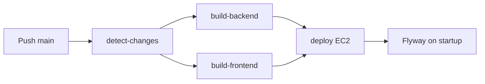
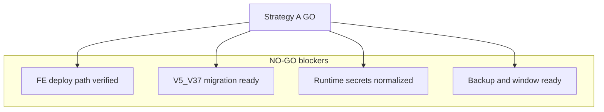

# Cập nhật CI/CD deploy FE (POS) và rollout migration production

## 1. Summary

**Trạng thái FE deploy path (repo):** [`.github/workflows/deploy.yml`](c:/Work/NhaDanShopBT/.github/workflows/deploy.yml) và [`dev-start.ps1`](c:/Work/NhaDanShopBT/dev-start.ps1) **đã** trỏ frontend sang [`nha-dan-pos-c091ee5b`](c:/Work/NhaDanShopBT/nha-dan-pos-c091ee5b) (`on.push.paths`, `paths-filter` frontend, `cache-dependency-path`, `working-directory` npm, artifact `dist/`, và `$UI_DIR`). Xác nhận: `rg "NhaDanShopUi" .github/workflows/deploy.yml dev-start.ps1` → không kết quả.

**Strategy A readiness: `NO-GO`** — không coi GO / không push `main` cho rollout production cho tới khi đủ mục [Readiness classification (Strategy A)](#readiness-classification-strategy-a).

**Blocker: Production runtime secrets**

- [`application.properties`](c:/Work/NhaDanShopBT/NhaDanShop/src/main/resources/application.properties) còn **hardcode** SMTP (`spring.mail.*`) và `goong.rest-api-key`.
- [`deploy.yml`](c:/Work/NhaDanShopBT/.github/workflows/deploy.yml) systemd (~209–221) **chưa** truyền `MAIL_*`, `APP_PUBLIC_BASE_URL`, `MANAGEMENT_HEALTH_MAIL_ENABLED`, `GHN_*`, `CASSO_*`, `GOONG_REST_API_KEY`, optional `GHN_FROM_DISTRICT_ID`, `VIETQR_IMAGE_BASE_URL`.
- Nếu SMTP/Goong trong repo là credential thật → **rotate/revoke** ngoài hệ thống (đã lộ trong source).

**Deploy artifact build policy (tóm tắt):** deploy workflow **không** chạy app tests; backend `./gradlew bootJar -x test --no-daemon`, frontend chỉ `npm ci` + `npm run build` (mục [Deploy artifact build policy](#deploy-artifact-build-policy)).

**DB:** Dry-run backup/restore/migrate local `V4` → `V37` đã PASS; migration thật trên production **chưa** chạy cho tới khi JAR mới khởi động với Flyway enabled.

**Lưu ý pipeline (quan trọng cho thứ tự rollout):** Filter `backend` trong `deploy.yml` gồm `NhaDanShop/**` **và** `.github/workflows/**`. Commit sửa `deploy.yml` (ví dụ thêm env secrets) trên `main` **có thể** `backend=true` → build JAR, upload, restart `nhadanshop` → **Flyway trên production**. Plan chọn **Strategy A** (mục 4 — rollout = **production migration event**). **Không push `main`** nếu chưa **GitHub Secrets checklist** + **final backup** + **maintenance window** (xem checklist Strategy A).

---

## 2. CI/CD — FE path trong `deploy.yml` (đã đúng trong repo)

File: [`.github/workflows/deploy.yml`](c:/Work/NhaDanShopBT/.github/workflows/deploy.yml)

| Vị trí | Giá trị hiện tại (đã verify) |
|--------|------------------------------|
| `on.push.paths` (~dòng 9) | `'nha-dan-pos-c091ee5b/**'` |
| `paths-filter` → `frontend:` (~dòng 48) | `'nha-dan-pos-c091ee5b/**'` |
| `setup-node` `cache-dependency-path` (~dòng 126) | `nha-dan-pos-c091ee5b/package-lock.json` |
| `Install dependencies` `working-directory` (~dòng 129) | `nha-dan-pos-c091ee5b` |
| `Build React app` `working-directory` (~dòng 133) | `nha-dan-pos-c091ee5b` |
| `Upload dist artifact` `path` (~dòng 144) | `nha-dan-pos-c091ee5b/dist/` |

**Giữ nguyên:** `name: frontend-dist`, `env.WEB_DIR=/var/www/nhadanshop`, bước `rsync` `./artifacts/frontend/` → `${WEB_DIR}/`, `VITE_API_BASE_URL: ''` (relative `/api` qua nginx).

**Kiểm tra định kỳ:** `rg "NhaDanShopUi" .github/workflows/deploy.yml` → không còn kết quả.

**Follow-up (blocker secrets):** mở rộng block ghi systemd để truyền runtime env — xem [Production runtime secrets plan](#production-runtime-secrets-plan).

**Ghi chú YAML:** `actionlint` nếu có; không có thì rà soát thủ công block `filters: |` và các key `working-directory`/`path`.

---

## Production runtime secrets plan

**Phạm vi triển khai (agent follow-up):** chuẩn hóa config + deploy workflow + GitHub Secrets; **không** GO Strategy A cho tới khi hoàn tất.

### Config changes cần lập kế hoạch

Chuẩn hóa [`application.properties`](c:/Work/NhaDanShopBT/NhaDanShop/src/main/resources/application.properties):

| Nhóm | Target properties |
|------|-------------------|
| SMTP | `spring.mail.host=${MAIL_HOST:}`, `port=${MAIL_PORT:587}`, `username=${MAIL_USERNAME:}`, `password=${MAIL_PASSWORD:}`, `from=${MAIL_FROM:${MAIL_USERNAME:}}`; giữ `smtp.auth`, `starttls.enable`, `starttls.required`; `management.health.mail.enabled=${MANAGEMENT_HEALTH_MAIL_ENABLED:true}` — **ghi quyết định** prod: `MANAGEMENT_HEALTH_MAIL_ENABLED=false` khi SMTP chưa sẵn sàng để tránh `/actuator/health` DOWN |
| Public URL | `app.public-base-url=${APP_PUBLIC_BASE_URL:http://localhost:5173}` — prod set URL thật (`http://<EC2_HOST>` hoặc HTTPS domain) |
| GHN | Giữ `ghn.token=${GHN_TOKEN:}`, `ghn.shop-id=${GHN_SHOP_ID:}`; cân nhắc `ghn.from-district-id=${GHN_FROM_DISTRICT_ID:}` |
| Casso | Giữ `casso.webhook-secure-token`, `casso.webhook-checksum-key` placeholders |
| Goong | `goong.rest-api-key=${GOONG_REST_API_KEY:}` (bỏ hardcode) |
| VietQR | Giữ URL public hoặc `vietqr.image-base-url=${VIETQR_IMAGE_BASE_URL:https://img.vietqr.io/image}` |

**Cảnh báo:** Nếu SMTP/Goong trong repo là key thật → **rotate/revoke** ngoài hệ thống (đã lộ trong source).

**Gate Strategy A:** Không `GO` cho đến khi config **không** hardcode SMTP/Goong secrets.

### Deploy workflow changes cần lập kế hoạch

Trong block ghi systemd trên EC2 ([`deploy.yml`](c:/Work/NhaDanShopBT/.github/workflows/deploy.yml) ~209+), thêm `Environment=...` từ GitHub Secrets:

**Bắt buộc / gần-bắt-buộc:** `MAIL_HOST`, `MAIL_PORT`, `MAIL_USERNAME`, `MAIL_PASSWORD`, `MAIL_FROM`, `APP_PUBLIC_BASE_URL`, `MANAGEMENT_HEALTH_MAIL_ENABLED`, `GHN_TOKEN`, `GHN_SHOP_ID`, `CASSO_WEBHOOK_SECURE_TOKEN`, `CASSO_WEBHOOK_CHECKSUM_KEY`, `GOONG_REST_API_KEY`

**Optional:** `GHN_FROM_DISTRICT_ID`, `VIETQR_IMAGE_BASE_URL`

Plan-level pseudocode:

```yaml
"Environment=\"MAIL_HOST=${{ secrets.MAIL_HOST }}\"" \
"Environment=\"MAIL_PORT=${{ secrets.MAIL_PORT }}\"" \
"Environment=\"MAIL_USERNAME=${{ secrets.MAIL_USERNAME }}\"" \
"Environment=\"MAIL_PASSWORD=${{ secrets.MAIL_PASSWORD }}\"" \
"Environment=\"MAIL_FROM=${{ secrets.MAIL_FROM }}\"" \
"Environment=\"APP_PUBLIC_BASE_URL=${{ secrets.APP_PUBLIC_BASE_URL }}\"" \
"Environment=\"MANAGEMENT_HEALTH_MAIL_ENABLED=${{ secrets.MANAGEMENT_HEALTH_MAIL_ENABLED }}\"" \
"Environment=\"GHN_TOKEN=${{ secrets.GHN_TOKEN }}\"" \
"Environment=\"GHN_SHOP_ID=${{ secrets.GHN_SHOP_ID }}\"" \
"Environment=\"CASSO_WEBHOOK_SECURE_TOKEN=${{ secrets.CASSO_WEBHOOK_SECURE_TOKEN }}\"" \
"Environment=\"CASSO_WEBHOOK_CHECKSUM_KEY=${{ secrets.CASSO_WEBHOOK_CHECKSUM_KEY }}\"" \
"Environment=\"GOONG_REST_API_KEY=${{ secrets.GOONG_REST_API_KEY }}\"" \
# optional: GHN_FROM_DISTRICT_ID, VIETQR_IMAGE_BASE_URL
```

**Log safety:** Giữ `grep -v`; mở rộng pattern mask: `PASSWORD|SECRET|KEY|TOKEN|GHN|CASSO|GOONG|MAIL`; không echo secret values.

### GitHub Secrets checklist

- [ ] `MAIL_HOST`
- [ ] `MAIL_PORT`
- [ ] `MAIL_USERNAME`
- [ ] `MAIL_PASSWORD`
- [ ] `MAIL_FROM`
- [ ] `APP_PUBLIC_BASE_URL`
- [ ] `MANAGEMENT_HEALTH_MAIL_ENABLED`
- [ ] `GHN_TOKEN`
- [ ] `GHN_SHOP_ID`
- [ ] `CASSO_WEBHOOK_SECURE_TOKEN`
- [ ] `CASSO_WEBHOOK_CHECKSUM_KEY`
- [ ] `GOONG_REST_API_KEY`
- [ ] (optional) `GHN_FROM_DISTRICT_ID`
- [ ] (optional) `VIETQR_IMAGE_BASE_URL`

Secrets **không** sync từ local `.env`; operator tạo/cập nhật trong GitHub repo **Settings → Secrets and variables → Actions**.

### Runtime config verification

Bổ sung vào **Strategy A checklist D** (và tham chiếu từ đây) — **chỉ** kiểm tra config/env đã được truyền, **không** chạy flow chức năng app:

- Trên EC2 (SSH hoặc log deploy): `systemctl show nhadanshop` / unit file có `Environment=` cho `MAIL_*`, `APP_PUBLIC_BASE_URL`, `MANAGEMENT_HEALTH_MAIL_ENABLED`, `GHN_*`, `CASSO_*`, `GOONG_REST_API_KEY` (và optional env nếu dùng).
- `journalctl` / log deploy: không echo giá trị secret; pattern mask log đúng (`PASSWORD|SECRET|KEY|TOKEN|GHN|CASSO|GOONG|MAIL`).
- Không hardcode SMTP/Goong còn trong JAR đang chạy sau khi đã deploy bản config mới (xác nhận qua commit/deploy artifact đúng).

---

## Deploy artifact build policy

**Backend deploy build** — giữ trong [`deploy.yml`](c:/Work/NhaDanShopBT/.github/workflows/deploy.yml):

```bash
./gradlew bootJar -x test --no-daemon
```

- Deploy artifact build dùng task `bootJar` với flag `-x test` (Gradle không chạy task `test` khi đóng gói JAR).
- **Không** thêm bước chạy app tests vào deploy workflow.

**Frontend deploy build** — giữ:

```bash
npm ci
npm run build
```

- Deploy job EC2 chỉ `npm ci` + `npm run build`; **không** thêm bước chạy app tests frontend trong workflow deploy.

*(Align với workflow hiện tại — plan ghi policy rõ; không yêu cầu đổi nếu đã đúng.)*

---

## 3. Local dev — `dev-start.ps1` (đã đúng trong repo)

- Dòng 33: `$UI_DIR = "$ROOT\nha-dan-pos-c091ee5b"` (đã verify).
- Rà toàn file: không còn chuỗi `NhaDanShopUi`. Logic `npm install` khi thiếu `node_modules`, `npm run dev` qua `cmd /k`, port 5173 — giữ theo [`nha-dan-pos-c091ee5b/package.json`](c:/Work/NhaDanShopBT/nha-dan-pos-c091ee5b/package.json).

**Kiểm tra:** `rg "NhaDanShopUi" dev-start.ps1` → không kết quả.

**Lưu ý repo:** [`.gitignore`](c:/Work/NhaDanShopBT/.gitignore) vẫn có pattern `NhaDanShopUi/...` — **không** bắt buộc xóa cho acceptance; tùy chọn dọn legacy.

---

## 4. Production rollout / migration safety

**Chuỗi kỹ thuật đã xác minh trong workflow:**

- Push `main` với path khớp → `detect-changes` → `build-backend` (nếu `backend==true`) build JAR, upload artifact.
- Deploy: SCP JAR, ghi systemd (Flyway `SPRING_FLYWAY_ENABLED=true`, `ddl-auto=validate`), `systemctl restart nhadanshop`.
- Flyway trên DB production hiện **V4**; code hiện có migrations tới **V37** → lần startup thành công sẽ áp **V5..V37**.
- Health trong workflow EC2: `curl http://localhost:8080/actuator/health`; health check sau deploy qua public: `http://$EC2_HOST/api/actuator/health` (đúng với nginx prefix `/api/`).



### Rollout decision for workflow-only changes

**Selected strategy: Strategy A** — đây là hướng triển khai **mặc định và đã chọn** cho rollout hiện tại. Runbook production phải ghi rõ dòng này.

**Ý nghĩa triển khai:**

- Commit sửa [`.github/workflows/deploy.yml`](c:/Work/NhaDanShopBT/.github/workflows/deploy.yml) (ví dụ thêm systemd env secrets) trên `main` **có thể** trigger **backend deploy + restart** vì `.github/workflows/**` đang nằm trong **backend** `paths-filter`.
- Rollout này **phải được coi là production migration event**: restart backend → Flyway chạy tự động nếu JAR build từ `main` chứa migrations mới hơn DB hiện tại.
- Production DB hiện **V4**; code/migration mục tiêu trên `main` là **V37**; dry-run **V4 → V37** đã **PASS** — vẫn cần **final backup** ngay trước deploy thật.

**Strategy A (đang áp dụng):** Chấp nhận workflow/CI thay đổi đi cùng khả năng backend redeploy/restart và Flyway; thực hiện đầy đủ **Strategy A rollout checklist** (mục dưới) + chi tiết kỹ thuật mục 4.1–4.4. **Readiness hiện tại: `NO-GO`** cho tới khi secrets + migration rollout readiness + backup/window hoàn tất.

**Strategy B (future option — không dùng rollout hiện tại):** Tách thay đổi chỉ-workflow khỏi backend migration bằng cách **sửa thiết kế** `paths-filter` / `on.push.paths`. **Không** áp Strategy B cho lần này.

### Strategy A rollout checklist (thứ tự bắt buộc)

#### A. Freeze / scope control

- **Không** push tự do từ toàn bộ dirty workspace.
- Trước `git add` / commit: **liệt kê chính xác** file được phép stage (ghi trong runbook/PR mô tả).
- **Scope tối thiểu đã xong (repo):** FE path trong `deploy.yml` + `dev-start.ps1`.
- **Scope triển khai secrets (cần agent):** `NhaDanShop/src/main/resources/application.properties` + mở rộng `deploy.yml` systemd env — **user approve** nếu vượt scope chỉ FE-path.
- Nếu muốn **kèm** thay đổi backend/migration khác: **checklist file riêng** + **user approve**; **liệt kê file** được stage trong runbook/PR.
- **Trước push:** GitHub Secrets checklist ([Production runtime secrets plan](#github-secrets-checklist)) **hoàn tất**.
- **Không push `main`** nếu chưa secrets checklist + **final backup** + **maintenance window** (mục B + gate secrets).
- **Không** stage backup, dump, log, secrets, artifact local.
- **Không** revert hoặc xóa hàng loạt thay đổi unrelated chỉ để “dọn” workspace.

#### B. Final production backup (trong maintenance window, trước push/deploy)

- Tạo **final** `pg_dump` production mới.
- Lưu **ngoài repo**; ưu tiên dưới `C:\Keys\backups\...` (hoặc đường dẫn ops tương đương).
- Tạo **checksum** file dump (ví dụ `sha256sum` / PowerShell `Get-FileHash`).
- Ghi **snapshot** `flyway_schema_history` (export hoặc query version/success).
- Ghi **row counts 13 bảng** bằng SQL mẫu mục 4.1; lưu kết quả text/CSV ngoài repo.
- **Xác nhận** file backup + checksum + snapshot + row counts **tồn tại và đọc được** trước khi push — nếu thiếu, **không push `main`**.

#### C. Push / deploy

- Chỉ push khi **maintenance window đã bắt đầu**, mục **B** hoàn tất, và **GitHub Secrets checklist** xong.
- Push commit (Strategy A) lên `main`.
- Theo dõi GitHub Actions workflow **Build & Deploy NhaDanShop**.
- Vì Strategy A **chấp nhận** backend restart, theo dõi kỹ các bước backend:
  - build backend JAR (`bootJar -x test`)
  - upload JAR
  - write systemd service
  - restart `nhadanshop`
  - health check (Actions + EC2 localhost)
- Trên EC2: `sudo journalctl -u nhadanshop -f` trong lúc migrate/startup, hoặc `journalctl` tail sau bước deploy.

#### D. Post-deploy verification

- `/api/actuator/health` → HTTP **200**.
- Frontend root `/` → HTTP **200**.
- DB production: Flyway version mới nhất **37**; **failed migration count = 0**.
- Chạy lại **row count 13 bảng** (SQL mục 4.1), so với pre-deploy.
- **Runtime config verification** (mục [Runtime config verification](#runtime-config-verification)): systemd/env presence, log masking — không flow app.

#### E. Failure handling

- **Actions fail trước khi** backend restart thành công trên prod: sửa workflow/build; DB production **có thể** chưa đổi — xác nhận bằng snapshot/SSH nếu cần.
- **Backend đã restart** và Flyway đã chạy **một phần**: **không** restore DB ngay; **không** sửa migration cũ đã áp dụng; đọc `journalctl`, lỗi Flyway, `flyway_schema_history`; sửa **forward-only** (migration mới +/hoặc hotfix JAR).
- **App fail sau migration** nhưng schema đã lên version mới: JAR rollback (nếu workflow/script có) chỉ rollback **binary**, **không** rollback schema; ưu tiên hotfix app hoặc migration tiếp.
- **Restore DB** từ backup chỉ khi có **quyết định rõ ràng** — sẽ mất mọi dữ liệu phát sinh sau thời điểm backup.

**Mục 4.1–4.4** bên dưới là **chi tiết kỹ thuật** — **thứ tự hành động production** phải bám **checklist A→E** trên.

### 4.1 Trước deploy

Chi tiết kỹ thuật bổ sung cho checklist **A** và **B**.

1. **Maintenance window** ngắn; thông báo bảo trì hệ thống theo quy trình ops nếu có user đang dùng.
2. **Backup production:** `pg_dump` mới nhất, lưu **ngoài repo**. Không commit dump/secrets.
3. **Baseline DB:** export/ảnh chụp `flyway_schema_history`.
4. **Row counts bảng lõi (bắt buộc, trước deploy):** `users`, `roles`, `user_roles`, `customers`, `suppliers`, `products`, `product_variants`, `product_batches`, `inventory_receipts`, `inventory_receipt_items`, `sales_invoices`, `sales_invoice_items`, `flyway_schema_history`.

SQL mẫu (một query, đủ để baseline):

```sql
SELECT 'users' AS table_name, COUNT(*) FROM users
UNION ALL SELECT 'roles', COUNT(*) FROM roles
UNION ALL SELECT 'user_roles', COUNT(*) FROM user_roles
UNION ALL SELECT 'customers', COUNT(*) FROM customers
UNION ALL SELECT 'suppliers', COUNT(*) FROM suppliers
UNION ALL SELECT 'products', COUNT(*) FROM products
UNION ALL SELECT 'product_variants', COUNT(*) FROM product_variants
UNION ALL SELECT 'product_batches', COUNT(*) FROM product_batches
UNION ALL SELECT 'inventory_receipts', COUNT(*) FROM inventory_receipts
UNION ALL SELECT 'inventory_receipt_items', COUNT(*) FROM inventory_receipt_items
UNION ALL SELECT 'sales_invoices', COUNT(*) FROM sales_invoices
UNION ALL SELECT 'sales_invoice_items', COUNT(*) FROM sales_invoice_items
UNION ALL SELECT 'flyway_schema_history', COUNT(*) FROM flyway_schema_history
ORDER BY table_name;
```

**Sau deploy:** chạy **cùng query** lần nữa và **đối chiếu** với bản trước deploy.

**Chênh lệch hợp lý (kỳ vọng):**

- `flyway_schema_history`: số dòng tăng khi migrate **V4 → V37**.
- `roles`: có thể **tăng** (ví dụ migration **V36** thêm `ROLE_STAFF`, `ROLE_CUSTOMER`).
- Các bảng nghiệp vụ còn lại: **không** nên giảm hay “mất” dòng nếu không có lý do rõ.

### 4.2 Triển khai

Theo checklist **C**. Bổ sung:

1. Xác nhận **B** + **GitHub Secrets checklist** hoàn tất rồi mới push.
2. Merge/push lên `main`; theo dõi GitHub Actions.
3. Trên EC2: `journalctl -u nhadanshop -f` trong lúc startup.
4. Xác nhận `/api/actuator/health` = 200.

### 4.3 Sau deploy

Bổ sung chi tiết cho checklist **D**:

1. DB: `flyway_schema_history` — version cao nhất **37**, không migration failed.
2. **Row counts sau deploy:** SQL mục 4.1.
3. HTTP root FE: 200.
4. **Runtime config verification** (mục Runtime config verification).

### 4.4 Khi deploy / startup fail

Bổ sung chi tiết cho checklist **E**:

- **JAR rollback:** chỉ cứu **binary**; **không** hoàn tác schema đã migrate một phần.
- **Ưu tiên:** forward-only (migration mới / hotfix JAR).
- **Restore DB** chỉ khi có **quyết định có chủ đích**.

---

## 5. Verification plan (không app tests)

### 5.1 Trước push / trước deploy

- **Static verify FE path:**

```bash
rg "NhaDanShopUi" .github/workflows/deploy.yml dev-start.ps1
```

→ không kết quả.

- **Workflow YAML:** `actionlint` nếu có; không có thì review thủ công indentation, `paths-filter`, `working-directory`, artifact `path`.

- **Artifact build policy** (deploy workflow — không app tests):

  - Backend: `./gradlew bootJar -x test --no-daemon`
  - Frontend: `npm ci` + `npm run build`

- Secrets chưa xong → **NO-GO** (xem Readiness classification).

### 5.2 Sau production deploy

- GitHub Actions workflow success.
- Backend: HTTP **200** trên `/api/actuator/health`.
- Frontend root `/`: HTTP **200**.
- DB: Flyway version mới nhất **37**; failed migration count = **0**.
- **Row counts 13 bảng** (SQL mục 4.1), so với pre-deploy.
- **Runtime config verification:** systemd/env presence, log masking review (mục [Runtime config verification](#runtime-config-verification)).

---

## 6. Risks và assumptions

- **Strategy A readiness: `NO-GO`** cho tới khi đủ [Readiness classification](#readiness-classification-strategy-a).
- **Strategy A đã chọn:** sửa `deploy.yml` trên `main` **có thể** gây **production backend restart** và **Flyway** — **không push** nếu chưa **secrets checklist** + **final backup** + **maintenance window**.
- **Production runtime secrets:** config hardcoded SMTP/Goong + workflow thiếu env → mail/GHN/Casso/Goong/VietQR/public URL sai hoặc lộ; triển khai secrets là **prerequisite** Strategy A. Plan này **lập kế hoạch** secrets; không thay thế việc setup GitHub Secrets và rotate key thật.
- Nếu commit trigger backend từ JAR `main` có migrations **V5–V37**, chuẩn bị như migration event.
- Workspace có nhiều thay đổi không liên quan: agent **chỉ** stage file thuộc scope đã approve (checklist **A**).
- Backup tại `C:\Keys\backups`: không add vào git.
- Frontend dùng relative `/api`: nginx hiện tại đủ.
- Migration fail: không sửa file Flyway cũ đã ship; chỉ hotfix forward.
- **Strategy B** không áp dụng rollout này.

---

## 7. Acceptance criteria

- [`deploy.yml`](c:/Work/NhaDanShopBT/.github/workflows/deploy.yml): frontend build/deploy dùng `nha-dan-pos-c091ee5b`; không `NhaDanShopUi`; artifact `frontend-dist` từ `nha-dan-pos-c091ee5b/dist/`.
- [`dev-start.ps1`](c:/Work/NhaDanShopBT/dev-start.ps1): `$UI_DIR` trỏ `nha-dan-pos-c091ee5b`; không `NhaDanShopUi`.
- **Production secrets:** config **không** hardcode SMTP/Goong; deploy workflow (khi implement) truyền env runtime qua systemd; **GitHub Secrets checklist** done.
- **Deploy build policy:** backend deploy `./gradlew bootJar -x test --no-daemon`; frontend deploy chỉ `npm ci` + `npm run build` (không app tests trong deploy job).
- **Plan/runbook:** `Selected strategy: Strategy A`; runbook A→E đủ scope, backup, push, post-verify kỹ thuật (mục 5.2 + checklist D), failure handling.
- **Gate:** Không push nếu chưa secrets checklist + final backup + maintenance window.
- **Readiness:** Strategy A vẫn **`NO-GO`** cho tới khi đủ 4 điều kiện Readiness classification.
- Không dump/backup/secrets trong git.

---

## Readiness classification (Strategy A)

**Hiện tại: `NO-GO`** cho đến khi **tất cả** đúng:

1. **FE deploy path verified** — `deploy.yml` + `dev-start.ps1` trỏ `nha-dan-pos-c091ee5b` (đã đúng trong repo; giữ verify `rg`).
2. **Migration coverage V5..V37 ready** — dry-run PASS; production chưa migrate; sẵn sàng Strategy A khi push/restart.
3. **Production runtime secrets done** — config chuẩn hóa + deploy env + GitHub Secrets checklist + runtime config verify (không app flow).
4. **Final backup + maintenance window** sẵn sàng.



| Điều kiện | Trạng thái hiện tại |
|-----------|---------------------|
| FE deploy path | Done trong repo |
| Migration V5..V37 readiness | Dry-run PASS; prod chưa migrate |
| Runtime secrets | **Blocker** — config + deploy + Secrets |
| Backup + window | **Pending** — trước push |

---

## Deliverable cho agent triển khai sau

1. **Secrets + deploy env:** `application.properties` placeholders; `deploy.yml` systemd env; GitHub Secrets checklist; runtime config verify — theo todo `prod-runtime-secrets`.
2. **Verification:** chạy [Verification plan](#5-verification-plan-không-app-tests) mục 5 (không app tests); không GO production trước Readiness classification.
3. **Runbook:** Strategy A checklist (A→E) trên production; ghi kết quả **D** (post-verify kỹ thuật mục 5.2).
4. **Không** chạy backup/restore/deploy/push trong bước chỉ sửa plan doc; thực thi sau user duyệt.
