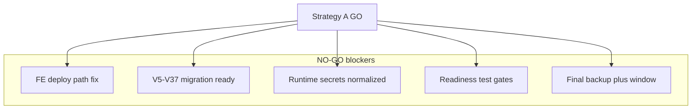

# Cập nhật plan rollout — secrets + deploy build policy

**Phạm vi:** Chỉ sửa [`.cursor/plans/update-deploy-pos-fe-prod-rollout_09f46bac.plan.md`](c:/Work/NhaDanShopBT/.cursor/plans/update-deploy-pos-fe-prod-rollout_09f46bac.plan.md). Không sửa code, workflow, config; không test/backup/deploy/push.

**Đã xác minh trong repo (readonly):**
- [`deploy.yml`](c:/Work/NhaDanShopBT/.github/workflows/deploy.yml) đã dùng `./gradlew bootJar -x test` và `npm ci` + `npm run build` (không `npm test`); systemd chỉ set DB/R2/JWT/CORS (dòng ~209–221); mask log `grep -v "PASSWORD\|SECRET\|KEY"`.
- [`application.properties`](c:/Work/NhaDanShopBT/NhaDanShop/src/main/resources/application.properties): SMTP + Goong hardcoded; GHN/Casso placeholder env; `app.public-base-url` đã dùng `${APP_PUBLIC_BASE_URL:...}`; VietQR URL cố định.

---

## Thay đổi theo section trong plan file

### A. Summary (mục 1)

Thêm đoạn **Readiness hiện tại: `NO-GO`** (Strategy A) cho đến khi đủ điều kiện mục **Readiness classification** (mục mới, xem F).

Nêu rõ blocker mới:
- **Production runtime secrets** chưa chuẩn hóa/setup qua GitHub Secrets → systemd; hiện deploy workflow chưa truyền SMTP, `APP_PUBLIC_BASE_URL`, GHN, Casso, Goong (và optional VietQR/GHN district).
- Config vẫn có secret nhạy cảm hardcoded trong `application.properties` (SMTP, Goong) — **phải** chuyển sang env + rotate nếu key thật đã lộ.

Ghi chú **deploy artifact build policy:** deploy workflow **không** chạy test gate; backend `bootJar -x test`, FE chỉ `npm ci` + `npm run build` — test là readiness/CI riêng, không chặn build artifact EC2.

### B. Sau mục 2 (CI/CD workflow changes) — mục mới

**`## Production runtime secrets plan`**

#### B.1 Config changes cần lập kế hoạch

Trong plan, liệt kê chuẩn hóa [`application.properties`](c:/Work/NhaDanShopBT/NhaDanShop/src/main/resources/application.properties):

| Nhóm | Target properties |
|------|-------------------|
| SMTP | `spring.mail.host=${MAIL_HOST:}`, `port=${MAIL_PORT:587}`, `username=${MAIL_USERNAME:}`, `password=${MAIL_PASSWORD:}`, `from=${MAIL_FROM:${MAIL_USERNAME:}}`; giữ `smtp.auth`, `starttls.enable`, `starttls.required`; `management.health.mail.enabled=${MANAGEMENT_HEALTH_MAIL_ENABLED:true}` — **ghi quyết định** default `true` vs `false` khi SMTP thiếu (tránh `/actuator/health` DOWN) |
| Public URL | `app.public-base-url=${APP_PUBLIC_BASE_URL:http://localhost:5173}` — prod set URL thật (`http://<EC2_HOST>` hoặc HTTPS domain) |
| GHN | Giữ `ghn.token=${GHN_TOKEN:}`, `ghn.shop-id=${GHN_SHOP_ID:}`; cân nhắc `ghn.from-district-id=${GHN_FROM_DISTRICT_ID:}` |
| Casso | Giữ `casso.webhook-secure-token`, `casso.webhook-checksum-key` placeholders |
| Goong | `goong.rest-api-key=${GOONG_REST_API_KEY:}` (bỏ hardcode) |
| VietQR | Giữ URL public hoặc `vietqr.image-base-url=${VIETQR_IMAGE_BASE_URL:https://img.vietqr.io/image}` + optional secret |

**Cảnh báo:** Nếu SMTP/Goong trong repo là key thật → **rotate/revoke** ngoài hệ thống (đã lộ trong source).

**Gate Strategy A:** Không `GO` cho đến khi config không hardcode SMTP/Goong secrets.

#### B.2 Deploy workflow changes cần lập kế hoạch

Trong block ghi systemd trên EC2 ([`deploy.yml`](c:/Work/NhaDanShopBT/.github/workflows/deploy.yml) ~209+), plan thêm `Environment=...` từ GitHub Secrets:

**Bắt buộc / gần-bắt-buộc:** `MAIL_HOST`, `MAIL_PORT`, `MAIL_USERNAME`, `MAIL_PASSWORD`, `MAIL_FROM`, `APP_PUBLIC_BASE_URL`, `MANAGEMENT_HEALTH_MAIL_ENABLED`, `GHN_TOKEN`, `GHN_SHOP_ID`, `CASSO_WEBHOOK_SECURE_TOKEN`, `CASSO_WEBHOOK_CHECKSUM_KEY`, `GOONG_REST_API_KEY`

**Optional:** `GHN_FROM_DISTRICT_ID`, `VIETQR_IMAGE_BASE_URL`

Plan-level pseudocode (như user spec):

```yaml
"Environment=\"MAIL_HOST=${{ secrets.MAIL_HOST }}\"" \
"Environment=\"MAIL_PORT=${{ secrets.MAIL_PORT }}\"" \
# ... full list per user request ...
```

**Log safety:** Giữ `grep -v`; mở rộng pattern mask: `PASSWORD|SECRET|KEY|TOKEN|GHN|CASSO|GOONG|MAIL`; không echo secret values.

#### B.3 GitHub Secrets checklist

Bullet checklist 14 secrets (incl. optional `GHN_FROM_DISTRICT_ID`, `VIETQR_IMAGE_BASE_URL`).

Ghi rõ: secrets **không** sync từ local `.env`; operator tạo/cập nhật trong GitHub repo Settings → Secrets.

#### B.4 Runtime verification sau deploy

Bổ sung vào **Strategy A checklist D** (và tham chiếu từ mục secrets):

- **SMTP:** forgot/reset không fail vì thiếu config; mail health không làm health fail nếu chưa bật.
- **GHN:** quote shipping — không lỗi “missing GHN_TOKEN”.
- **Casso:** `/api/webhooks/casso` tồn tại; dashboard URL prod `http://<EC2_HOST>/api/webhooks/casso` (hoặc HTTPS); token/checksum configured.
- **Goong:** autocomplete không “Goong API key not configured”.
- **VietQR:** QR image URL đúng.

### C. Mục mới: Deploy artifact build policy (sau secrets hoặc trong mục 2)

**Backend deploy build** — document & require giữ:

```bash
./gradlew bootJar -x test --no-daemon
```

- Deploy artifact build, skip tests cho tốc độ.
- **Không** đổi deploy workflow sang `./gradlew test`.
- Test gate: readiness/CI trước push hoặc operator override có ý thức.

**Frontend deploy build:**

```bash
npm ci
npm run build
```

- **Không** `npm test` trong deploy job EC2.
- `npm test` = readiness/CI gate riêng; CI regression workflow có thể chạy tests khi trigger — deploy workflow không kéo dài bởi tests.

*(Align với workflow hiện tại — plan ghi policy rõ, không yêu cầu đổi code nếu đã đúng.)*

### D. Mục 5 Test plan — phân tách rõ

- **Pre-push readiness (operator):** giữ `gradlew test`, `npm test` như gate **trước** quyết định push Strategy A.
- **Deploy workflow (EC2 artifact):** **không** chạy tests — trỏ mục C.
- Ghi rõ: test blocker vận hành có thể vẫn `NO-GO` dù deploy build skip tests.

### E. Risks (mục 6)

Thêm risk/blocker:
- Secrets hardcoded + workflow thiếu env → mail/GHN/Casso/Goong/VietQR/public URL sai hoặc lộ.
- Strategy A `NO-GO` nếu chưa secrets plan hoàn tất.

Sửa dòng cũ “plan này không đụng secrets” → “plan này **lập kế hoạch** secrets; triển khai secrets là prerequisite Strategy A”.

### F. Acceptance criteria (mục 7)

Thêm:
- Deploy workflow backend: `bootJar -x test`.
- Deploy workflow frontend: không `npm test`.
- Production secrets: config không hardcode SMTP/Goong; deploy truyền env; GitHub Secrets checklist done.
- Readiness `NO-GO` cho đến khi đủ 5 điều kiện (mục F2).

### G. Readiness classification (mục mới, trước Deliverable)

**`## Readiness classification (Strategy A)`**

**Hiện tại: `NO-GO`** cho đến khi **tất cả**:

1. FE deploy path pass (`NhaDanShopUi` → `nha-dan-pos-c091ee5b` trong deploy.yml + dev-start).
2. Migration coverage `V5..V37` pass (dry-run đã PASS; prod chưa migrate).
3. **Production runtime secrets** chuẩn hóa: config + deploy env + GitHub Secrets checklist.
4. Frontend build/test gate + backend test/override decision xử lý (readiness, không trong deploy artifact build).
5. Final backup + maintenance window sẵn sàng.

### H. Strategy A checklist (mục 4)

**A. Freeze / scope:** thêm file được phép khi làm secrets (ngoài deploy.yml): `application.properties`, và mở rộng deploy.yml systemd env — **user approve** nếu vượt scope CI/CD tối thiểu.

**B:** giữ nguyên backup gate.

**Trước C (push):** thêm gate — GitHub Secrets checklist (B.3) hoàn tất; không push nếu secrets chưa setup.

### I. Frontmatter todos

- Thêm todo `prod-runtime-secrets`: chuẩn hóa application.properties + deploy.yml env + GitHub Secrets + verify (B.1–B.4).
- Cập nhật `pre-push-tests`: tách “readiness tests” vs “deploy workflow skip tests”.
- Optional: `edit-deploy-yml` note — secrets env lines là phần follow-up sau FE path fix.

---

## Sau khi user duyệt — hành động agent

1. Apply các chỉnh sửa trên vào **đúng file** `update-deploy-pos-fe-prod-rollout_09f46bac.plan.md` (StrReplace/Write sections, không tạo plan file mới).
2. Trả summary 4 bullet theo user mục 5 (blocker locations, secrets checklist, skip-test policy, remaining NO-GO blockers).


